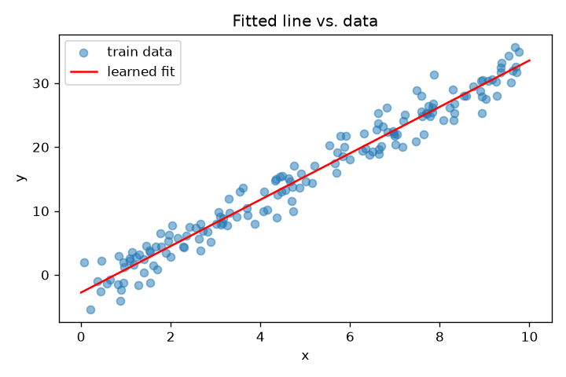
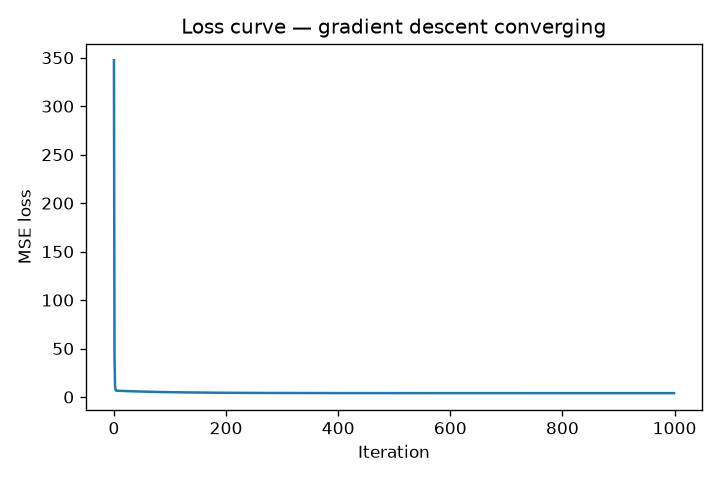

# 01 — Linear Regression from Scratch

> **New to this?** Read sections 1–3 slowly; they assume no machine learning at all,
> just algebra and the idea of a derivative. Every formula is written out in words
> first, then in symbols, then shown as the exact line of code that implements it.

## 1. What you'll build

A linear regression model using **nothing but numpy** — no `sklearn.fit()` doing the
real work. You'll train it two completely different ways and check both against
scikit-learn, so that by the end you can explain from the formula up *why* it works,
not just that it does.

| Part | What it shows | The evidence |
|---|---|---|
| 1 | Gradient descent recovers a function you already know | True $y = 3.5x - 2$ → learned $y = 3.633x - 2.759$ |
| 1 | A "good" model's leftover error is just noise | Test MSE **4.112** vs. the noise variance **4.0** you injected |
| 2 | Iteration and algebra find the *same* answer | GD, normal equation and sklearn all give MSE 0.5559, R² 0.5758 |

That second row is worth pausing on. It's the first appearance of an idea that runs
through this whole curriculum: **there is a floor below which no model can go**, and a
model sitting on that floor is finished, not broken.

## 2. The core idea

You have some inputs — square footage, median income, hours studied — and a number you
want to predict. Linear regression makes one bet: **the output is a weighted sum of
the inputs, plus a constant.**

$$\text{price} = w_1 \cdot \text{size} + w_2 \cdot \text{bedrooms} + \ldots + b$$

Each weight $w_j$ answers "if this input goes up by 1, how much does the prediction
move?" The constant $b$ is where the prediction sits when every input is zero.

"Training" means finding the weights that make that sum match reality as closely as
possible. Which forces two questions, and the rest of this project is answering them:

1. **What does "as closely as possible" mean, exactly?** → the loss function (§3.2)
2. **How do we actually find those weights?** → gradient descent (§3.4), and for this
   particular model, algebra (§3.5)

## 3. The math

### 3.1 The model

$$\hat{y} = Xw + b$$

- $X$ is your data: $n$ rows (examples) × $d$ columns (features).
- $w$ is a column of $d$ weights — one per feature.
- $b$ is a single number, the **bias** or **intercept**.
- $\hat{y}$ ("y-hat") is the vector of predictions. The hat means *estimated*, as
  opposed to $y$, the truth.

The matrix multiply $Xw$ is just "for each row, multiply each feature by its weight and
add them up" — done for all $n$ rows at once.

### 3.2 The loss: why *squared* error

We need one number saying how wrong the model currently is. That's **Mean Squared
Error**:

$$J(w, b) = \frac{1}{n}\sum_{i=1}^{n}\left(\hat{y}_i - y_i\right)^2$$

Take each prediction's error, square it, average. Why square it rather than take the
absolute value?

- **Squaring is differentiable everywhere.** $|x|$ has a sharp kink at zero with no
  well-defined slope, and every method in §3.4 depends on slopes existing.
- **Squaring punishes big errors disproportionately.** Being off by 10 contributes 100;
  being off by 1 contributes 1. So one catastrophic miss costs more than a hundred
  small ones — usually what you want.
- **Squaring has a statistical justification.** MSE is the loss you get from assuming
  the noise is Gaussian and asking "which weights make the observed data most likely?"
  Project 02 derives exactly this for a different noise assumption, and it produces a
  different loss. *Choosing a loss is really choosing an assumption about the noise.*

Project 02 also shows a case — classification — where squared error is the **wrong**
choice, and demonstrates it failing.

### 3.3 The gradient, derived

$J$ is a function of the weights. We want the weights that make it smallest. The
derivative $\partial J/\partial w_j$ tells us how $J$ responds to nudging $w_j$: positive
means increasing $w_j$ makes things worse, so we should decrease it.

Differentiate, applying the chain rule to the squared term:

$$
\frac{\partial J}{\partial w_j}
= \frac{1}{n}\sum_{i=1}^{n} 2\left(\hat{y}_i - y_i\right)\cdot \frac{\partial \hat{y}_i}{\partial w_j}
$$

Now, what is $\partial \hat{y}_i/\partial w_j$? Since $\hat{y}_i = \sum_k w_k x_{ik} + b$,
every term with $k \neq j$ is a constant with respect to $w_j$ and differentiates away,
leaving just the coefficient sitting next to $w_j$:

$$\frac{\partial \hat{y}_i}{\partial w_j} = x_{ij}$$

Substituting back:

$$\boxed{\ \frac{\partial J}{\partial w_j} = \frac{2}{n}\sum_{i=1}^{n}\left(\hat{y}_i - y_i\right)x_{ij}\ }$$

Stacked over all features at once, and doing the same for $b$ (where
$\partial \hat{y}_i/\partial b = 1$):

$$\frac{\partial J}{\partial w} = \frac{2}{n}X^{T}(\hat{y} - y) \qquad\qquad \frac{\partial J}{\partial b} = \frac{2}{n}\sum_{i=1}^{n}(\hat{y}_i - y_i)$$

**Read that formula in words: gradient = error × input.** A feature only gets its
weight adjusted in proportion to how big the errors were *and* how large that feature
was on the examples that got it wrong. Remember this shape — project 02 derives a
completely different loss for a completely different task and lands on the same
structure, which is not a coincidence.

### 3.4 Gradient descent, and one step worked by hand

The gradient points **uphill**, so to reduce the loss we step the other way, scaled by
a **learning rate** $\alpha$:

$$w := w - \alpha\frac{\partial J}{\partial w} \qquad\qquad b := b - \alpha\frac{\partial J}{\partial b}$$

Repeat until the loss stops moving. Let's do one step by hand on three points —
$(1,2), (2,4), (3,6)$, which lie exactly on $y = 2x$ — starting from $w = 0$, $b = 0$
with $\alpha = 0.1$.

**Predict.** With $w = b = 0$, every prediction is $\hat{y} = [0, 0, 0]$, so the errors
$\hat{y} - y$ are $[-2, -4, -6]$:

$$J = \frac{(-2)^2 + (-4)^2 + (-6)^2}{3} = \frac{4 + 16 + 36}{3} = 18.667$$

**Gradients.** Using $\frac{2}{n}\sum(\hat{y}_i - y_i)x_i$:

$$
\frac{\partial J}{\partial w} = \frac{2}{3}\big[(-2)(1) + (-4)(2) + (-6)(3)\big] = \frac{2}{3}(-28) = -18.667
$$
$$
\frac{\partial J}{\partial b} = \frac{2}{3}\big[(-2) + (-4) + (-6)\big] = \frac{2}{3}(-12) = -8.0
$$

Both are negative — meaning "you're underestimating; increase both."

**Update.**

$$w := 0 - 0.1 \times (-18.667) = 1.867 \qquad b := 0 - 0.1 \times (-8.0) = 0.8$$

**Result.** We started at $w=0$ and moved to $w = 1.867$, heading straight for the true
$w = 2$. The loss went from $18.667$ to $\mathbf{0.296}$ — in a single step. That's the
entire algorithm; everything else is repetition.

**Choosing $\alpha$ is a real tradeoff.** Too large and each step overshoots the
minimum and bounces outward until the loss becomes `nan`; too small and you'd need a
million iterations. Exercise 1 makes you break it both ways, which is the fastest way
to build intuition for it.

### 3.5 The closed form: solving it exactly

Gradient descent walks downhill step by step. But MSE is a **convex quadratic** in $w$
— a bowl with exactly one bottom — so we can skip the walking and solve for where the
gradient equals zero directly.

Fold $b$ into $w$ (prepend a column of 1s to $X$, so the bias becomes just another
weight whose feature is always 1) and set the gradient to zero:

$$\frac{2}{n}X^{T}(Xw - y) = 0$$

Multiply out and rearrange:

$$X^{T}Xw = X^{T}y$$

These are the **normal equations**. Solving for $w$:

$$\boxed{\ w = (X^{T}X)^{-1}X^{T}y\ }$$

One line of algebra, exact answer, no learning rate and no iterations. So why does
anyone use gradient descent?

- Inverting $X^TX$ costs about $O(d^3)$ in the number of features $d$. Fine for 8
  features; hopeless for 100,000.
- $X^TX$ must be invertible — it isn't if two features are perfectly correlated.
- **Most models have no closed form at all.** Neural networks (project 06 onward) have
  no formula you can solve for the optimum. Gradient descent is the general method;
  this is the rare case where you can check it against an exact answer.

Part 2 runs both and confirms they agree to four decimal places.

### 3.6 Reading the metrics: MSE and R²

MSE is what we optimize, but its units are the target's *squared* — "0.5559 squared
hundreds-of-thousands of dollars" means nothing to anyone. **R²** rescales it into
something interpretable:

$$R^2 = 1 - \frac{\sum_i (y_i - \hat{y}_i)^2}{\sum_i (y_i - \bar{y})^2} = 1 - \frac{\text{your model's squared error}}{\text{squared error of just guessing the mean}}$$

The denominator is the error you'd get from the laziest possible model: ignore all
features and always predict the average. So:

- $R^2 = 1$ — perfect predictions.
- $R^2 = 0$ — exactly as good as guessing the mean. Your features bought you nothing.
- $R^2 < 0$ — worse than guessing the mean. Possible, and a sign something is wrong.

R² is a *ratio*, so unlike MSE it's comparable across datasets with different units.
Project 03 goes much deeper on evaluation; this is enough to tell whether the model is
doing anything at all.

## 4. From formula to code

Open [`linear_regression.py`](linear_regression.py). The `LinearRegressionGD` docstring
numbers each formula (1)–(5), and the matching line in `fit()` carries the same number.

| # | Formula | Code |
|---|---|---|
| (1) | $\hat{y} = Xw + b$ | `y_pred = X @ self.weights + self.bias` |
| (2) | $J = \frac{1}{n}\sum(\hat{y}-y)^2$ | `np.mean(error ** 2)` |
| (3) | $\frac{\partial J}{\partial w} = \frac{2}{n}X^T(\hat{y}-y)$ | `dw = (2 / n_samples) * (X.T @ error)` |
| (4) | $\frac{\partial J}{\partial b} = \frac{2}{n}\sum(\hat{y}-y)$ | `db = (2 / n_samples) * np.sum(error)` |
| (5) | $w := w - \alpha\frac{\partial J}{\partial w}$ | `self.weights -= self.learning_rate * dw` |
| — | $w = (X^TX)^{-1}X^Ty$ | `normal_equation()` |

Notice how short `fit()` is. The entire algorithm is five lines inside a loop; the
value of this project is in understanding *why* those five lines are what they are.

## 5. The data

Two datasets, deliberately different in shape:

1. **Synthetic 1D data** (`run_synthetic_demo`) — points generated from a known line,
   $y = 3.5x - 2$, plus Gaussian noise with $\sigma = 2$. Synthetic *on purpose*:
   because we know the true answer, we can check that gradient descent recovers it.
   Always sanity-check an implementation on data whose answer you know before trusting
   it on data where you don't.
2. **California housing** (`run_california_housing_demo`) — a real dataset built into
   scikit-learn: 8 features (median income, house age, average rooms, location, …)
   predicting median house value per district. Real data brings a real problem —
   features on wildly different scales — which is why standardization appears here and
   not in the 1D case.

## 6. Results — what each plot is telling you

### Part 1 — the fitted line



The red line is what gradient descent found starting from $w = 0, b = 0$, knowing
nothing. The scatter is the training data. The fit looks right — but the interesting
part is the numbers:

```
True function:  y = 3.5 * x + -2.0
Learned (GD):   y = 3.633 * x + -2.759
Test MSE: 4.112   R^2: 0.955
```

**Why isn't the answer exactly 3.5 and −2?** Because the model never saw the true
function — it only saw 160 noisy samples *from* it. A different random sample would
give a slightly different line. The model recovered the truth as well as that sample
allows, and no better. (Project 03 names this gap — it's *variance*.)

**Now the important number.** We injected noise with $\sigma = 2$, so its variance is
$\sigma^2 = 4$. The test MSE came out at **4.112**. Those are the same number.

That is not a coincidence and it's not luck. Rewriting the error: since $y = f(x) + \varepsilon$,
even a *perfect* model that recovered $f$ exactly would still be wrong by $\varepsilon$ on
every new point, giving expected squared error $\sigma^2 = 4$. Our model's 4.112 is the
noise floor plus a sliver. **There is essentially nothing left to learn here.** A
"better" algorithm reporting MSE 2.0 on this data would not be smarter — it would be
leaking test data (project 03, Part 5, does exactly that on purpose).

This is the single most useful habit in applied ML: before trying to improve a model,
ask what the floor is.

### Part 1 — the loss curve



Each point is the loss after one update. It drops steeply, then flattens — and **the
flattening is convergence**: the gradient has shrunk toward zero, so the steps get
tiny and further iterations change almost nothing. A curve that rises, oscillates, or
goes to `nan` means the learning rate is too big (exercise 1).

### Part 2 — three roads, one destination

```
Method                                 MSE       R^2
----------------------------------------------------
Scratch (gradient descent)          0.5559    0.5758
Normal equation (closed form)       0.5559    0.5758
scikit-learn LinearRegression       0.5559    0.5758
```

Identical to four decimal places — and this agreement is the whole point of Part 2.
Three genuinely different procedures (a thousand iterative steps; one matrix inversion;
scikit-learn's SVD-based solver) landed on the same weights because MSE is convex and
therefore has exactly **one** minimum. There is nowhere else to end up.

If you ever modify the gradient and this table stops agreeing, your derivation is
wrong. That's a correctness test you can run without a debugger.

**Is R² = 0.576 good?** It means the 8 features explain about 58% of the variation in
house values — genuinely useful, and clearly not the whole story. House prices depend
on plenty this dataset doesn't record. Some of the remaining 42% is noise; some is
structure a straight line can't capture, since linear regression can only add features
up in fixed proportions. Projects 04 and 06 introduce models that can bend.

## 7. Run it

```bash
cd 01-linear-regression-from-scratch
python3 -m venv .venv
source .venv/bin/activate
pip install -r requirements.txt
python linear_regression.py
```

Writes `outputs/loss_curve.png` and `outputs/fitted_line.png`. Part 2 downloads the
California housing dataset on first run. If that fails with
`SSL: CERTIFICATE_VERIFY_FAILED` — a common macOS/python.org quirk — see the fix in
[`../_shared/setup.md`](../_shared/setup.md).

## 8. Exercises

Edit the file and re-run — the goal is to *feel* each effect, not read about it.

1. **Break convergence in both directions.** Set `learning_rate=5.0` in
   `run_synthetic_demo`. The loss curve should explode or oscillate instead of
   descending — each step overshoots the minimum and lands further out. Then try
   `0.0001`: it descends but barely moves in 1000 iterations. Find roughly the largest
   learning rate that still converges.
2. **Skip standardization.** In `run_california_housing_demo`, feed the *unscaled*
   `X_train`/`X_test` to `LinearRegressionGD` (leave the other two on scaled data).
   Watch the MSE explode or hit `nan`. Why: population is in the thousands while rooms
   per household is single digits, so one shared learning rate is simultaneously far
   too large for one weight and far too small for another.
3. **Prove the normal equation is exact.** Raise `n_iterations` to 20,000 in Part 2.
   Gradient descent's numbers should converge to match the normal equation's *exactly*
   — run long enough on a convex loss, iteration finds the same unique minimum algebra
   does.
4. **Add L2 regularization (ridge regression).** Add `+ alpha * self.weights` to `dw`
   — work out on paper first why that's the gradient of adding $\alpha\sum_j w_j^2$ to
   the loss. Try `alpha=1.0` then `100.0` and watch the weights shrink toward zero.
   This previews a central idea: deliberately fitting the training data *worse* in
   exchange for generalizing better (project 03 explains why that trade wins).
5. **Test the noise floor claim.** In `run_synthetic_demo`, change the noise scale from
   `2.0` to `0.5`, then `5.0`. Predict the resulting test MSE *before* running —
   it should land near $\sigma^2$ (0.25 and 25). Getting this prediction right means
   you've understood §6 better than most practitioners.

## 9. What's next

Project 02 keeps this exact gradient-descent machinery but changes the **task**:
predicting a category ("is this tumor malignant?") instead of a number. You'll see why
MSE — which worked fine here — becomes actively harmful for classification, watch a
model trained with it get permanently stuck, and derive the sigmoid and cross-entropy
loss from first principles the same way we derived MSE's gradient above.
