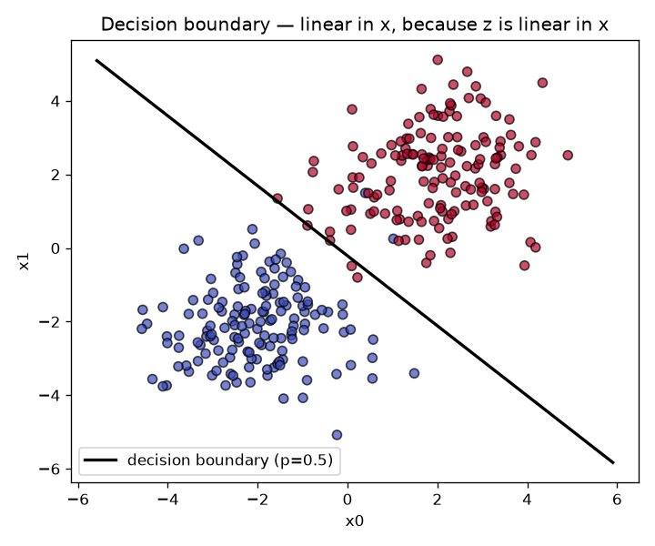
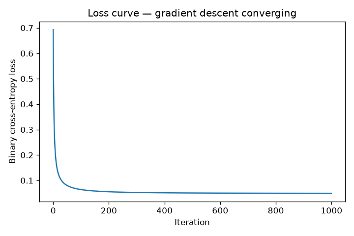
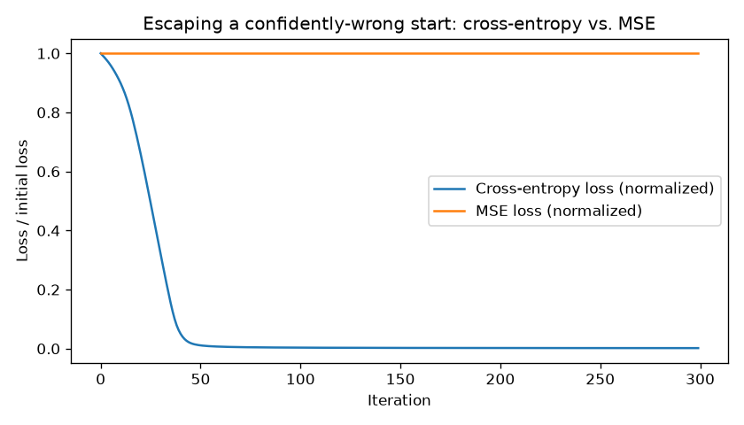

# 02 — Logistic Regression / Classification

> **New to this?** Read sections 1–3 slowly. They assume only project 01 (a linear
> model, a loss, and gradient descent). Every formula is written in words first, then
> in symbols, then shown as the exact line of code that implements it.

## 1. What you'll build

A binary classifier in pure numpy, using the **same gradient-descent skeleton as
project 01** — but for predicting a *category* instead of a number. Two things have to
change, and you'll derive both rather than being handed them.

| Part | What it shows | The evidence |
|---|---|---|
| 1 | A linear model of *log-odds* gives a straight decision boundary | 98.3% accuracy, and the boundary plotted as a literal straight line |
| 2 | Your from-scratch math is correct | Scratch 96.5% vs. scikit-learn 98.2% on real cancer data |
| 3 | MSE is not merely suboptimal here — it **breaks** | Same start, same data: cross-entropy 24.0 → 0.04, MSE 0.987 → 0.987 |

Part 3 is the heart of this project. "Use cross-entropy for classification" is
something you can read anywhere; here you'll watch an MSE-trained model sit completely
frozen for 300 iterations while an otherwise identical model converges, and you'll have
derived beforehand exactly why it happens.

## 2. The core idea

Linear regression outputs an unbounded number. That's wrong for "is this tumor
malignant?", where the answer is 0 or 1 and anything in between should mean a
*probability*. Feeding house-price machinery this task fails in two distinct ways:

1. **The output range is wrong.** $Xw + b$ happily returns $-4.7$ or $12.3$. There is
   no sensible reading of "this tumor is −4.7 malignant." We need to squash the number
   into $(0, 1)$. → §3.1
2. **The scoring is wrong.** Squared error treats a probability estimate like a
   measurement, penalizing symmetrically and gently. But being *confidently wrong*
   about a probability is a far worse failure than hedging, and we want a loss that
   says so. → §3.2

Fix (1) and you get the sigmoid. Fix (2) and you get cross-entropy. Fix both and the
gradient turns out to be almost exactly project 01's.

## 3. The math

### 3.1 The sigmoid, and where it comes from

The model computes the same linear score as before, then squashes it:

$$z = Xw + b \qquad\qquad \hat{y} = \sigma(z) = \frac{1}{1 + e^{-z}}$$

This function maps any real number into $(0,1)$: as $z \to +\infty$, $e^{-z} \to 0$ and
$\sigma \to 1$; as $z \to -\infty$, $e^{-z} \to \infty$ and $\sigma \to 0$; at $z = 0$
it's exactly $0.5$.

But why *this* squashing function and not any other S-shaped curve? Because it's the
inverse of the **log-odds**. The odds of an event with probability $p$ are
$p/(1-p)$ — "3-to-1 on" — and their log is:

$$z = \log\frac{p}{1 - p}$$

Solve that for $p$ and you get $p = 1/(1+e^{-z})$: the sigmoid, exactly. So the honest
description of this model is **not** "linear regression with a squasher bolted on". It
is:

> The **log-odds** of the positive class are a linear function of the features.

That reframing immediately explains something you can see in the plot below. The
decision boundary — where the model switches its answer — is where $p = 0.5$. And
$p = 0.5$ means odds of 1, so $\log(1) = 0$, so the boundary is exactly where:

$$z = w_1x_1 + w_2x_2 + b = 0$$

which is the equation of a **straight line** (a flat hyperplane in higher dimensions).
The probability surface curves smoothly from 0 to 1, but the boundary through it is
perfectly straight — and that's a consequence of the log-odds being linear, not an
approximation.

### 3.2 Cross-entropy, derived from maximum likelihood

We need a loss for probability estimates. Rather than inventing one, ask a precise
question: **which weights make the data we actually observed most probable?**

Treat each label $y_i \in \{0,1\}$ as a coin flip (a Bernoulli trial) whose probability
of coming up 1 is $\hat{y}_i$. The probability of observing the label we actually saw is:

$$P(y_i \mid x_i) = \hat{y}_i^{\,y_i}\,(1 - \hat{y}_i)^{\,1 - y_i}$$

That looks fiddly but it's just a switch, because anything raised to the power 0 is 1.
If $y_i = 1$ the exponents are $1$ and $0$, so the expression collapses to $\hat{y}_i$.
If $y_i = 0$ they are $0$ and $1$, collapsing to $1 - \hat{y}_i$. Either way it returns
the probability the model assigned to whatever actually happened.

Assuming examples are independent, the probability of the **whole dataset** is the
product:

$$L(w,b) = \prod_{i=1}^{n}\hat{y}_i^{\,y_i}(1-\hat{y}_i)^{1-y_i}$$

Products of thousands of numbers below 1 underflow to zero and are painful to
differentiate, so take the log — which is safe, because $\log$ is monotonic, so
whatever maximizes $L$ also maximizes $\log L$. Logs turn products into sums:

$$\log L(w,b) = \sum_{i=1}^{n}\Big[y_i\log\hat{y}_i + (1-y_i)\log(1-\hat{y}_i)\Big]$$

We want to *maximize* this, but optimizers minimize by convention. So negate it, and
average over $n$ to keep the scale independent of dataset size:

$$\boxed{\ J(w,b) = -\frac{1}{n}\sum_{i=1}^{n}\Big[y_i\log\hat{y}_i + (1-y_i)\log(1-\hat{y}_i)\Big]\ }$$

That is **binary cross-entropy**, and notice we didn't choose it — it fell out of
"assume Bernoulli labels and maximize likelihood." Project 01's MSE has the same
pedigree: it's the maximum-likelihood loss when you assume *Gaussian* noise. Picking a
loss is really picking an assumption about how your data was generated.

**Why it punishes confident wrongness so hard:** the loss for a single positive example
is $-\log\hat{y}$. Predict 0.9 and pay $0.105$. Predict 0.1 and pay $2.303$. Predict
0.001 and pay $6.908$. As $\hat{y} \to 0$ the penalty goes to **infinity**. Squared
error, by contrast, can never charge more than 1.

### 3.3 The gradient — and a cancellation that matters

Now differentiate. Two facts first:

$$\frac{d}{d\hat{y}}\log\hat{y} = \frac{1}{\hat{y}} \qquad\qquad \sigma'(z) = \sigma(z)\big(1 - \sigma(z)\big) = \hat{y}(1-\hat{y})$$

(That second one is a genuinely nice property of the sigmoid — its derivative is
computable from its own output, no extra work. Worth deriving once on paper.)

Chain the derivative through $J \to \hat{y} \to z$:

$$\frac{\partial J}{\partial \hat{y}} = -\frac{1}{n}\left[\frac{y}{\hat{y}} - \frac{1-y}{1-\hat{y}}\right]$$

$$
\frac{\partial J}{\partial z} = \frac{\partial J}{\partial \hat{y}}\cdot\frac{\partial \hat{y}}{\partial z}
= -\frac{1}{n}\left[\frac{y}{\hat{y}} - \frac{1-y}{1-\hat{y}}\right]\hat{y}(1-\hat{y})
$$

Multiply the bracket through by $\hat{y}(1-\hat{y})$ — the $\hat{y}$ cancels in the first
term and the $(1-\hat{y})$ cancels in the second:

$$= -\frac{1}{n}\Big[y(1-\hat{y}) - (1-y)\hat{y}\Big] = -\frac{1}{n}\Big[y - y\hat{y} - \hat{y} + y\hat{y}\Big] = -\frac{1}{n}(y - \hat{y})$$

$$\boxed{\ \frac{\partial J}{\partial z} = \frac{1}{n}(\hat{y} - y)\ }$$

**The $\hat{y}(1-\hat{y})$ term vanished completely.** Cross-entropy's derivative
produced exactly the reciprocals needed to cancel the sigmoid's derivative. That
cancellation is the entire reason this pairing is used — and §3.4 shows what happens
when you break it.

Stacked across features:

$$\frac{\partial J}{\partial w} = \frac{1}{n}X^{T}(\hat{y} - y) \qquad\qquad \frac{\partial J}{\partial b} = \frac{1}{n}\sum_i(\hat{y}_i - y_i)$$

**Compare with project 01**, whose gradient was $\frac{2}{n}X^T(\hat{y}-y)$. Same error
term, same $X^T(\cdot)$ structure — only a constant differs (project 01's 2 came from
differentiating a square; there's no square here). Different task, different output
function, different loss, *same shape of gradient*. That's because both are
**generalized linear models**, and "gradient = error × input" is the general pattern
for that whole family. You'll meet it again in backpropagation.

### 3.4 Why MSE fails — the prediction Part 3 tests

Suppose we ignore all of the above and just use squared error on the sigmoid's output,
$J = \frac{1}{n}\sum(\hat{y}-y)^2$. Now the chain rule gives:

$$\frac{\partial J}{\partial z} = \underbrace{(\hat{y} - y)}_{\text{how wrong}} \cdot \underbrace{\hat{y}(1 - \hat{y})}_{\text{sigmoid derivative — survives!}}$$

With no cross-entropy logs to cancel it, that second factor stays. And look at what it
does. When the model is **confidently wrong** — say $\hat{y} = 0.001$ when $y = 1$:

$$\hat{y}(1-\hat{y}) = 0.001 \times 0.999 \approx 0.001$$

The gradient gets multiplied by ~0.001. **The update becomes almost zero at precisely
the moment the model most needs a large correction.** The sigmoid is saturated — flat —
so its derivative is nearly zero, and MSE's gradient inherits that flatness.

Cross-entropy's gradient, $\hat{y} - y$, has no such factor. Confidently wrong gives
$0.001 - 1 = -0.999$: a full-strength correction.

This is called the **vanishing gradient** problem, and it's not a curiosity — it's a
central obstacle in deep learning (projects 06 and 09). The prediction to test: *start
both models from a confidently-wrong position and the MSE model should be unable to
escape.* Part 3 runs exactly that experiment.

## 4. From formula to code

Open [`logistic_regression.py`](logistic_regression.py). The `LogisticRegressionGD`
docstring numbers each formula, and the matching line in `fit()` carries the number.

| # | Formula | Code |
|---|---|---|
| (1) | $z = Xw + b$ | `z = X @ self.weights + self.bias` |
| (2) | $\hat{y} = \sigma(z)$ | `y_hat = self._sigmoid(z)` |
| (3) | $J = -\frac{1}{n}\sum[y\log\hat{y} + (1-y)\log(1-\hat{y})]$ | the `loss = -np.mean(...)` line |
| (4) | $\partial J/\partial z = \hat{y} - y$ | `dz = y_hat - y` |
| (5) | $\partial J/\partial w = \frac{1}{n}X^T(\hat{y}-y)$ | `dw = (1 / n_samples) * (X.T @ dz)` |
| (6) | $w := w - \alpha\,\partial J/\partial w$ | `self.weights -= self.learning_rate * dw` |
| §3.4 | MSE's extra $\hat{y}(1-\hat{y})$ | `dz = error * y_hat * (1 - y_hat)` |

Two implementation details that exist for numerical reasons, not mathematical ones:

- `np.clip(z, -500, 500)` in `_sigmoid` — $e^{-z}$ overflows to `inf` for very negative
  $z$. Clipping changes nothing meaningful (the sigmoid is already 0 or 1 to machine
  precision out there) and avoids warnings.
- `np.clip(y_hat, 1e-12, 1 - 1e-12)` before the log — $\log(0)$ is $-\infty$. Since a
  perfectly confident correct prediction should cost ~0 and a perfectly confident wrong
  one should cost a lot (but finite), nudging away from the exact endpoints keeps the
  loss a real number.

`predict_proba` returns $\hat{y}$ itself — the probability, which is what you want when
confidence matters. `predict` thresholds it at 0.5 to give a hard label. **That
threshold is a choice, not a property of the model** — exercise 2, and the main subject
of project 03.

## 5. The data

Three scenarios, each isolating one idea:

1. **Synthetic 2D blobs** (`run_synthetic_demo`) — two Gaussian clusters. Two
   dimensions specifically so the decision boundary can be *drawn*, letting you see
   the "linear boundary from linear log-odds" claim rather than only deriving it.
2. **Breast cancer diagnosis** (`run_breast_cancer_demo`) — a real scikit-learn
   dataset: 30 features from cell-nucleus measurements, predicting malignant vs.
   benign. Real features, real scale differences (hence standardization), and a real
   asymmetry between error types — missing a malignant tumour is not equivalent to a
   false alarm.
3. **The same blobs from a sabotaged starting point** (`run_loss_comparison_demo`) —
   both models start at identical, deliberately wrong weights pointing away from the
   correct direction, instead of the usual zero-init. Zero-init starts every prediction
   at $p = 0.5$, where the sigmoid is *steepest* and MSE's gradient is healthiest — so
   it would hide the effect. The bad init puts both models deep in saturation, which is
   where the two losses part company.

## 6. Results — what each plot is telling you

### Part 1 — the boundary is a straight line



```
Learned: w=[1.623 1.706], b=0.361
Test accuracy: 0.983
```

The black line is where the model puts $p = 0.5$. It is *exactly* straight — that's
§3.1's claim made visible. The underlying probability surface is a smooth S-shaped
ramp from 0 to 1, yet the set of points where it crosses 0.5 is perfectly flat, because
that set is the solution of the linear equation $z = 0$.

You can read the weights off the picture too: $w = [1.623, 1.706]$ are nearly equal, so
the boundary sits at roughly 45°, meaning both features contribute about equally to
the decision. This is also linear models' great virtue — the parameters are
interpretable in a way a neural network's are not.

### Part 1 — the loss curve



Same shape as project 01's: steep descent, then flattening as the gradient shrinks
toward zero. The y-axis is now cross-entropy rather than MSE, but the mechanics of
gradient descent haven't changed at all — which is the point of reusing the skeleton.

### Part 2 — scratch vs. the real library

```
Method                            Accuracy  Precision   Recall      F1
----------------------------------------------------------------------
Scratch (gradient descent)           0.965      0.986    0.958   0.972
scikit-learn LogisticRegression      0.982      0.986    0.986   0.986
```

Close, but not identical — and the difference is *expected*, not a bug. scikit-learn
defaults to the L-BFGS solver (a second-order method using curvature, not plain
gradient descent) and applies **L2 regularization by default**, which our scratch model
has none of. Exercise 3 adds it and closes most of the gap.

The four metrics are previewed here and explained properly in project 03. For now:
recall 0.958 means the scratch model caught 95.8% of the benign cases, and in a
screening context you'd want to know which class you're measuring and which error is
costlier — a theme project 03 develops at length.

### Part 3 — the experiment: MSE frozen solid



```
Same bad starting point, same learning rate, same data, 300 iterations:
  Cross-entropy loss: 24.032 -> 0.040
  MSE loss:           0.987 -> 0.987
```

This is the payoff. Both curves are normalized to their own starting loss (the two
losses live on different scales, but "fraction of initial loss remaining" is directly
comparable), so both begin at 1.0.

The blue curve collapses to near zero within ~50 iterations. **The orange line is
flat** — not slow, not noisy: visually indistinguishable from horizontal across 300
iterations. The MSE model has not learned anything at all.

Nothing differs between these two runs except the loss function. Same initialization,
same learning rate, same data, same update rule. And §3.4 predicted this before the
code ran: starting deep in saturation, MSE's gradient carries a $\hat{y}(1-\hat{y})$
factor of roughly $0.001$, so every update is a thousandth of the size it needs to be.
The model is confidently wrong and structurally unable to notice.

This is what "the wrong loss function" actually looks like — not slightly worse
accuracy, but a model that cannot train.

## 7. Run it

```bash
cd 02-logistic-regression-classification
python3 -m venv .venv
source .venv/bin/activate
pip install -r requirements.txt
python logistic_regression.py
```

Expect ~98% on Part 1's blobs, mid-to-high 90s for both methods in Part 2, and in
Part 3 a cross-entropy loss falling from ~24 to ~0.04 while MSE stays pinned near
0.987. Writes three plots to `outputs/`.

## 8. Exercises

1. **Find the tipping point.** Part 3's bad init is $w = [-8, -8]$, $b = -2$. Try
   milder ones — $[-2,-2]$, then $[-4,-4]$. At what magnitude does MSE stop being stuck
   and start learning at a comparable rate? This tells you *how* confidently wrong a
   model must be before the vanishing gradient bites. MSE isn't uniformly bad; it's bad
   specifically near saturation.
2. **Move the threshold.** In `run_breast_cancer_demo`, change
   `scratch_model.predict(X_test_scaled)` to use `threshold=0.3`, then `0.7`. Watch
   precision and recall move in opposite directions while the *model itself never
   changes*. Then argue on paper which threshold a cancer screening programme should
   use, and why. (Project 03 shows a case where this choice improves F1 tenfold.)
3. **Add L2 regularization.** Add `+ alpha * self.weights` to `dw` in `fit()` — the
   gradient of adding $\alpha\sum_j w_j^2$ to the loss. Try `alpha=0.1` and `alpha=10.0`
   on the cancer data and watch the scratch model move toward sklearn's numbers, since
   sklearn regularizes by default.
4. **Break the boundary.** In `make_synthetic_2d`, move the cluster centres from
   $[-2,-2]$ and $[2,2]$ to $[-1,-1]$ and $[1,1]$ so the classes overlap. Accuracy
   drops and the boundary plot shows points stranded on the wrong side. No straight
   line can separate overlapping classes — this is what project 01's "irreducible
   error" looks like for classification.
5. **Verify the cancellation numerically.** Pick a single training point, compute
   $\partial J/\partial z$ by hand from §3.3, then compare against a numerical
   derivative: $\big(J(z + 10^{-6}) - J(z - 10^{-6})\big) / (2 \times 10^{-6})$. They
   should agree to ~6 decimals. This is **gradient checking**, and it's the standard
   way to catch a bad derivation before it silently trains a broken model.

## 9. What's next

Both projects so far have reported accuracy, MSE and R² almost in passing — and Part 2
above quietly showed four metrics disagreeing about the same model without explaining
which to trust. Project 03 makes evaluation the subject: why a single train/test split
can lie to you, k-fold cross-validation, the bias-variance decomposition derived and
verified numerically, precision/recall/F1/ROC-AUC in depth, and a demonstration of data
leakage manufacturing 89% accuracy from pure random noise.
