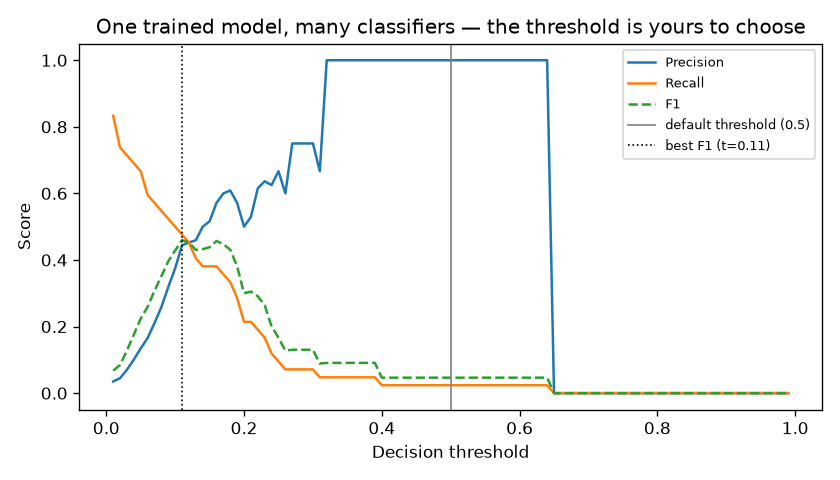
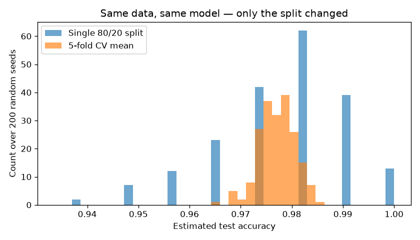
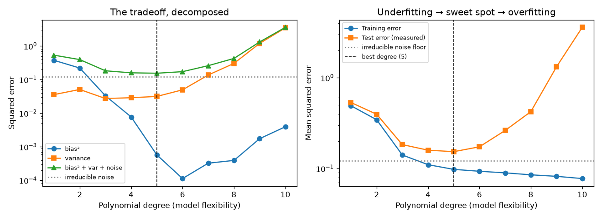
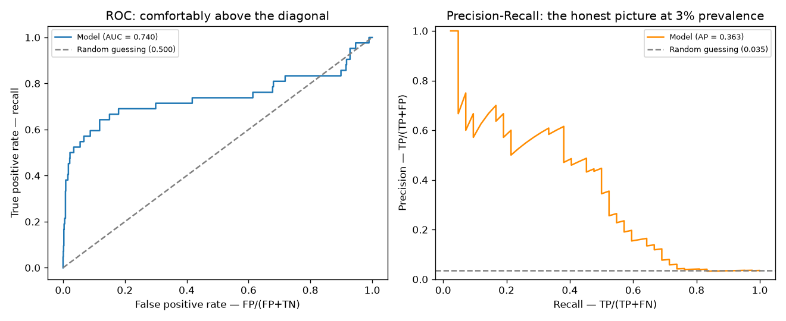
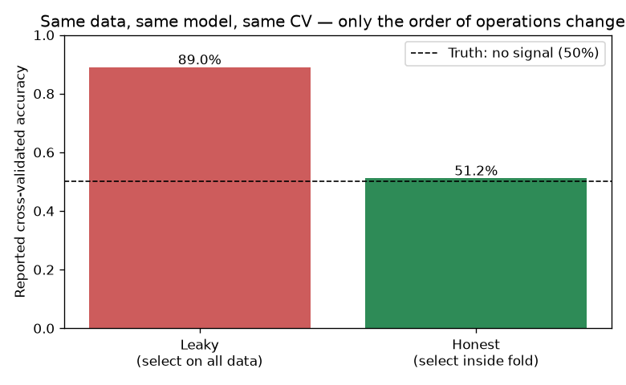

# 03 — Model Evaluation & Validation

> **New to this?** Read sections 1–3 slowly; they assume nothing beyond projects 01
> and 02. Every formula below is written out in words first, then in symbols, then
> shown as the exact line of code that implements it.

## 1. What you'll build

Projects 01 and 02 built models and reported a single number at the end — "R² = 0.87",
"accuracy = 96%" — almost as an afterthought. This project makes that number the
subject, because **the number is where most real machine-learning mistakes live.** A
model that is genuinely broken can report 96.5% accuracy. A model with no signal at
all can be made to report 89%. Both happen below, on purpose, with the numbers printed
so you can see it rather than take my word for it.

You'll implement every metric from scratch (they're all just counting), then run five
experiments:

| Part | The claim | How it's proven |
|---|---|---|
| 1 | Accuracy is misleading on imbalanced data | A model that catches **1 of 42** cancers scores 96.6% |
| 2 | One train/test split is a *noisy measurement* | Same data + model, 200 splits → answers from 93.9% to 100% |
| 3 | Test error = bias² + variance + noise | Computed both sides independently; they agree to 0.004 |
| 4 | ROC-AUC flatters models on rare-event data | ROC says 0.74, precision-recall says 0.36 |
| 5 | Leakage manufactures accuracy from nothing | 5000 columns of **pure random noise** → 89% |

## 2. What is model evaluation, why do we need it, and where does it matter?

### What it is

Model evaluation is **measuring how good a model is — honestly.** Not on the data it
learned from, and not with a number that flatters it.

That sounds trivial. It is the single most common source of serious, expensive mistakes
in applied machine learning, and this whole project is five demonstrations of why.

The core difficulty is a small one that compounds:

```
   your data                 the world
  ┌──────────┐              ┌──────────────────┐
  │ 1,000    │   you must   │  every future    │
  │ examples │ ──────────▶  │  case, forever   │
  │ you have │  generalize  │  (unseen)        │
  └──────────┘              └──────────────────┘
       ▲                              ▲
   you can measure              you actually care
   performance here             about performance HERE
```

You can only measure on the left. You only care about the right. **Every technique in
this project is a way of using the left to make an honest guess about the right.**

### Why we need it — three failures you cannot see without it

1. **A model can memorize instead of learning.** Ask any flexible model to fit 1,000
   examples and it can simply store them, scoring 100% on data it has seen and failing
   on anything new. Measuring on training data doesn't just overstate quality — it
   actively rewards the worst models.
2. **The headline number can be measuring the wrong thing.** In Part 1, a cancer
   detector that finds **1 tumour out of 42** reports 96.6% accuracy and 100%
   precision. Both numbers are correct. Both are useless. You need to know which metric
   answers your actual question.
3. **The measurement itself is noisy.** In Part 2, the same model on the same data
   scores anywhere from 93.9% to 100% depending purely on which rows landed in the test
   set. Report the lucky one and you've misled everyone, without lying.

And underneath all three: **you cannot improve what you cannot measure.** Part 3's
bias-variance decomposition splits your error into causes with *different fixes* — one
says "get a bigger model", the other says "get more data". Guessing wrong wastes months.

### Where it actually matters

- **Anywhere the classes are imbalanced** — fraud, disease, defects, churn. The rarer
  and more important the event, the more accuracy lies to you.
- **Medical and safety-critical models** — a false negative and a false positive have
  wildly different costs, so a single accuracy number is never the right summary.
- **Any published or audited result** — "we achieve 97%" means nothing without knowing
  how it was measured. Part 5 shows an 89% result produced from **pure random noise**
  by a mistake anyone could make.
- **Model selection, everywhere** — choosing between two models, or tuning any
  hyperparameter, is *entirely* an evaluation problem. Every later project in this
  curriculum leans on cross-validation from here on.
- **Kaggle and benchmark leaderboards** — the gap between leaderboard score and real
  performance is almost always a leakage story like Part 5's.

**This is the project that makes the other projects trustworthy.** Nothing here builds a
new model; everything here tells you whether to believe one.

## 3. The core idea

When you report "my model is 96% accurate", you are making a claim about **data the
model has never seen** — future patients, tomorrow's transactions. But you only have
the data in front of you. So every evaluation method in this project is an attempt to
answer one question:

> How do I use data I *have* to estimate performance on data I *don't have*?

Two separate things can go wrong, and it's worth keeping them apart in your head:

1. **You measured the right thing badly** — your estimate is noisy or biased upward.
   That's Parts 2 and 5 (splitting and leakage).
2. **You measured the wrong thing** — the estimate is accurate, but the metric doesn't
   capture what you care about. That's Parts 1 and 4 (accuracy and AUC).

Part 3 sits underneath both: it explains *why* held-out error behaves the way it does,
by splitting it into three pieces that come from three different causes.

---

## 4. The math

### 4.1 Everything starts with four numbers

Take a binary classifier. For each example there are exactly four possible outcomes:
the truth is positive or negative, and you predicted positive or negative. Count how
often each happens and you get the **confusion matrix**:

|  | **Predicted: positive** | **Predicted: negative** |
|---|---|---|
| **Actually positive** | TP — true positive (caught it) | FN — false negative (**missed it**) |
| **Actually negative** | FP — false positive (**false alarm**) | TN — true negative (correctly ignored) |

That's the whole foundation. Every metric below is one ratio of these four counts, and
the *only* thing that distinguishes them is **what you divide by**:

$$
\text{accuracy} = \frac{TP + TN}{TP + TN + FP + FN}
\qquad
\text{precision} = \frac{TP}{TP + FP}
\qquad
\text{recall} = \frac{TP}{TP + FN}
$$

> **Reading them aloud:** *"Accuracy equals TP plus TN, over TP plus TN plus FP plus FN.
> Precision equals TP over TP plus FP. Recall equals TP over TP plus FN."*
>
> | Symbol | Say it | What it means here |
> |---|---|---|
> | $TP$ | "true positive" | Predicted positive, **and it was**. A catch. |
> | $TN$ | "true negative" | Predicted negative, **and it was**. Correctly ignored. |
> | $FP$ | "false positive" | Predicted positive, **but it wasn't**. A false alarm. Also called a *Type I error*. |
> | $FN$ | "false negative" | Predicted negative, **but it was positive**. A miss. Also called a *Type II error* — and usually the one that hurts. |
> | the fraction bar | "over" | Division. In every metric here the numerator is "cases I got right of some kind" and the denominator is "the total I'm measuring against". |
>
> **Memory aid:** the first letter says whether the model was **right** (T) or **wrong**
> (F); the second says what the model **predicted** (P or N). So a "false negative" is
> a *wrong* prediction of *negative* — the model said no, the truth was yes.
>
> **Where they come from:** these are **definitions**, not derivations — but the
> *choice* of denominator is the entire content. Change what you divide by and you've
> changed the question you're asking, as the worked example below makes painfully clear.

Read the denominators, not the numerators — that's where the meaning is:

- **Accuracy** divides by *everything*. "How often am I right?"
- **Precision** divides by *everything I flagged*. "When I raise an alarm, how often is
  it real?" — the metric you care about when false alarms are expensive.
- **Recall** divides by *everything that's actually positive*. "Of the real cases out
  there, how many did I catch?" — the metric you care about when misses are expensive.

Notice that recall's denominator, $TP + FN$, is *fixed by the data* — it's the total
number of real positives, and nothing the model does can change it. That's exactly why
recall can't be gamed by simply predicting "positive" less often.

**A worked example, straight from Part 1's output.** Out of 1200 test cases with 42
real positives, the model produced:

$$TN = 1158, \quad FP = 0, \quad FN = 41, \quad TP = 1$$

$$
\text{accuracy} = \frac{1 + 1158}{1200} = 0.966
\qquad
\text{precision} = \frac{1}{1 + 0} = 1.000
\qquad
\text{recall} = \frac{1}{1 + 41} = 0.024
$$

96.6% accurate. 100% precise. And it **found one cancer out of forty-two.** Accuracy
and precision both look superb; recall is the one telling the truth. This is not a
contrived example — it is what logistic regression does by default on 3% prevalence data.

### 4.2 F1: why the *harmonic* mean

Precision and recall trade off, so people combine them into one number. But why this
strange-looking formula?

$$F_1 = 2 \cdot \frac{\text{precision} \cdot \text{recall}}{\text{precision} + \text{recall}}$$

That's the **harmonic mean**, not the ordinary average. The reason is that the ordinary
average is far too forgiving of a model that abandons one of the two entirely. Compare
the model above (precision 1.0, recall 0.024):

$$
\text{arithmetic mean} = \frac{1.0 + 0.024}{2} = 0.512
\qquad
F_1 = 2\cdot\frac{1.0 \times 0.024}{1.0 + 0.024} = 0.047
$$

The arithmetic mean says "about average — 0.51". $F_1$ says 0.047, which is the honest
verdict on a cancer detector that misses 41 of 42 cases. The harmonic mean is always
dominated by the **smaller** of its inputs, so you cannot buy a good score by maxing
out one metric and sacrificing the other.

### 4.3 The threshold is not part of the model

This trips up nearly everyone. Logistic regression outputs a *probability* $\hat{p}$.
Turning that into a yes/no answer needs a cutoff:

$$\hat{y} = \begin{cases} 1 & \text{if } \hat{p} \ge t \\ 0 & \text{if } \hat{p} < t \end{cases}$$

The default $t = 0.5$ is **a convention, not a result of training.** One trained model
plus many thresholds gives you many different classifiers, with wildly different
precision/recall. Choosing $t$ is a decision about *consequences* — how bad is a miss
versus a false alarm? — and no amount of training data can answer it for you.

### 4.4 Why one split isn't enough — and what k-fold does about it

Hold out 20% as a test set and you get an estimate of test accuracy. But *which* 20%
you happened to hold out is random, so your estimate is a random variable with its own
spread. If the held-out set has $m$ examples and the true accuracy is $p$, the number
correct is roughly binomial, and the standard error of your estimate is:

$$\text{SE} = \sqrt{\frac{p(1-p)}{m}}$$

With $m = 114$ (20% of the breast-cancer dataset) and $p \approx 0.98$, that's about
1.3% — which matches the 1.31% standard deviation actually measured in Part 2. Small
test sets give noisy answers, and the noise is not tiny.

**k-fold cross-validation** fixes this by refusing to waste data. Split the dataset
into $k$ equal folds; train $k$ times, each time holding out a different fold:

```
        fold 1     fold 2     fold 3     fold 4     fold 5
run 1 [  TEST  ][  train  ][  train  ][  train  ][  train  ]
run 2 [ train  ][   TEST  ][  train  ][  train  ][  train  ]
run 3 [ train  ][  train  ][   TEST  ][  train  ][  train  ]
run 4 [ train  ][  train  ][  train  ][   TEST  ][  train  ]
run 5 [ train  ][  train  ][  train  ][  train  ][   TEST  ]
```

Every example is tested exactly once, by a model that never saw it. The reported score
is the average:

$$\text{CV score} = \frac{1}{k}\sum_{i=1}^{k} \text{score}(\text{fold}_i)$$

Averaging $k$ estimates shrinks the noise — Part 2 measures a **3.7× reduction** in
standard deviation. The cost is that you train $k$ models instead of one.

### 4.5 The bias-variance decomposition, derived

This is the most important piece of theory in classical ML, and it's worth doing the
algebra once rather than memorizing the conclusion.

**Setup.** The world generates data as a true function plus random noise:

$$y = f(x) + \varepsilon, \qquad \mathbb{E}[\varepsilon] = 0, \qquad \text{Var}(\varepsilon) = \sigma^2$$

You draw a training set $D$ and fit a model $\hat{f}_D$. Because $D$ is random, $\hat{f}_D$
is random too — a different sample would have given you a different model. Define the
**average model you'd get across all possible training sets**:

$$\bar{f}(x) = \mathbb{E}_D[\hat{f}_D(x)]$$

**What we want** is the expected squared error at a point $x$, averaged over both the
training randomness and the noise in the new test point:

$$\mathbb{E}_{D,\varepsilon}\left[(y - \hat{f}_D(x))^2\right]$$

**Step 1 — split off the noise.** Substitute $y = f(x) + \varepsilon$ and expand:

$$
\mathbb{E}\left[(f + \varepsilon - \hat{f}_D)^2\right]
= \mathbb{E}\left[(f - \hat{f}_D)^2\right] + \mathbb{E}[\varepsilon^2] + 2\,\mathbb{E}\left[\varepsilon\,(f - \hat{f}_D)\right]
$$

The noise $\varepsilon$ on the *new* point is independent of the training set $D$ and has
mean zero, so the cross term vanishes and $\mathbb{E}[\varepsilon^2] = \sigma^2$:

$$= \mathbb{E}_D\left[(f - \hat{f}_D)^2\right] + \sigma^2$$

**Step 2 — add and subtract $\bar{f}$.** This is the standard trick: insert
$-\bar{f} + \bar{f}$, which changes nothing, then expand the square:

$$
\mathbb{E}_D\left[(f - \bar{f} + \bar{f} - \hat{f}_D)^2\right]
= (f - \bar{f})^2 + \mathbb{E}_D\left[(\bar{f} - \hat{f}_D)^2\right] + 2(f - \bar{f})\,\mathbb{E}_D\left[\bar{f} - \hat{f}_D\right]
$$

The last term dies because $\mathbb{E}_D[\hat{f}_D] = \bar{f}$ by definition, so
$\mathbb{E}_D[\bar{f} - \hat{f}_D] = 0$. What's left is the decomposition:

$$
\boxed{\ \underbrace{\mathbb{E}\left[(y - \hat{f}_D(x))^2\right]}_{\text{test error}}
= \underbrace{(f(x) - \bar{f}(x))^2}_{\text{bias}^2}
+ \underbrace{\mathbb{E}_D\left[(\hat{f}_D(x) - \bar{f}(x))^2\right]}_{\text{variance}}
+ \underbrace{\sigma^2}_{\text{noise}}\ }
$$

> **Reading it aloud:** *"The expected squared difference between y and f-hat-D of x
> equals: f of x minus f-bar of x, squared; plus the expectation over D of f-hat-D of x
> minus f-bar of x, squared; plus sigma squared."*
>
> | Symbol | Say it | What it means here |
> |---|---|---|
> | $\mathbb{E}[\cdot]$ | "expectation of" / "expected value of" | The **average over all possible outcomes**, weighted by probability. Read $\mathbb{E}[X]$ as "if I repeated this experiment forever, what would $X$ average out to?" |
> | $\mathbb{E}_D[\cdot]$ | "expectation over D" | Averaging over **all possible training sets** specifically. The subscript names *what* is random. This is the key mental move: imagine re-collecting your data many times. |
> | $f(x)$ | "f of x" | The **true** underlying function — reality, which you never observe directly. |
> | $\hat{f}_D$ | "f-hat sub D" | The model **you fit on training set $D$**. Change $D$ and you get a different $\hat{f}$ — that variability is the whole point. |
> | $\bar{f}(x)$ | "f bar of x" | The **average model** — what you'd get by fitting on every possible training set and averaging the predictions. A **bar** always means "average of". |
> | $\varepsilon$ | "epsilon" | The **noise** — the random part of $y$ that no model can predict. Greek epsilon conventionally denotes a small error term. |
> | $\sigma^2$ | "sigma squared" | The **variance of that noise**: how big it is on average. Here $\sigma$ is a standard deviation (unlike project 02's sigmoid $\sigma$ — same letter, different job). |
> | $\underbrace{\ }_{\text{label}}$ | — | Just a brace labelling which piece is which. Not an operation. |
>
> **Where it comes from:** **fully derived**, in the two steps immediately above, from
> nothing but expanding a square and using $\mathbb{E}[\varepsilon] = 0$. It is an
> *identity* — always exactly true, for every model and dataset — which is why Part 3
> can check it numerically to four decimal places.

**In plain language:**

- **Bias²** — how wrong the *average* model is. High when the model is too rigid to
  represent the truth (a straight line cannot bend into a sine wave). Underfitting.
- **Variance** — how much the model *moves around* when you resample the training data.
  High when the model is flexible enough to chase noise in its particular sample.
  Overfitting.
- **Noise ($\sigma^2$)** — irreducible. It is the randomness in $y$ itself. **No model,
  no amount of data, and no algorithm can ever get below this floor.** If someone claims
  error below $\sigma^2$, they have a leak (see Part 5).

The critical insight is the *tension*: making a model more flexible reduces bias and
increases variance. You are not looking for zero of either — you're looking for the
minimum of their sum.

**This is a theorem, not a metaphor**, and Part 3 checks it numerically: it computes
bias², variance and $\sigma^2$ from one set of formulas, computes the actual measured
error from a completely separate calculation, and confirms they match to within 0.004.

### 4.6 ROC, AUC, and what AUC actually means

Instead of committing to one threshold, sweep *all* of them and plot the result. At
each threshold compute:

$$\text{TPR} = \frac{TP}{TP+FN} = \text{recall} \qquad\qquad \text{FPR} = \frac{FP}{FP+TN}$$

Plotting TPR against FPR traces the **ROC curve**; the area under it is **AUC**. A
random model traces the diagonal (AUC 0.5); a perfect one hugs the top-left (AUC 1.0).

There's a much more useful way to read AUC than "area under a curve":

$$\text{AUC} = P\big(\text{score}(x^+) > \text{score}(x^-)\big) + \tfrac{1}{2}P\big(\text{score}(x^+) = \text{score}(x^-)\big)$$

**AUC is the probability that a randomly chosen positive is ranked above a randomly
chosen negative.** (This equivalence to the Mann-Whitney U statistic isn't obvious;
Part 4 verifies it by sampling 200,000 random positive/negative pairs and counting —
getting 0.7393 against the curve's 0.7402.)

That reading immediately tells you AUC's limitation: it only measures **ranking**. A
model can have perfect AUC while its probabilities are systematically wrong, because
ranking is unchanged by any monotonic distortion of the scores.

**The imbalance trap.** FPR's denominator is $FP + TN$. When negatives massively
outnumber positives, $TN$ is huge, so hundreds of false alarms barely nudge FPR and the
ROC curve stays flatteringly high. Precision, $TP/(TP+FP)$, contains **no $TN$ term at
all** — so the precision-recall curve stays honest. Note also that the PR baseline
isn't 0.5; a random classifier scores the **prevalence** (0.035 here).

For the area under a PR curve, report **average precision**, which sums the actual
achieved precision at each operating point:

$$\text{AP} = \sum_n (R_n - R_{n-1})\, P_n$$

rather than the trapezoid rule, which interpolates between operating points and so
credits the model for classifiers no threshold can actually produce. Part 4 prints both
(0.3634 vs 0.3323) so you can see the gap.

---

## 5. From formula to code

Open [`model_evaluation.py`](model_evaluation.py). Each function's docstring carries a
numbered formula, and the numbers match this table.

| # | Formula | Code |
|---|---|---|
| (1) | TP, TN, FP, FN | `confusion_counts()` |
| (2) | $(TP+TN)/n$ | `accuracy_scratch()` |
| (3) | $TP/(TP+FP)$ | `precision_scratch()` |
| (4) | $TP/(TP+FN)$ | `recall_scratch()` |
| (5) | $2PR/(P+R)$ | `f1_scratch()` |
| (6) | ROC sweep | `roc_curve_scratch()` |
| (7) | PR sweep | `pr_curve_scratch()` |
| (8) | $\int y\,dx$ | `auc_trapezoid()` |
| (8b) | $\sum (R_n - R_{n-1})P_n$ | `average_precision_scratch()` |
| (9) | k-fold index split | `kfold_indices()` |
| (10) | $(f - \bar{f})^2$ | `bias_sq = np.mean((mean_pred - f_true) ** 2)` |
| (11) | $\mathbb{E}_D[(\hat{f}_D - \bar{f})^2]$ | `variance = np.mean(preds.var(axis=0))` |
| (12) | $\sigma^2$ | `noise = TRUE_SIGMA ** 2` |

One implementation detail worth understanding, in `roc_curve_scratch`: rather than
looping over candidate thresholds, it sorts by score descending and takes a cumulative
sum. **Accepting the top $k$ scores as "positive" *is* the classifier whose threshold
equals the $k$-th score** — so one sort plus one `cumsum` evaluates every threshold at
once. Same result, no loop.

## 6. The data

Four datasets, each chosen to isolate one idea:

1. **Synthetic imbalanced data** (Parts 1 and 4) — `make_classification` with
   `weights=[0.97, 0.03]`, i.e. 3% positives, the shape of real fraud, disease, and
   defect data. Imbalance is the setting where accuracy and ROC-AUC mislead, so it has
   to be built in deliberately.
2. **Breast cancer diagnosis** (Part 2) — the same real sklearn dataset as project 02.
   Reused on purpose: you already know what a "normal" score looks like on it, which
   makes the split-to-split variation easier to read.
3. **A synthetic sine wave with known noise** (Part 3) — $f(x) = \sin(1.5x)$ plus
   Gaussian noise with $\sigma = 0.35$. It *must* be synthetic: bias is defined against
   the true function $f$, so verifying the decomposition requires knowing $f$ and
   $\sigma^2$ exactly — which you never do with real data.
4. **Pure noise** (Part 5) — 100 samples, 5000 random features, coin-flip labels. There
   is nothing to learn, by construction. That's the point: any accuracy above 50% is
   measurably a bug in the *procedure*.

## 7. Results — what each plot is telling you

Run the code (section 7) and you'll regenerate all of these.

### Part 1 — one model, many classifiers



Nothing is being retrained here — this is **one fitted model**, swept across thresholds.
Precision (rising) and recall (falling) move in opposite directions by construction:
lowering the bar flags more cases, catching more real positives while accepting more
false alarms. At the default $t = 0.5$, $F_1$ is 0.047. At $t = 0.11$ it's **0.460** —
a ten-fold improvement from changing a number you were free to choose all along. If you
take one practical habit from this project, it's *tune the threshold on validation data*.

### Part 2 — the same experiment, 200 times



Both histograms estimate the same quantity, on the same data, with the same model. The
only difference is the random seed of the split. The single-split distribution (wide)
spans 93.9% to 100%; the 5-fold CV distribution (narrow) is 3.7× tighter. Every point
in the wide histogram is a number someone could honestly report — which is precisely
why a single split is weak evidence, and why "we got 99%" means little without knowing
how it was measured.

### Part 3 — the decomposition, verified



**Left:** bias² (falling) and variance (rising) cross, and their sum plus the noise
floor is U-shaped with a minimum at degree 5. **Right:** the practical consequence —
training error (blue) falls monotonically forever, while test error (orange) turns
upward after degree 5. A model selected by training error would pick the worst option
available. Note both panels are log-scaled, and that test error never drops below the
dotted noise floor at $\sigma^2 = 0.1225$.

The printed table is the actual verification:

```
 deg     bias²   variance    noise   predicted   measured  train err
   1    0.3740     0.0358   0.1225      0.5322     0.5337     0.4917
   5    0.0006     0.0315   0.1225      0.1546     0.1534     0.0980   <- best
  10    0.0039     3.4605   0.1225      3.5869     3.5831     0.0776
```

`predicted` comes from the three decomposition terms; `measured` comes from an entirely
separate calculation against fresh noisy targets. They agree to within 0.004 at every
degree. Watch degree 1 (bias 0.374, variance 0.036 — rigid, consistently wrong) against
degree 10 (bias 0.004, variance 3.46 — flexible, wildly unstable). Same total error
scale, opposite causes, opposite fixes: degree 1 needs a *bigger* model, degree 10
needs *more data* or regularization. Diagnosing which one you have is the whole point.

### Part 4 — two views of the same predictions



Identical model, identical scores, two curves. ROC (left) sits well above its diagonal
baseline at 0.740. PR (right) tells you that at 60% recall you're operating around 40%
precision — most of your alarms are false. The ROC curve isn't *wrong*, it's answering
a different question; on rare-event problems the PR curve is the one that reflects what
using the model would actually feel like.

### Part 5 — accuracy from nothing



The data contains **no signal whatsoever** — random features, coin-flip labels. Truth
is the dashed 50% line. Selecting features on the full dataset and *then*
cross-validating reports **89%**. Moving that identical selection step inside the fold
gives **51%**. Same data, same model, same CV, same number of features — only the
*order of operations* changed.

The mechanism: with 5000 random columns and 100 rows, some columns correlate with the
labels by chance. Picking them using all the labels smuggles the test folds' answers
into the feature set, so the "held-out" folds were never held out. This is the single
most common serious bug in applied ML, and it does not announce itself — it looks like
a great result.

## 8. Run it

```bash
cd 03-model-evaluation-validation
python3 -m venv .venv
source .venv/bin/activate
pip install -r requirements.txt
python model_evaluation.py
```

Takes about 6 seconds and writes five plots into `outputs/`. Expect: Part 1's model to
catch 1 of 42 positives at the default threshold; Part 2's single-split spread of ~6
percentage points; Part 3's predicted-vs-measured columns to agree to ~0.004; Part 4's
scratch metrics to match sklearn exactly; Part 5 to report ~89% on pure noise.

## 9. Exercises

1. **Make accuracy look even better.** In `make_imbalanced`, change `weights` to
   `[0.99, 0.01]`. The do-nothing baseline's accuracy rises toward 99%. At what
   prevalence does the trained model stop beating "always predict negative" *on
   accuracy* while still being obviously more useful? This is the argument for why
   you always report the majority-class baseline alongside your model.
2. **Cost-sensitive thresholds.** In `run_accuracy_paradox_demo`, the threshold is
   chosen by maximizing F1 — which silently assumes a false positive and a false
   negative are equally bad. Write a cost function $C = 10 \cdot FN + 1 \cdot FP$ and
   pick the threshold minimizing it instead. How far does it move? Argue on paper what
   the ratio should be for cancer screening.
3. **Break the polynomial.** Raise the degree cap in `run_bias_variance_demo` from 10
   back to 15 and re-run. Variance explodes past 10⁴ while bias² stays near zero.
   Then raise `n_train` from 30 to 300 and re-run: the explosion largely disappears.
   You've just demonstrated the other lever — variance is reduced by more data, bias
   is not.
4. **Find the leak's breaking point.** In `run_leakage_demo`, reduce `n_features` from
   5000 to 500, then 50. The leaked accuracy falls toward 50%. Why? (Hint: how many
   random columns do you need before one correlates with the labels by chance?) This
   tells you leakage is most dangerous exactly where modern ML lives — wide data.
5. **Nested cross-validation.** Part 5 fixed leakage in feature selection, but the same
   bug applies to hyperparameter tuning: if you pick $C$ for `LogisticRegression` by
   CV and then report that same CV score, the score is optimistically biased. Implement
   an outer CV loop for scoring wrapped around an inner CV loop for tuning, and compare
   the honest outer score against the tuned inner score.
6. **Stratify or not.** Every split in this project passes `stratify=y`, preserving
   class proportions. On the 3%-prevalence data, remove it and re-run Part 2. Some
   folds will contain very few positives — watch recall become erratic across folds.

## 10. What's next

Everything so far has been a straight line: linear regression fits a line, logistic
regression fits a linear boundary. Project 04 moves to models that carve up feature
space in **axis-aligned rectangles** instead — decision trees — and derives entropy and
information gain to explain how a tree decides what to split on. Trees also overfit
enthusiastically, which is where this project's tools start earning their keep: you'll
use cross-validation and the bias-variance framing to explain *why* averaging many
noisy trees (random forests) works so well.
