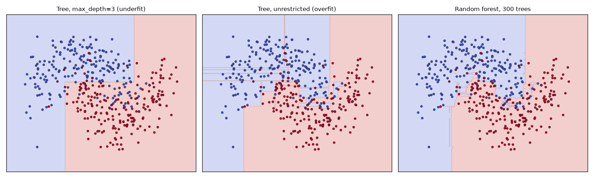
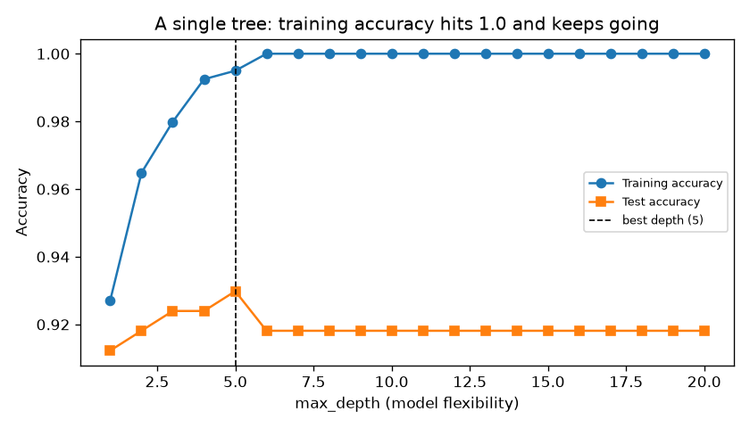
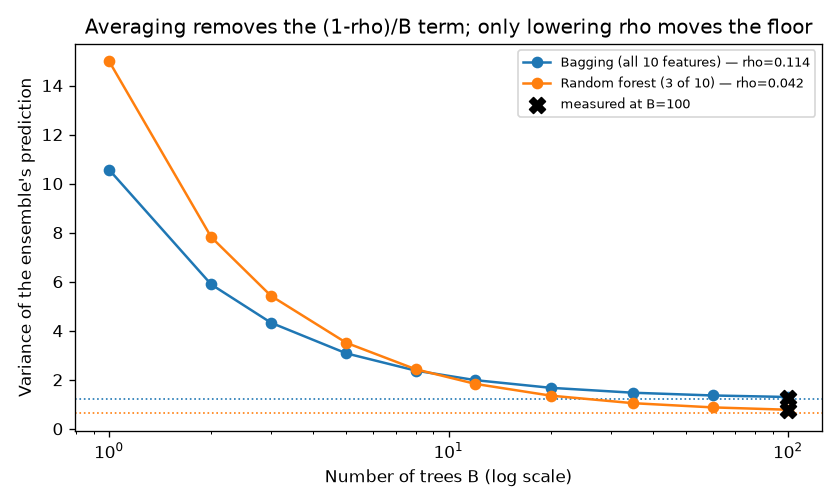
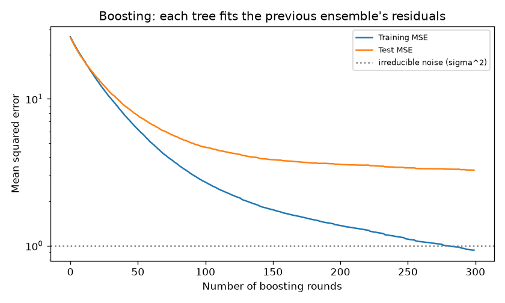

# 04 — Trees & Ensembles

> **New to this?** Sections 1–3 assume nothing. Section 2 explains what a decision
> tree even *is* and where you'd use one, before any mathematics appears.

## 1. What you'll build

A decision tree from scratch on entropy and information gain, then the two fundamentally
different ways of combining many trees — and a measurement of which kind of error each
one actually fixes.

| Part | The claim | How it's proven |
|---|---|---|
| 1 | Trees split on whichever question removes the most uncertainty | The winning split's arithmetic printed: 0.9531 − 0.3949 = **0.5583 bits** |
| 2 | A single tree memorizes its training data | Training accuracy **1.000**, test accuracy 0.918 |
| 3 | Averaging removes variance, but only down to a floor | Formula predicts **1.298** for 100 trees; measured **1.275** |
| 4 | Random forests work by *decorrelating* trees | ρ falls 0.114 → 0.042, variance floor 1.204 → 0.635 |
| 5 | "Fit the residuals" is literally gradient descent | 300 stumps scoring 16.26 each → **3.27** combined |
| 6 | Bagging fixes variance; boosting fixes bias | Measured bias²/variance for all five models |

## 2. What is a decision tree, and why would you use one?

### What it is

A decision tree is **a flowchart of yes/no questions, learned from data.** That's it.
To decide whether a tumour is malignant, it asks something like:

```
                    Is "worst area" <= 887.7 ?
                     /                      \
                  YES                        NO
                   |                          |
     Is "worst concave points"        →  MALIGNANT
       <= 0.146 ?                        (131 of 137 samples here)
        /        \
     YES          NO
      |            |
   BENIGN     Is "texture" <= 25.6 ?
                  /         \
              BENIGN     MALIGNANT
```

Each internal node is a question about one feature. Each leaf is an answer. Predicting
means walking from the top to a leaf. **The learning problem is choosing which
questions to ask, and in what order** — that's what §3 is about.

### Why we need it — what's wrong with what we already have?

Projects 01 and 02 built *linear* models. They were excellent, but they share three
limits that trees don't have:

1. **Linear models assume a straight-line relationship.** Logistic regression's
   decision boundary is a straight line — you saw it plotted in project 02. If the
   truth is "approve the loan if income is high *and* debt is low, *unless* the
   applicant is under 25, in which case require a co-signer", no single line expresses
   that. Trees represent **interactions** and **rules** natively.
2. **Linear models need numerical, scaled input.** Both earlier projects called
   `StandardScaler`, and neither could handle a feature like "city" without extra
   encoding work. A tree just asks `city == "Delhi"?`. It doesn't care about scale at
   all — only about *order* — so standardization is unnecessary.
3. **Linear models give you a coefficient, not a reason.** "Weight = 1.62" is
   interpretable to a statistician. "This loan was declined because debt-to-income was
   above 0.43 and credit history was under 2 years" is interpretable to a customer, a
   regulator, and a judge.

The cost of that flexibility is that trees overfit enthusiastically — Part 2 measures
it — which is exactly why nobody uses one tree alone, and why ensembles (Parts 3–5)
are the real subject of this project.

### Where it's actually used

Tree ensembles — random forests and gradient boosting — are the **default winning
method for tabular data**, which is to say most business data that lives in a database
or spreadsheet:

- **Credit scoring and loan approval** — rules are auditable, and regulators can demand
  an explanation for a decision. A neural network cannot easily provide one.
- **Fraud detection** — interactions matter enormously ("this amount, from this
  country, at this hour, on a card first used yesterday").
- **Medical triage and diagnosis** — a clinician can read the tree and check whether
  its reasoning is medically sensible, which builds justified trust.
- **Ranking search results, ad click prediction, recommendation** — gradient-boosted
  trees (XGBoost, LightGBM) run in production at basically every large tech company.
- **Kaggle competitions on tabular data** — gradient boosting wins the overwhelming
  majority, still, after a decade of deep learning.

**When *not* to reach for a tree:** images, audio, and text. Trees ask questions about
individual features, and "pixel 4,502 > 130" is a meaningless question about a photo.
Those need the models in projects 08–10. The rough rule: **if your data is a table,
start with gradient-boosted trees; if it's a signal, start with a neural network.**

## 3. The core idea

To turn "ask good questions" into an algorithm, you need to make one word precise:
**good**. A good question is one whose answer tells you a lot about the label.

Before the split, the samples at a node are a mixture of classes — uncertain. After
splitting on a good question, each side should be *more* uniform. So we need to
measure "how mixed is this group?", and then pick the split that reduces mixedness the
most. That measure is **entropy**, and the reduction is **information gain**.

## 4. The math

### 4.1 Entropy — measuring uncertainty in bits

$$H(S) = -\sum_{k} p_k \log_2 p_k$$

> **Reading it aloud:** *"H of S equals minus the sum, over every class k, of p-k times
> log-base-two of p-k."*
>
> | Symbol | Say it | What it means here |
> |---|---|---|
> | $H$ | "H" | **Entropy.** The letter is Shannon's, from the related quantity in thermodynamics. Its unit is **bits**. |
> | $S$ | "S" | The **set** of samples sitting at this node of the tree. |
> | $\sum_k$ | "sum over k" | **Add up** the expression once for each class $k$. With two classes (benign, malignant) it means: compute the term for benign, compute it for malignant, add them. |
> | $k$ | "kay" | An index labelling the classes — just a counter, like `for k in classes`. |
> | $p_k$ | "p sub k" | The **proportion** of samples in $S$ belonging to class $k$. If 267 of 426 are benign, $p_{\text{benign}} = 267/426 = 0.627$. All the $p_k$ add to 1. |
> | $\log_2$ | "log base two" | The power you must raise **2** to, to get the input. $\log_2 8 = 3$ because $2^3 = 8$. Base 2 is what makes the unit *bits*. |
> | $-$ (leading) | "minus" | $p_k$ is between 0 and 1, and the log of such a number is **negative**. The leading minus flips the total positive, so entropy is never below zero. |
>
> **Where it comes from:** it's a *definition* — Claude Shannon's, from 1948 — but a
> forced one. He asked what a measure of uncertainty must satisfy (maximal when all
> outcomes are equally likely; zero when one outcome is certain; additive for
> independent events) and proved this formula is the **only** one that does, up to
> choice of base. So it isn't one option among many; it's the answer.

Read it as: **"how many yes/no questions would I need, on average, to learn the label
of a random member of this group?"** Some values worth knowing by heart, and all three
are printed when you run the code:

| Group | $p$ | $H$ | Meaning |
|---|---|---|---|
| `[1,1,1,1]` | 100% one class | **0.000 bits** | No uncertainty. You already know the answer. |
| `[0,0,0,1]` | 75/25 | **0.811 bits** | Fairly predictable — guess the majority and you're usually right. |
| `[0,0,1,1]` | 50/50 | **1.000 bits** | Maximum uncertainty. A coin flip needs exactly one bit. |

Why $\log_2$? Because with $2^b$ equally likely outcomes you need $b$ bits to identify
one — so $\log_2(1/p) = -\log_2 p$ is the "surprise" of an outcome with probability
$p$, and entropy is the *average* surprise. Rare events are surprising; certain events
carry no information.

The convention $0\log_2 0 = 0$ handles empty classes, justified by
$\lim_{p\to 0} p\log_2 p = 0$.

**Gini impurity** is the common alternative:

$$\text{Gini}(S) = 1 - \sum_k p_k^2$$

"Label a random member by drawing a label at random from the group's own distribution
— how often are you wrong?" It behaves almost identically (0.5 and 0.375 for the two
mixed rows above) and avoids computing a logarithm, which is why it's scikit-learn's
default. Exercise 2 checks whether the choice ever matters.

### 4.2 Information gain — scoring a split

$$IG(S, \text{split}) = H(S) - \left[\frac{n_L}{n}H(S_L) + \frac{n_R}{n}H(S_R)\right]$$

> **Reading it aloud:** *"Information gain equals the entropy of S, minus the quantity:
> n-left over n times the entropy of S-left, plus n-right over n times the entropy of
> S-right."*
>
> | Symbol | Say it | What it means here |
> |---|---|---|
> | $IG$ | "I-G" | **Information gain** — bits of uncertainty this question removed. |
> | $S_L,\ S_R$ | "S left, S right" | The two groups the split creates: samples answering **yes** and **no**. The subscript is just a name tag. |
> | $n$ | "n" | How many samples are at this node **before** splitting. |
> | $n_L,\ n_R$ | "n left, n right" | How many land on each side. Always $n_L + n_R = n$. |
> | $\frac{n_L}{n}$ | "n-left over n" | The **fraction** going left — a weight between 0 and 1. |
> | $[\ \cdot\ ]$ | "the quantity" | Brackets for grouping only; subtract the *whole* thing. |
>
> **Where it comes from:** it's not a new idea, just entropy applied twice —
> *before* minus *after*. The only design decision is weighting the children by size
> rather than treating them equally, and §4.2's next paragraph explains why that's
> forced.

**The uncertainty you had, minus the uncertainty you're left with.** The second term is
a *weighted* average over the two children, weighted by how many samples land in each —
and that weighting is essential. A split that peels off 2 perfectly pure samples out of
500 has a beautiful child node and has told you almost nothing.

**Worked example — the real root split, from the code's output.** 426 training samples,
267 benign and 159 malignant:

$$H(\text{parent}) = -\tfrac{267}{426}\log_2\tfrac{267}{426} - \tfrac{159}{426}\log_2\tfrac{159}{426} = 0.9531 \text{ bits}$$

Nearly 1 bit — close to maximum uncertainty. The best question found is
**`worst area <= 887.67`**, which sends 289 samples left (261 benign / 28 malignant)
and 137 right (6 benign / 131 malignant):

$$H(S_L) = 0.4590 \qquad H(S_R) = 0.2594$$

$$
IG = 0.9531 - \left[\frac{289}{426}(0.4590) + \frac{137}{426}(0.2594)\right] = 0.9531 - 0.3949 = \mathbf{0.5583 \text{ bits}}
$$

**One question removed 59% of the uncertainty in the entire dataset.** Both children
are now strongly dominated by one class. That single number is the whole mechanism —
the algorithm tries every feature at every threshold and keeps whichever produces the
largest gain.

### 4.3 Growing the tree: greedy recursive splitting

```
build(samples):
    if samples are pure, or too few, or we're too deep:
        return a leaf predicting the majority class
    find the (feature, threshold) with the highest information gain
    split the samples in two
    return a node with build(left) and build(right)
```

This is the **CART** algorithm. Two properties are worth knowing:

- **It's greedy.** It takes the single best split now and never reconsiders, even
  though a slightly worse split now might enable a much better one later. Finding the
  globally optimal tree is NP-hard, so *every* practical implementation — sklearn's
  included — is greedy.
- **Splits are axis-aligned.** Each question involves one feature, so every boundary is
  perpendicular to an axis. The decision surface is always a union of rectangles, which
  you can see directly in §7's boundary plot. A diagonal boundary must be approximated
  by a staircase.

### 4.4 Why one tree isn't enough

Left unconstrained, `build` splits until every leaf is pure — which it always can,
provided no two samples have identical features and different labels. Perfect training
accuracy, achieved by memorization.

In project 03's language: **a deep tree is a low-bias, high-variance model.** It can
represent almost anything (low bias), but *which* thing it represents swings wildly
with the training sample (high variance). Part 6 measures exactly this: variance 9.105
for an unrestricted tree, versus 1.410 once bagged.

That diagnosis points at the fix. Project 03 showed variance is what **averaging**
reduces. So: build many trees and average them.

### 4.5 Bagging, and the variance formula

**Bagging** = **b**ootstrap **agg**regat**ing**. Draw $B$ bootstrap samples (sample $n$
rows *with replacement* from your $n$ rows, so each draw omits ~37% of the data and
duplicates others), fit one tree on each, average the predictions.

Why does averaging help? For $B$ trees each with prediction variance $\sigma^2$ and
**pairwise correlation $\rho$** between any two, the variance of their average is:

$$\boxed{\ \text{Var}\left(\frac{1}{B}\sum_{b=1}^{B}\hat{f}_b\right) = \rho\sigma^2 + \frac{1-\rho}{B}\sigma^2\ }$$

> **Reading it aloud:** *"The variance of the average of B tree-predictions equals rho
> times sigma-squared, plus one-minus-rho over B, times sigma-squared."*
>
> | Symbol | Say it | What it means here |
> |---|---|---|
> | $\text{Var}(\cdot)$ | "variance of" | **How much a quantity jumps around** when you rerun the experiment — here, when you redraw the training data. Big variance = unreliable model. |
> | $B$ | "B" | The **number of trees** in the ensemble. |
> | $\hat{f}_b$ | "f-hat sub b" | The prediction of **tree number $b$**. The **hat** ( $\hat{\ }$ ) always means *estimated by a model*, versus the unknown truth $f$. |
> | $\frac{1}{B}\sum_b \hat{f}_b$ | "one over B, sum of f-hat-b" | Add up all $B$ predictions and divide by $B$ — i.e. **the average**. That average is what the ensemble outputs. |
> | $\sigma^2$ | "sigma squared" | The **variance of one single tree**. $\sigma$ (lower-case Greek *sigma*) is the standard deviation, so $\sigma^2$ is its square. Same $\sigma^2$ as project 03's noise term — the notation is universal. |
> | $\rho$ | "roh" (Greek *rho*) | The **correlation between two different trees**, from −1 to 1. $\rho = 1$: the trees are identical. $\rho = 0$: they're unrelated. Here it measures **how much the trees make the same mistakes**. |
>
> **Where it comes from:** it is *derived*, in two lines, immediately below — from
> nothing but the standard rule for the variance of a sum. No statistics beyond that
> rule is needed.

Deriving it takes two lines. The variance of a sum is the sum of all covariances — $B$
diagonal terms each $\sigma^2$, and $B(B-1)$ off-diagonal terms each $\rho\sigma^2$:

$$
\text{Var}\left(\frac{1}{B}\sum_b \hat{f}_b\right) = \frac{1}{B^2}\left[B\sigma^2 + B(B-1)\rho\sigma^2\right] = \frac{\sigma^2}{B} + \frac{(B-1)\rho\sigma^2}{B} = \rho\sigma^2 + \frac{1-\rho}{B}\sigma^2
$$

**Now read the two terms, because they behave completely differently:**

- $\dfrac{1-\rho}{B}\sigma^2$ **vanishes as $B \to \infty$.** Adding trees is free
  variance reduction — and unlike nearly every other knob in ML, it cannot overfit.
  More trees is never worse, only slower.
- $\rho\sigma^2$ **contains no $B$ at all.** It is a **hard floor.** Averaging cannot
  remove error that all the trees share. If your trees are highly correlated, adding
  the thousandth changes nothing.

> ⚠️ **A note on how Part 3 tests this.** If you measure $\sigma^2$ and $\rho$ on the
> same trees you then "predict", the formula above is an algebraic identity and
> agreement is guaranteed arithmetic, not evidence. So the code estimates $\sigma^2$
> and $\rho$ from **25 trees**, uses them to predict the variance of a **100-tree**
> ensemble, and then measures that separately. Nothing forces those to match.

### 4.6 Random forests: attack $\rho$, not $B$

Bagged trees stay correlated because they're grown greedily from nearly identical data:
if one feature is strongly predictive, *every* tree splits on it first, so they all make
similar mistakes.

A **random forest** adds one idea: at each split, consider only a random subset of
features (typically $\sqrt{d}$ for classification, $d/3$ for regression). Sometimes the
dominant feature simply isn't available, forcing that tree down a different path. The
trees are *deliberately handicapped* so that they disagree.

The trade is explicit in the formula: $\rho$ falls (good — the floor drops), but
$\sigma^2$ rises (bad — each tree is individually worse). **Whether the trade pays off
is an empirical question, not a theorem** — and on this project's data, Part 6 finds it
does *not*. That's not a bug; it's what the tradeoff looks like when only 5 of 10
features carry signal.

### 4.7 Boosting: fitting what's left over

Bagging builds trees **in parallel** to cancel variance. Boosting builds them
**sequentially** to cancel *bias*. Start with a constant, then repeatedly add a small
tree fit to the current mistakes:

$$F_0(x) = \bar{y} \qquad r_m = y - F_{m-1}(x) \qquad F_m(x) = F_{m-1}(x) + \alpha\, h_m(x)$$

> **Reading it aloud:** *"F-zero of x is y-bar. The residual at round m is y minus
> F-m-minus-one of x. And F-m of x is F-m-minus-one of x, plus alpha times h-m of x."*
>
> | Symbol | Say it | What it means here |
> |---|---|---|
> | $F_m$ | "F sub m" | The **whole ensemble's prediction after $m$ rounds.** Capital $F$ is the running total; $m$ counts rounds, not samples. |
> | $F_0$ | "F zero" | The **starting guess**, before any tree exists. |
> | $\bar{y}$ | "y bar" | The **mean of all training targets**. A **bar** over a letter always means "average of". Predicting the mean is the best you can do knowing nothing. |
> | $r_m$ | "r sub m" | The **residual** — what's still wrong after $m-1$ rounds. Literally "what's left over". |
> | $h_m$ | "h sub m" | The **new small tree** added at round $m$. Lower-case $h$ for a *weak* learner, capital $F$ for the strong ensemble — a standard convention. |
> | $\alpha$ | "alpha" | The **learning rate** (typically 0.01–0.1). Exactly the same $\alpha$ as project 01: how big a step to take. |
> | $x$ | "x" | The input features of whichever sample you're predicting. |
>
> **Where it comes from:** the *form* is a definition (start somewhere, repeatedly add
> a correction), but the crucial choice — fitting the new tree to the **residuals** —
> is *derived* immediately below, and turns out to be forced by calculus rather than
> chosen.

where $h_m$ is a shallow tree fit to the residuals $r_m$.

"Fit the residuals" sounds like a heuristic. It isn't. Take the squared-error loss for
one point, $L = \tfrac{1}{2}(y - F)^2$, and differentiate **with respect to the
prediction $F$ itself**:

$$\frac{\partial L}{\partial F} = -(y - F) \qquad\Longrightarrow\qquad -\frac{\partial L}{\partial F} = y - F = r$$

> **Reading it aloud:** *"The partial derivative of L with respect to F equals minus
> the quantity y minus F. Therefore minus that derivative equals y minus F, which is
> the residual."*
>
> | Symbol | Say it | What it means here |
> |---|---|---|
> | $L$ | "L" | The **loss** for a single point — how wrong this one prediction is. |
> | $\partial$ | "partial" (or "del") | A **derivative** taken while holding everything else fixed. The curly $\partial$ rather than $d$ signals there are several variables in play. Read $\frac{\partial L}{\partial F}$ as *"if I nudge $F$ slightly, how much does $L$ move?"* |
> | $\Longrightarrow$ | "therefore" | Logical consequence — the next statement follows from the previous. |
> | $\frac{1}{2}$ (in $L$) | "one half" | Pure convenience: differentiating the square brings a 2 down, and the $\tfrac12$ cancels it. Changes nothing else. |
>
> **Where it comes from:** ordinary calculus — the chain rule on $\tfrac12(y-F)^2$,
> the same move as project 01 §4.3. The *surprise* isn't the derivative, it's what it
> equals: the residual you were already fitting.

$$\boxed{\ \text{the residual IS the negative gradient}\ }$$

So $F_m = F_{m-1} + \alpha \cdot (\text{negative gradient})$ is **exactly the gradient
descent update from project 01** — with one difference. Projects 01 and 02 stepped in
the space of *parameters* ($w$ and $b$). Boosting steps in the space of *functions*: the
"parameter" being updated is the whole prediction function, and each tree is one step
downhill. Hence *gradient* boosting. And $\alpha$ is the learning rate, playing exactly
the role it did in project 01.

This also explains why the trees are deliberately **weak** (depth 1–3). Each is one
small step; you want many small steps, not a few large ones — the same reason project
01's learning rate had to be small.

## 5. From formula to code

Open [`trees_and_ensembles.py`](trees_and_ensembles.py).

| # | Formula | Code |
|---|---|---|
| (1) | $H(S) = -\sum p_k\log_2 p_k$ | `entropy()` |
| (2) | $\text{Gini} = 1-\sum p_k^2$ | `gini()` |
| (3) | $IG = H(S) - \sum\frac{n_c}{n}H(S_c)$ | `information_gain()` |
| — | greedy recursive splitting | `DecisionTreeScratch._build()` |
| — | try every (feature, threshold) | `DecisionTreeScratch._best_split()` |
| — | $\rho\sigma^2 + \frac{1-\rho}{B}\sigma^2$ | `_ensemble_variance_study()` |
| (4) | $F_m = F_{m-1} + \alpha h_m(r_m)$ | `GradientBoostingScratch.fit()` |

One implementation detail: `_candidate_thresholds` only considers midpoints *between
distinct observed values*, since no other cut separates the samples differently — and
subsamples those to 32 quantiles per feature so that split-finding doesn't dominate the
runtime. sklearn does the same thing on large inputs. This is why the scratch tree and
sklearn's give *close* but not identical results.

## 6. The data

1. **Breast cancer diagnosis** (Parts 1–2) — the same real sklearn dataset as projects
   02 and 03, so you can compare a tree's behaviour against models you already know.
2. **Two moons** (Part 2's plot) — two interleaving crescents. Chosen because the true
   boundary is *curved*, which is precisely what axis-aligned splits struggle to draw.
3. **Friedman #1** (Parts 3–6) — a synthetic regression benchmark:

   $$y = 10\sin(\pi x_1x_2) + 20(x_3-0.5)^2 + 10x_4 + 5x_5 + \varepsilon$$

   with 10 features of which **only 5 appear in the formula** — the other 5 are pure
   noise. Synthetic on purpose for two reasons: bias is defined against the true
   function, so the decomposition needs $f$ known exactly; and the useless features are
   what make `max_features` a genuinely interesting choice.

## 7. Results — what each plot is telling you

### Part 2 — what a tree's decision surface actually looks like



Three models on the same two-moons data. **Left:** depth 3 — you can literally count the
splits, and the boundary is three or four rectangles. Too rigid to follow the crescents.
**Middle:** unrestricted — note the thin horizontal slivers reaching out to capture
individual points. Each one is a rule invented to memorize a single noisy sample, and
none will generalize. **Right:** 300 trees averaged — still built from axis-aligned
rectangles, but averaging hundreds of slightly different staircases produces a smooth,
sensible boundary. That's variance reduction, visible to the eye.

### Part 2 — memorization, measured



```
 depth   train acc   test acc   leaves
     1      0.9271     0.9123        2
     3      0.9799     0.9240        7
     5      0.9950     0.9298       14      <- best test accuracy
     6      1.0000     0.9181       16
    20      1.0000     0.9181       16
```

Training accuracy reaches **exactly 1.000** at depth 6 and stays there: the tree has
carved the training set into pure leaves and cannot be wrong about data it has already
seen. Test accuracy peaks at depth 5 and then *drops*. This is project 03's U-curve
with depth as the flexibility knob instead of polynomial degree — the same phenomenon in
a completely different model family, which is the point of having learned it as a
principle rather than a fact about polynomials.

### Parts 3 & 4 — the variance floor



```
Ensemble                         sigma^2     rho    floor  predicted  measured
Bagging (all 10 features)         10.567   0.114    1.204      1.298     1.275
Random forest (3 of 10)           14.992   0.042    0.635      0.778     0.779
```

The curves are the formula; the dotted lines are the $\rho\sigma^2$ floors; the black
X's are the directly measured variances at $B = 100$. Predicted **1.298** vs. measured
**1.275** for bagging, and **0.778** vs. **0.779** for the forest — from parameters
estimated on a quarter as many trees.

Both curves fall steeply and then flatten onto their floors. Going from 1 tree to 20
buys almost everything; going from 60 to 100 buys almost nothing. **The floor is set
entirely by $\rho$**, which is why the forest's curve flattens lower.

Notice the honest cost in the table: the forest's $\sigma^2$ is *higher* (14.99 vs
10.57). Each individual random-forest tree is **worse** than each bagged tree, because
it's sometimes denied the feature it wanted. It wins on correlation and loses on
individual quality.

### Part 5 — boosting



```
A single depth-2 tree (the weak learner)        16.2583
Scratch gradient boosting (300 x depth-2)        3.2716
sklearn GradientBoostingRegressor                3.2696
Irreducible noise floor (sigma^2)                1.0000
```

A depth-2 tree is nearly useless alone — three splits to model a five-variable
nonlinear function, scoring 16.26 against a noise floor of 1.00. Add 300 of them, each
fit to what the previous ones got wrong, and error falls to **3.27**, most of the way to
the floor. The scratch implementation matches sklearn to three decimal places (3.2716
vs 3.2696), which is the correctness check for §4.7's derivation.

In the plot, both curves fall steeply then flatten, with test error staying slightly
above training error. Unlike bagging, boosting **can** overfit if run too long — each
round deliberately increases model complexity — which is why `n_estimators` is a
hyperparameter you tune (with cross-validation, per project 03) rather than crank.

### Part 6 — which error does each ensemble actually fix?

```
Model                              bias²   variance    noise     total
Single tree (unrestricted)         3.839      9.105    1.000    13.944
Single tree (max_depth=3)          6.899      5.138    1.000    13.037
Bagging (50 trees)                 4.182      1.410    1.000     6.593
Random forest (50, 3 feats)        5.560      0.976    1.000     7.536
Boosting (300 x depth-2)           1.775      1.170    1.000     3.945
```

This table is the entire project in five rows, using project 03's decomposition as a
measuring instrument.

- **Unrestricted tree**: bias 3.84, variance **9.11**. Variance is 70% of its error.
  The diagnosis is unambiguous, and it tells you the fix must be an averaging method.
- **Depth-3 tree**: variance nearly halves, bias nearly doubles. The same model family
  moved along the tradeoff by one hyperparameter.
- **Bagging**: bias essentially unchanged (3.84 → 4.18 — averaging doesn't change the
  *expected* model), variance cut **6.5×**. Total error halves. Textbook.
- **Random forest**: variance falls further still (1.41 → 0.98, exactly as $\rho$
  predicted) — **but its total error is worse than plain bagging** (7.54 vs 6.59),
  because bias rose from 4.18 to 5.56. With only 5 of 10 features carrying signal,
  showing each split just 3 random features often hides all the useful ones.
  **Decorrelation is not free.** `max_features` is a hyperparameter to tune, not a free
  win, and the textbook claim "random forests beat bagging" is a statement about typical
  datasets, not a law. Exercise 4 sweeps it.
- **Boosting**: the lowest bias by far (1.78) *and* low variance, winning overall —
  built entirely from depth-2 stumps too weak to use individually.

**Bagging is a variance fix. Boosting is a bias fix.** Measure which term dominates
your error, then pick accordingly. That's the practical payoff of project 03.

## 8. Run it

```bash
cd 04-trees-and-ensembles
python3 -m venv .venv
source .venv/bin/activate
pip install -r requirements.txt
python trees_and_ensembles.py
```

Takes about 15 seconds and writes four plots to `outputs/`.

## 9. Exercises

1. **Read a real tree.** After Part 1, add
   `from sklearn.tree import export_text; print(export_text(sk, feature_names=list(data.feature_names)))`.
   Follow one path from root to leaf and translate it into a sentence a doctor could
   read. This is the interpretability §2 promised — check that it's real.
2. **Does entropy vs. Gini matter?** Run Part 1's scratch tree with
   `criterion="gini"`. Compare accuracy and the chosen root split. They almost always
   agree; the two curves differ meaningfully only when classes are extremely imbalanced.
   Now you know why sklearn's default is the cheaper one.
3. **Watch bagging fail to help.** Set `max_depth=3` on the base estimator inside
   `BaggingRegressor` in Part 6. Variance was already low, so bagging buys almost
   nothing while bias stays high. Averaging only fixes variance — it cannot rescue a
   model that's too rigid.
4. **Find where the forest wins.** In Part 6, sweep `max_features` over
   `[0.2, 0.3, 0.5, 0.7, 1.0]` and print bias² and variance for each. You should see
   bias rise and variance fall monotonically, with total error minimized somewhere in
   between. Then raise the number of *informative* features in `sample_friedman` (the
   Friedman function uses only the first 5) — with fewer useless features, does
   aggressive subsampling become more or less attractive?
5. **Break boosting with a big learning rate.** In Part 5, set `learning_rate=1.0` and
   watch the test curve turn upward while training error keeps falling. Then try
   `0.01` with `n_estimators=300` — underfit. This is project 01's learning-rate
   tradeoff in a new setting; the mechanism is identical because the update is.
6. **Verify the gradient claim numerically.** For squared loss, §4.7 claims the
   residual equals the negative gradient. Confirm it: pick a point, compute
   $\big(L(F + 10^{-6}) - L(F - 10^{-6})\big)/(2\times10^{-6})$, and check it equals
   $-(y - F)$. Then work out what the residual would be for *absolute* error instead —
   this is how boosting generalizes to other losses.

## 10. What's next

Every model so far has been **supervised**: each example came with a label, and the goal
was predicting it. Project 05 removes the labels entirely. Without a target to fit,
what does "learning" even mean? You'll derive k-means from its objective function and
prove why its two alternating steps must converge, derive PCA from the eigenvectors of
the covariance matrix, and verify numerically that PCA's reconstruction error equals
exactly the sum of the eigenvalues you discarded.
