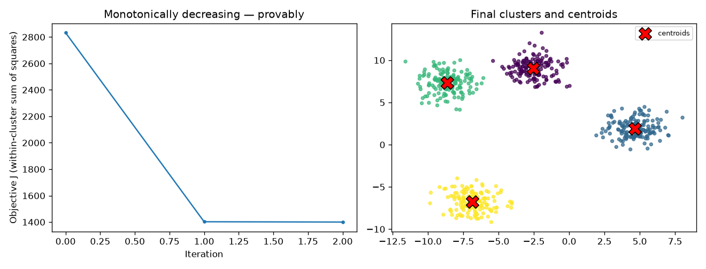
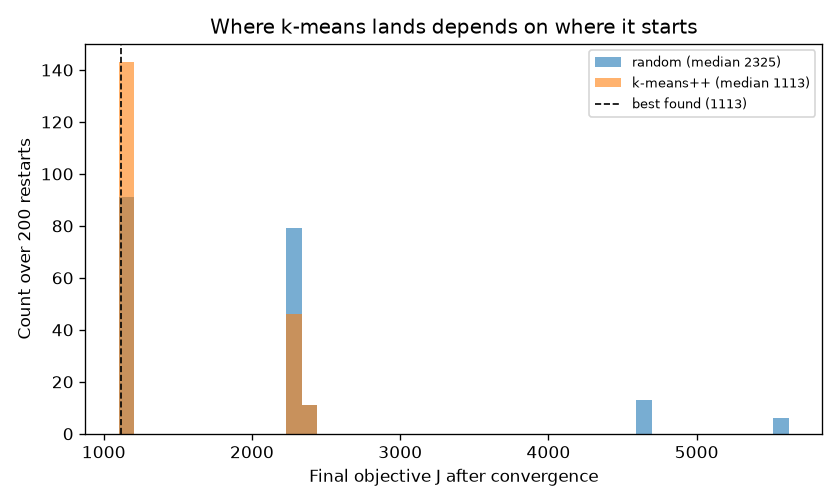
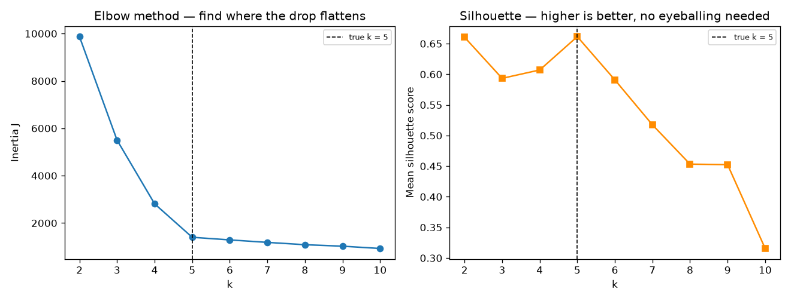
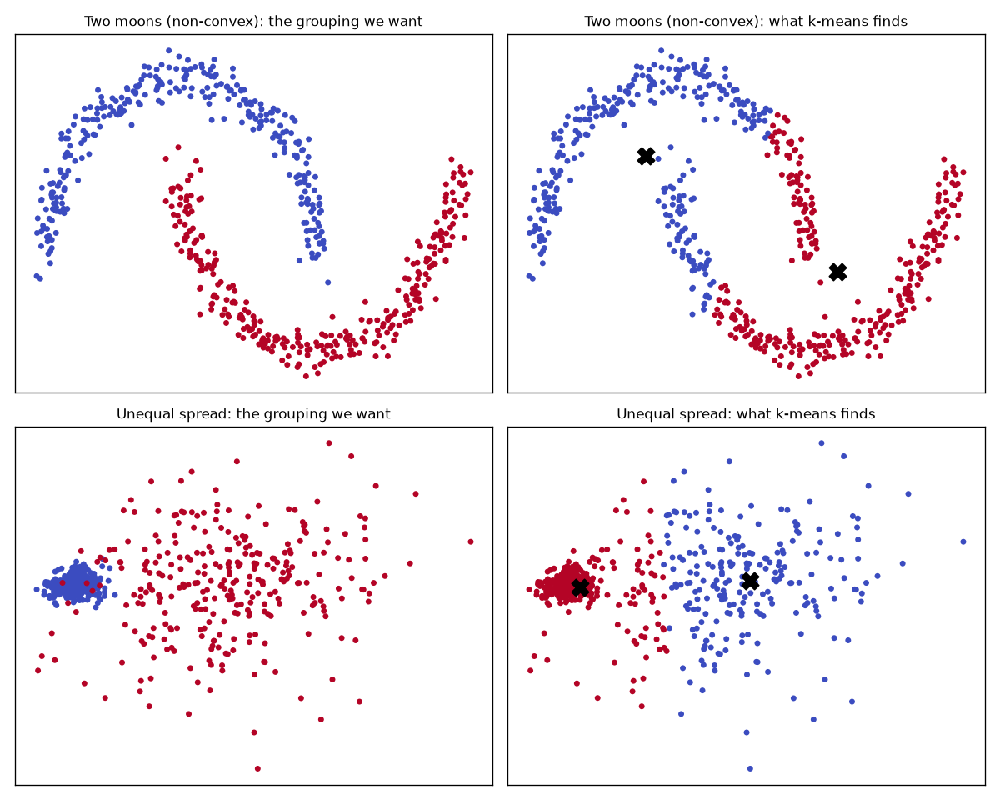
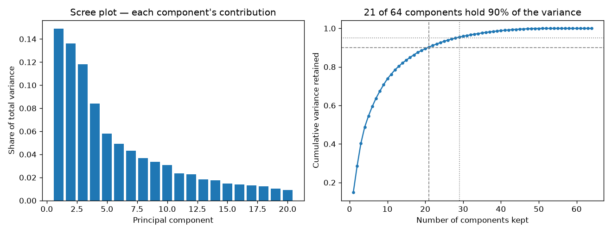
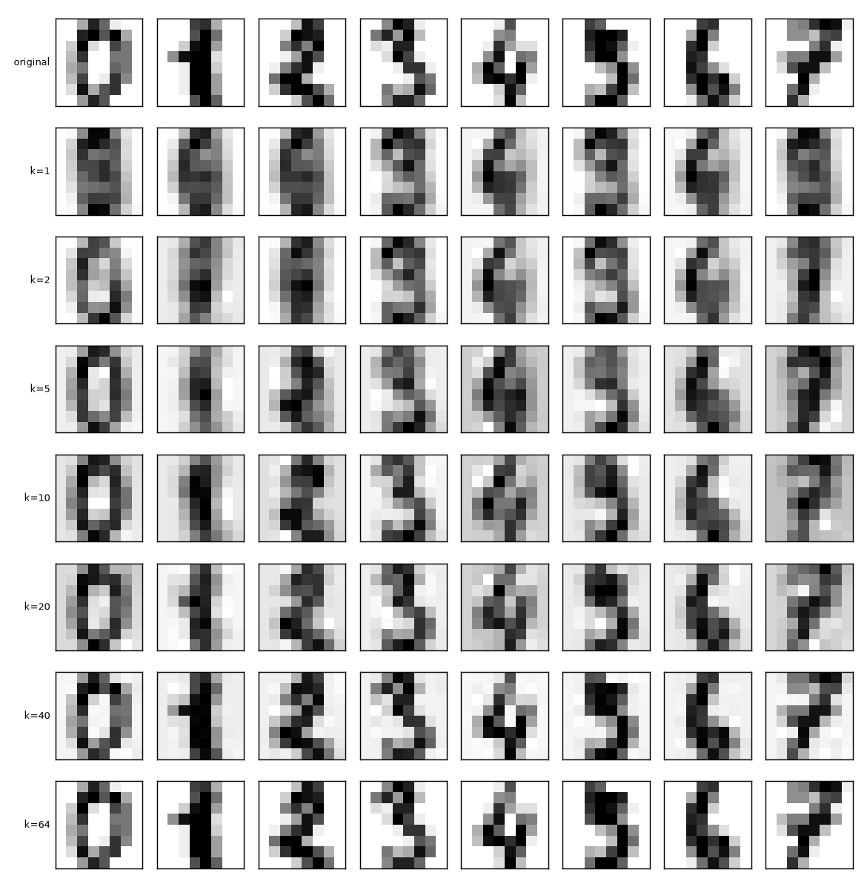

# 05 — Clustering & Dimensionality Reduction

> **New to this?** Section 2 explains what unsupervised learning even *means* before
> any mathematics appears. Every equation in §4 and §5 comes with a table explaining
> each symbol and where the equation came from.

## 1. What you'll build

k-means and PCA, both from scratch, both derived from their objective functions rather
than presented as recipes. This is the first **unsupervised** project — no labels
anywhere.

| Part | The claim | How it's proven |
|---|---|---|
| 1 | k-means provably cannot make its objective worse | J: 2832 → 1402 → 1400, **0 of 2 steps increased**; matches sklearn exactly |
| 2 | It converges to a *local* minimum, and that costs you | Random init stuck in a worse solution **54.5%** of 200 restarts |
| 3 | You can pick k without ever seeing a label | Silhouette peaks at **k = 5**, the true number |
| 4 | k-means fails on whole shapes of data, by design | ARI **0.242** on two crescents |
| 5 | PCA's directions are eigenvectors of the covariance | Matches sklearn to 6 decimals; **21 of 64** components hold 90% of variance |
| 6 | PCA is the *best possible* linear projection | **0 of 500** random projections beat it; best was 3.0× worse |
| 7 | Most of your dimensions are redundant | Digits stay clusterable on 10 of 64 dimensions |

## 2. What is unsupervised learning, and why would you use it?

### What changed

Every project so far was **supervised**: each example came with the right answer
attached — a house price, a diagnosis — and learning meant reducing the gap between
your prediction and that answer.

**Unsupervised learning removes the answers.** You get $X$ and no $y$. Which raises an
awkward question: if there's no right answer, what does "learning" even mean, and how
could you possibly be wrong?

The resolution is that you replace "match the labels" with **an objective you can
compute from the data alone**:

- **Clustering** — group the rows so that members of a group are similar to each other.
  You can measure "similar" without any labels.
- **Dimensionality reduction** — describe each row with fewer numbers while losing as
  little information as possible. You can measure "information lost" by trying to
  rebuild the original and seeing how close you get.

Both are still optimization. Only the objective changed.

### Why we need it

**Because labels are expensive and data isn't.** A radiologist charges for every scan
they annotate; a server logs a million events for free. Most data in the world has no
labels, and unsupervised methods are the ones that work on it.

Four concrete jobs:

1. **Discovering structure nobody specified.** "Do our customers fall into natural
   groups?" — there's no ground truth to supervise against, because the segments don't
   exist until you find them.
2. **Compression.** 64 pixels → 20 numbers, losing almost nothing (Part 7). Less
   storage, faster models, less overfitting.
3. **Visualization.** You can't plot 64 dimensions. You can plot 2. Reducing to 2–3
   dimensions is often the fastest way to *see* what's in a new dataset.
4. **Preprocessing for supervised models.** High-dimensional data breaks
   distance-based methods (the "curse of dimensionality"). PCA first, model second —
   Part 7 shows clustering actually improving after most dimensions are thrown away.

### Where it's actually used

- **Customer segmentation** — group buyers by behaviour, then market to each group.
- **Anomaly and fraud detection** — cluster normal activity; whatever sits far from
  every cluster is worth a look. Critically, this works for *novel* fraud, which a
  supervised model trained on known fraud would miss.
- **Recommendation** — group users with similar taste; recommend what their neighbours
  liked.
- **Image and signal compression** — the direct application of Part 7.
- **Genomics** — thousands of gene-expression measurements per patient, no labels;
  clustering finds disease subtypes that were previously unknown.
- **Preprocessing for the rest of this curriculum** — PCA's "represent data in fewer,
  more meaningful dimensions" is the direct ancestor of **embeddings** in project 12,
  which are how RAG and every modern LLM application represent meaning.

**When *not* to use it:** if you have labels and a specific question, supervise. A
classifier trained on labelled fraud will beat clustering at catching *known* fraud
every time. Unsupervised methods answer "what's in here?", not "is this one bad?"

### A warning that matters

Clustering **always returns clusters.** Ask for 5 groups in pure random noise and you
will get 5 groups, each with a centre and a tidy boundary. The algorithm cannot tell
you whether the structure it found is real. That is why Part 3's tools — and honest
scepticism — matter more here than in supervised work, where a test set keeps you
honest automatically.

---

## 3. The core idea

**k-means** answers "which rows belong together?" by proposing that each group has a
centre, and every point belongs to the nearest one. Learning means placing the centres
so that points are, on the whole, close to their own centre.

**PCA** answers "which directions matter?" by noticing that real data rarely fills its
space. Height and weight are correlated, so two-dimensional data really lies near a
one-dimensional line. PCA finds the directions the data actually varies along and
discards the rest.

The common thread: **both define a number to minimize, then minimize it.** Same shape
of problem as projects 01–04; only the objective is different.

## 4. The math of k-means

### 4.1 The objective

$$J = \sum_{i=1}^{n}\left\lVert x_i - \mu_{c_i} \right\rVert^2$$

> **Reading it aloud:** *"J equals the sum, over every data point i, of the squared
> norm of x-i minus mu-sub-c-i."*
>
> | Symbol | Say it | What it means here |
> |---|---|---|
> | $J$ | "J" | The **objective** (also called *inertia* or *within-cluster sum of squares*). Lower is better. The same letter used for the loss in projects 01–02 — deliberately, it plays the same role. |
> | $\sum_{i=1}^{n}$ | "sum from i equals 1 to n" | Add the term up once **for every data point**. |
> | $x_i$ | "x sub i" | Data point number $i$ — a vector, e.g. a customer's (age, spend). |
> | $c_i$ | "c sub i" | **Which cluster point $i$ is assigned to** — a number from 1 to k. |
> | $\mu$ | "mew" (Greek *mu*) | A **centroid** — the centre of a cluster. Greek $\mu$ is the standard symbol for a mean, and §4.2 proves a centroid really is a mean. |
> | $\mu_{c_i}$ | "mu sub c sub i" | The centroid **of the cluster that point $i$ belongs to**. Nested subscripts read outward: find $i$'s cluster, then take that cluster's centre. |
> | $\lVert \cdot \rVert$ | "norm of" | **Length of a vector** — ordinary straight-line distance. $\lVert a - b\rVert$ is the distance between $a$ and $b$. |
> | $\lVert \cdot \rVert^2$ | "norm squared" | That distance, squared. Squared for exactly project 01's reasons: it's differentiable, and it punishes far-away points more. |
>
> **Where it comes from:** this is a **definition** — we're choosing what "good
> clustering" means. But it's a considered choice, and §7 (Part 4) shows precisely what
> it costs: because $J$ only ever measures distance to a centre, k-means can only find
> round, similarly-sized blobs. The objective *is* the assumption.

In words: **for every point, measure how far it is from its own cluster's centre;
square it; add them all up.** Tight clusters make $J$ small.

Two unknowns must be chosen together: the assignments $c_i$ and the centres $\mu_k$.
Trying every possible assignment is impossible (there are roughly $k^n$ of them), so
k-means alternates — fix one, optimize the other, repeat.

### 4.2 The two steps, and why they can't fail

**Assignment step** — hold the centres fixed, choose the best assignments:

$$c_i \leftarrow \arg\min_k \left\lVert x_i - \mu_k \right\rVert^2$$

> | Symbol | Say it | What it means here |
> |---|---|---|
> | $\arg\min_k$ | "arg min over k" | **The $k$ that makes the expression smallest** — not the smallest value, but *which one* achieves it. `np.argmin` is exactly this. |
> | $\leftarrow$ | "gets" | Assignment, as in code. |
>
> **Where it comes from:** it's forced. $J$ is a sum of independent per-point terms, so
> to minimize the total you minimize each term separately — and each point's term is
> smallest when it picks its nearest centre. No calculus needed.

**Update step** — hold the assignments fixed, choose the best centres:

$$\mu_k \leftarrow \frac{1}{|S_k|}\sum_{i \in S_k} x_i$$

> | Symbol | Say it | What it means here |
> |---|---|---|
> | $S_k$ | "S sub k" | The **set of points currently assigned** to cluster $k$. |
> | $i \in S_k$ | "i in S-k" | $\in$ means **"is a member of"**. Sum over the points in that cluster. |
> | $\lvert S_k\rvert$ | "size of S-k" | **How many points** are in the cluster. Bars around a set mean its count. |
>
> **Where it comes from:** *derived*, and it's the reason the algorithm is called
> k-**means**. Fix the assignments and differentiate $J$ with respect to one centre:
>
> $$\frac{\partial}{\partial \mu_k}\sum_{i\in S_k}\lVert x_i - \mu_k\rVert^2 = -2\sum_{i \in S_k}(x_i - \mu_k) = 0$$
>
> $$\Longrightarrow \sum_{i\in S_k} x_i = |S_k|\,\mu_k \Longrightarrow \mu_k = \frac{1}{|S_k|}\sum_{i\in S_k}x_i$$
>
> The mean isn't a sensible-looking choice — **it is the unique minimizer**. Using the
> median instead would minimize a different objective (that's k-medians).

**Why convergence is guaranteed.** Each step minimizes the *same* $J$ while holding the
other variable fixed, so neither can ever increase it. $J$ is therefore non-increasing
and bounded below by 0. And since there are only finitely many ways to partition $n$
points into $k$ groups, the algorithm cannot decrease forever — it must stop.

That's a genuine proof, and Part 1 confirms the implementation obeys it: **0 of 2 steps
increased $J$**.

### 4.3 What the proof does *not* give you

Convergence to a **local** minimum is guaranteed. Reaching the **global** minimum is
not. Where you land depends entirely on where you started — Part 2 measures the damage.

**k-means++** fixes most of it. Pick the first centre at random; then pick each
subsequent centre with probability proportional to $D(x)^2$, the squared distance from
$x$ to the nearest centre already chosen. Distant points are far likelier to be chosen,
so the initial centres start spread out rather than clumped in one dense region.

## 5. The math of PCA

### 5.1 The setup

$$\text{centre: } X_c = X - \bar{x} \qquad\qquad \text{covariance: } C = \frac{1}{n}X_c^{T}X_c$$

> | Symbol | Say it | What it means here |
> |---|---|---|
> | $\bar{x}$ | "x bar" | The **mean of each column**, subtracted so the cloud is centred on the origin. PCA measures *variation*, which is meaningless until you fix an origin. |
> | $X^T$ | "X transpose" | Flip rows and columns. $X_c^TX_c$ produces a (features × features) matrix. |
> | $C$ | "C" | The **covariance matrix**. Entry $C_{jk}$ is how features $j$ and $k$ vary *together*: positive if they rise together, near zero if unrelated. The diagonal holds each feature's own variance. |
>
> **Where it comes from:** the definition of variance and covariance, written as a
> matrix product. $C$ is symmetric ($C_{jk} = C_{kj}$ — "j varies with k" is the same
> statement as "k varies with j"), which is what lets us use the fast, stable `eigh`
> instead of the general `eig`.

### 5.2 The derivation: why eigenvectors?

**Goal:** find the direction along which the data varies most. A direction is a unit
vector $w$, and the variance of the data projected onto it is $w^TCw$. So:

$$\max_{w}\ w^{T}Cw \quad \text{subject to} \quad \lVert w\rVert = 1$$

The constraint is essential — without it you'd just make $w$ enormous. Constrained
maximization calls for a **Lagrange multiplier**: build a new function that adds a
penalty for violating the constraint, weighted by an unknown $\lambda$:

$$\mathcal{L}(w, \lambda) = w^{T}Cw - \lambda\left(w^{T}w - 1\right)$$

Differentiate with respect to $w$ and set to zero:

$$\frac{\partial \mathcal{L}}{\partial w} = 2Cw - 2\lambda w = 0 \qquad\Longrightarrow\qquad \boxed{\ Cw = \lambda w\ }$$

> **Reading it aloud:** *"C times w equals lambda times w."*
>
> | Symbol | Say it | What it means here |
> |---|---|---|
> | $\lambda$ | "lam-da" (Greek *lambda*) | An **eigenvalue**. Here it turns out to *be* the variance along direction $w$. |
> | $w$ | "w" | An **eigenvector** — a direction that the matrix $C$ only stretches, never rotates. |
> | $Cw = \lambda w$ | — | "Multiplying by $C$ has the same effect on $w$ as multiplying by the single number $\lambda$." Such special directions are the eigenvectors. |
>
> **Where it comes from:** *derived*, above, from "maximize variance subject to unit
> length". This is the crux of PCA: **we did not decide to use eigenvectors** — we
> asked for the direction of maximum variance, and the eigenvector equation fell out.

And there's a bonus. Multiply $Cw = \lambda w$ on the left by $w^T$, using
$w^Tw = 1$:

$$w^{T}Cw = \lambda w^{T}w = \lambda$$

The left side is the variance along $w$. So **the eigenvalue $\lambda$ *is* the variance
captured by that component.** Sorting eigenvectors by eigenvalue therefore sorts
directions by how much of the data's variation they explain.

$$\text{explained variance ratio of component } j = \frac{\lambda_j}{\sum_m \lambda_m}$$

### 5.3 Reconstruction error = the eigenvalues you threw away

Keep the top $k$ components and rebuild the data. Because the eigenvectors are
orthonormal, total variance splits cleanly into "kept" and "discarded", giving:

$$\frac{1}{n}\sum_{i=1}^{n}\left\lVert x_i - \hat{x}_i \right\rVert^2 = \sum_{j=k+1}^{d}\lambda_j$$

> | Symbol | Say it | What it means here |
> |---|---|---|
> | $\hat{x}_i$ | "x-hat sub i" | The **reconstruction** — point $i$ squashed to $k$ dimensions and expanded back. |
> | $\sum_{j=k+1}^{d}$ | "sum from j = k+1 to d" | Add up the eigenvalues of the components you **dropped**. |
>
> **Where it comes from:** it's a **theorem**, following from orthonormality. Note
> carefully what this means for testing: verifying it numerically checks that the
> *code* is right, **not** that the maths is right — an identity cannot fail. Part 6's
> comparison against random projections is the genuinely falsifiable test.

The practical payoff: **the eigenvalues tell you the cost of compression before you
compress.** You can choose $k$ from the eigenvalue list alone.

That the top-$k$ eigenvectors are optimal among *all* possible $k$-dimensional linear
projections is the **Eckart–Young theorem**. Part 6 tests it against 500 competitors.

## 6. From formula to code

Open [`clustering_and_pca.py`](clustering_and_pca.py).

| # | Formula | Code |
|---|---|---|
| (1) | $J = \sum_i\lVert x_i - \mu_{c_i}\rVert^2$ | `d2[np.arange(len(X)), labels].sum()` |
| (2) | $c_i \leftarrow \arg\min_k\lVert x_i-\mu_k\rVert^2$ | `labels = np.argmin(d2, axis=1)` |
| (3) | $\mu_k \leftarrow \text{mean}(S_k)$ | `new_centroids[k] = members.mean(axis=0)` |
| (4) | $X_c = X - \bar{x}$ | `X_c = X - self.mean_` |
| (5) | $C = \frac{1}{n}X_c^TX_c$ | `C = (X_c.T @ X_c) / n` |
| (6) | $Cw = \lambda w$ | `np.linalg.eigh(C)` |
| — | k-means++ seeding | `_init_centroids()` |

Two details worth noting:

- `np.linalg.eigh` (not `eig`) because $C$ is symmetric — it guarantees real eigenvalues
  and orthogonal eigenvectors, and is faster. It returns them **ascending**, so the code
  reverses the order.
- $C$ divides by $n$, not $n-1$. That makes §5.3's identity exact to the last decimal.
  sklearn uses $n-1$ for `explained_variance_`; the **ratios** are identical either way,
  which is why Part 5's comparison matches to six decimals.

## 7. Results — what each plot is telling you

### Part 1 — the objective can only go down



```
 iteration     objective J        change
         0       2832.4719
         1       1402.4929    -1429.9791
         2       1400.0916       -2.4012
```

Three iterations. Every change is negative — as §4.2 proved it must be. Almost all the
work happens in the first step; the rest is fine-tuning. The scratch implementation and
sklearn reach **the same inertia to three decimals (1400.092)** and agree on the
clustering (ARI 0.9955), which is the correctness check.

### Part 2 — where you start decides where you finish



```
Init                best J   median J   worst J   % stuck >1% above best
random             1113.45    2324.53   5564.15                    54.5%
k-means++          1113.45    1113.45   2357.77                    28.5%
```

Same data, same algorithm, same $k$ — **only the starting centroids differ**, 200 times.
Random init landed in a clearly worse solution **more than half the time**, sometimes
5× worse than the best. k-means++ finds the best solution in the *median* case.

Neither is immune, which is why sklearn runs k-means 10 times by default and keeps the
best. Note *why* you're allowed to do that: $J$ is computable **without labels**, so you
can always tell which of two clusterings scored better. You can't do this with accuracy
in a supervised setting without a test set.

### Part 3 — choosing k with no answer key



```
   k     inertia J   drop from k-1   silhouette
   3        5501.2          4371.1       0.5934
   4        2810.2          2691.1       0.6070
   5        1398.6          1411.6       0.6615   <- true k
   6        1287.4           111.1       0.5909
   7        1183.4           104.1       0.5174
```

**Inertia always falls as k rises** — at $k = n$ every point is its own cluster and
$J = 0$ — so you cannot just minimize it. The elbow is where the *drops* collapse: look
at the third column, which falls 4371 → 2691 → 1412 → **111**. Adding a sixth cluster
buys almost nothing, so five is the answer.

**Silhouette** needs no eyeballing. For each point, let $a$ = mean distance to its own
cluster and $b$ = mean distance to the nearest other cluster; the score is
$(b-a)/\max(a,b)$. Near +1 means comfortably inside its cluster; near 0 means on a
border; negative means it's probably in the wrong one. It peaks at exactly **k = 5**,
the true value — and neither method used a single label.

> **Worth knowing:** an earlier version of this script fitted each $k$ with one random
> start, and inertia came out *lower* at $k=6$ than at $k=5$ — impossible for properly
> minimized $J$, and it broke both curves. It was Part 2's lesson biting. The code now
> uses best-of-10 restarts. Set `n_init = 1` to reproduce the broken version.

### Part 4 — the two failures k-means cannot be tuned out of



```
Two moons (non-convex)                        ARI 0.2421
Unequal spread                                ARI 0.5618
```

Left column: the grouping we want. Right column: what k-means finds. Both failures
trace back to the objective, not the algorithm — $J$ only ever measures **squared
distance to a centre**, so the regions it produces are always "points nearest to this
centre": convex, roughly equal-sized cells.

- **Two moons:** each crescent's own centre falls *outside* it, closer to the other
  crescent. No placement of two centres can recover the shapes. k-means slices both
  crescents in half instead.
- **Unequal spread:** the wide cluster's outer points are genuinely nearer the tight
  cluster's centre, so they get absorbed.

**Neither is fixable by tuning, more restarts, or more data.** The assumption baked into
$J$ is wrong for this data, so you need a different objective: density-based (DBSCAN),
distribution-based (Gaussian mixture models), or graph-based (spectral clustering).
Recognizing *which assumption broke* is the skill worth taking away.

### Parts 5 & 6 — PCA, and the test that could have failed



Scratch and sklearn agree on every explained-variance ratio to six decimals. On 8×8
digit images:

```
   50% of variance ->  5 of 64 components
   90% of variance -> 21 of 64 components
   99% of variance -> 41 of 64 components
```

**21 numbers carry 90% of the variation in a 64-pixel image**, because pixels are
enormously redundant — neighbours are nearly always similar and corners are nearly
always blank. The scree plot's steep drop is that redundancy made visible.

The identity from §5.3 checks out exactly:

```
   k    reconstruction MSE    sum of dropped eigenvalues
   2            858.944781                    858.944781
  20            126.992558                    126.992558
```

Two completely different computations — rebuild 1797 images and measure the error,
versus add up some eigenvalues — agreeing to six decimals. **But that is a check on the
code, not on the theory**: an identity cannot come out any other way.

So here's the test that *could* have failed. Is the top-$k$ eigenvector basis really the
best of **all** $k$-dimensional linear projections? Compare against 500 random
orthonormal bases at $k = 10$:

```
  PCA reconstruction error         :  314.5150
  Best of 500 random projections   :  955.9098
  Median random projection         : 1014.1453
  Random projections that beat PCA :  0 / 500
```

**Zero.** And the best of 500 was still 3.0× worse. That's the Eckart–Young theorem
made empirical — and unlike the identity above, this comparison had a real chance of
embarrassing us.

### Part 7 — what discarding components looks like



The top row is the original digits; each row below reconstructs them from fewer
components.

- **k=1** — every digit is the same blurry smudge. One number per image can't
  distinguish them.
- **k=5** (54% variance) — shapes appear; the 0 is clearly a 0, but 3/5/8 are
  ambiguous.
- **k=10** (74%) — all eight digits are readable. **10 numbers instead of 64.**
- **k=20** (89%) — visually close to the originals.
- **k=40** (99%) — essentially indistinguishable, at 1.6× compression.
- **k=64** — exact, MSE 0.000, because nothing was discarded.

Notice the reconstructions look *smoother* than the originals. High-order components
encode fine, pixel-level variation, which is mostly noise — so dropping them is a
denoiser as much as a compressor.

That's why clustering survives compression:

```
k-means on all 64 pixels                            ARI 0.6657    64 dims
k-means on 10 principal components                  ARI 0.6517    10 dims
k-means on 20 principal components                  ARI 0.6679    20 dims
```

**20 components cluster slightly better than all 64 pixels.** Throwing away two-thirds
of the dimensions removed noise rather than signal. Nothing in this pipeline used the
digit labels — they appear only in the final scoring line.

## 8. Run it

```bash
cd 05-clustering-and-dimensionality-reduction
python3 -m venv .venv
source .venv/bin/activate
pip install -r requirements.txt
python clustering_and_pca.py
```

Takes about 30 seconds and writes six plots to `outputs/`.

## 9. Exercises

1. **Cluster pure noise.** Generate `X = rng.normal(size=(500, 2))` — no structure at
   all — and run Part 3's elbow and silhouette on it. You'll still get clusters, and
   the silhouette will still have a maximum. Compare its *value* (~0.3–0.4) against the
   0.66 on real clusters. The lesson from §2's warning, measured: clustering always
   returns an answer, so the score's magnitude is what tells you whether to believe it.
2. **Break the convergence proof.** In the update step, replace the mean with the
   median (`np.median`). Print the objective each iteration — it should now sometimes
   *increase*, because §4.2's derivation showed the mean is what minimizes squared
   distance. You've just falsified a theorem's precondition and watched its conclusion
   fail.
3. **Scaling changes the answer.** k-means uses raw euclidean distance, so a feature
   measured in rupees dominates one measured in metres. Multiply one column of Part 1's
   data by 100 and re-cluster. Then apply `StandardScaler` first and try again.
   (Contrast with project 04: trees didn't care about scale at all.)
4. **Watch the curse of dimensionality.** Append 200 columns of pure noise to the
   digits data and re-run Part 7's clustering. ARI should fall sharply. Then run PCA to
   20 components first and cluster that — most of the damage should reverse. This is
   the practical argument for reducing dimensions before any distance-based method.
5. **PCA does not know about classes.** PCA maximizes *variance*, which is not the same
   as *separating labels*. Construct data whose largest-variance direction is useless
   for classification (two long parallel bands offset slightly sideways) and confirm
   PC1 points along the bands rather than between them. This is why supervised
   alternatives (LDA) exist.
6. **Reconstruct your own image.** Load any small greyscale image, treat rows as
   samples, and reconstruct at several $k$. Plot reconstruction error against $k$ and
   compare it to the cumulative-eigenvalue curve — §5.3 says they must match.

## 10. What's next — and the end of Phase 1

**Phase 1 (classical ML) is complete.** You've built linear and logistic regression by
hand, learned to evaluate them honestly, and covered the two big families that dominate
tabular data: trees/ensembles and unsupervised structure-finding.

Look back at what stayed constant. Every project defined an objective, derived its
gradient or its optimum, and minimized it — MSE, cross-entropy, information gain,
within-cluster distance, reconstruction error. **Learning is optimization, and the
interesting choice is always the objective**, because the objective is where your
assumptions live. Project 04's trees couldn't draw a diagonal; project 05's k-means
couldn't find a crescent — both limits came from the objective, not the code.

Phase 2 begins at **project 06 — Neural Network from Scratch**, which keeps this exact
pattern and changes one thing: instead of a fixed model shape whose gradient you derive
once by hand, you'll stack layers and derive backpropagation — the chain rule applied
systematically, so the gradient can be computed for *any* architecture. Projects 01 and
02 already did backprop for a one-layer network without calling it that; project 06 adds
the second layer, and everything after is scale.
