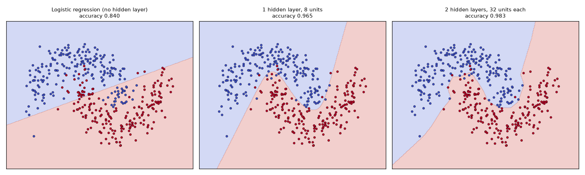
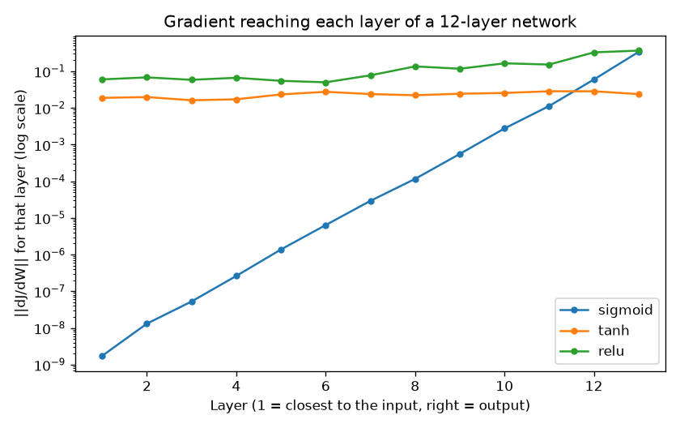
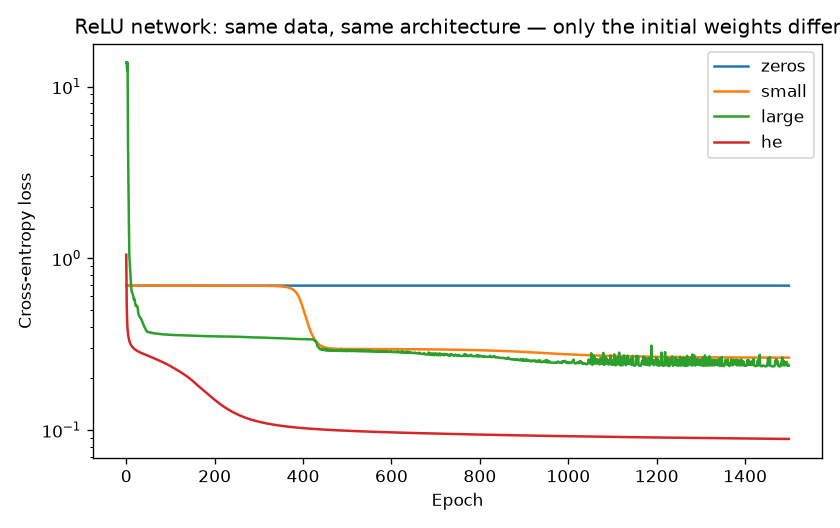
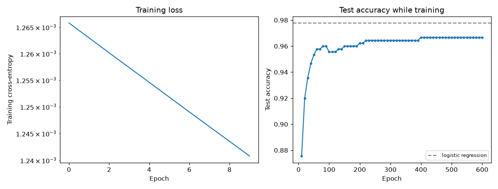

# 06 — Neural Network from Scratch

> **New to this?** Section 2 explains what a neural network *is* before any maths.
> Every equation in §4 has a "reading it aloud" line, a table explaining each symbol,
> and a note on whether it was derived, defined, or assumed.

**Phase 2 starts here.** Everything up to now had a fixed shape whose gradient you
derived once by hand. From here the shape is yours to choose, and the gradient is
computed *systematically* — that's backpropagation.

## 1. What you'll build

A fully-connected neural network in pure numpy — forward pass, backpropagation, and
gradient descent — then six experiments.

| Part | The claim | How it's proven |
|---|---|---|
| 1 | A linear model **cannot** solve XOR; one hidden layer can | Logistic regression **0.50**, network **1.00** |
| 2 | The backprop derivation is correct | Analytic vs. numerical gradients agree to **~1e-9** |
| 3 | Without a nonlinearity, depth does nothing | 4-layer net collapses to one matrix, difference **3.9e-16** |
| 4 | Sigmoid can't train deep networks | Gradient shrinks **1.9e+08×** from output to layer 1 |
| 5 | Zero init breaks a network permanently | 32 hidden units, **1 distinct** weight vector after training |
| 6 | A bigger model is not automatically better | Logistic regression **beats** the network, 0.9778 vs 0.9667 |

Part 6 is not the result I wanted, and it's reported as it came out — sklearn's network
loses to logistic regression too, which is how you know it isn't a bug.

## 2. What is a neural network, why do we need one, and where is it used?

### What it is

A neural network is **a stack of linear models with a bend applied between each one.**

That's genuinely the whole idea. You already built the pieces:

- Project 01 gave you $Xw + b$ — a linear layer.
- Project 02 gave you the sigmoid — a bend.

A neural network alternates them:

```
  input          hidden layer            output
   x1  ─┐      ┌──────────────┐
        ├──▶   │  z = xW + b  │ ──bend──▶  ┌──────────┐
   x2  ─┤      │  a = g(z)    │            │ z = aW+b │ ──softmax──▶  P(class)
        │      └──────────────┘            └──────────┘
   x3  ─┘         (learned features)         (a linear
                                            classifier on
    raw features                            those features)
```

Each layer is project 01's model. Between them sits an **activation function** $g$ that
bends the output. Stack a few and you can represent essentially any function — but
without the bend, the whole stack collapses back into a single linear layer, which
Part 3 demonstrates to 16 decimal places.

The one genuinely new idea is **learned features**. Every earlier project took your
features as given: you handed it "size" and "bedrooms", and it found weights. A neural
network's hidden layers *invent their own features* — combinations of the inputs that
make the final linear classifier's job easy. Part 1 prints those invented features for
XOR so you can look at them.

### Why we need it — what's wrong with what we have?

**Linear models can only draw straight boundaries.** Project 02's plot showed it; §4.1
proved it. For a great many real problems that's simply not enough, and the classic
minimal example is XOR:

```
    x2
     |
   1 |  ●(0,1)          ○(1,1)          ● = class 1
     |                                   ○ = class 0
     |
   0 |  ○(0,0)          ●(1,0)
     +---------------------------- x1
        0                1

   Try to draw ONE straight line with both ● on one side
   and both ○ on the other. It cannot be done.
```

This killed neural network research for over a decade after Minsky and Papert pointed
it out in 1969. The fix — add a hidden layer — was known, but nobody had an efficient
way to *train* one. **Backpropagation is that method**, popularized in 1986, and it is
what §4.4 derives.

Why not use project 04's trees, which also draw nonlinear boundaries? Trees ask
questions about individual features, which works beautifully on tables and badly on
signals — "is pixel 4,502 greater than 130?" is a meaningless question about a photo.
Networks learn *combinations* of all inputs at once, which is what images, audio, and
language need.

### Where it's actually used

Every modern AI system you've heard of is a neural network:

- **Image recognition** — medical scans, self-driving perception, face unlock (project 08).
- **Speech and audio** — transcription, voice assistants, translation (project 09).
- **Language** — ChatGPT, Claude, translation, search. **A transformer (project 10) is
  built from the exact layers you're writing today**, arranged differently.
- **Recommendation** — YouTube, Spotify, TikTok feeds.
- **Science** — AlphaFold's protein structures, weather forecasting, drug discovery.

**When *not* to use one, which matters just as much:** on ordinary tabular data,
gradient-boosted trees (project 04) usually win, train in seconds, and can be explained
to a regulator. Networks need lots of data, lots of compute, and offer no
interpretability. **Part 6 of this project is a live demonstration** — logistic
regression beats the network on handwritten digits. Reach for a network when your data
has *structure a linear model can't express* — pixels with neighbours, words in order,
audio over time.

## 3. The core idea

Three ingredients, and you already have all three:

1. **Forward pass** — push the input through the layers to get a prediction. This is
   just project 01's $Xw + b$, repeated, with a bend between.
2. **Loss** — measure the error. This is project 02's cross-entropy, unchanged.
3. **Backward pass** — work out how much every weight contributed to the error, then
   nudge each one downhill. This is project 01's gradient descent; the only new part is
   *computing* the gradient when there are layers in between.

That third point is the whole difficulty. In project 01 a weight touched the output
directly, so its derivative was one line. Now a weight in layer 1 affects layer 2,
which affects layer 3, which affects the loss. Untangling that is what backprop does —
and it turns out to be the **chain rule**, applied with good bookkeeping.

## 4. The math

### 4.1 The forward pass

$$z^{l} = a^{l-1}W^{l} + b^{l} \qquad\qquad a^{l} = g(z^{l})$$

> **Reading it aloud:** *"z-superscript-l equals a-superscript-l-minus-one times
> W-superscript-l, plus b-superscript-l. And a-superscript-l equals g of z-l."*
>
> | Symbol | Say it | What it means here |
> |---|---|---|
> | $l$ | "ell" | **Which layer** we're talking about. Written as a superscript, *not* a power — $W^2$ means "layer 2's weights", not "W squared". Context always makes it clear. |
> | $L$ | "big L" | The **total number of layers**, so $a^L$ is the final output. |
> | $a^{l}$ | "a superscript l" | The **activations** — layer $l$'s output after bending. $a$ is for "activation", a leftover from the biological analogy. |
> | $a^{0}$ | "a zero" | The **input** $X$ itself. Treating the input as "layer 0's activations" makes the formula uniform. |
> | $z^{l}$ | "z superscript l" | The **pre-activation** — the linear part, before bending. Also called the *logit*, exactly as in project 02. |
> | $W^{l}$ | "W superscript l" | Layer $l$'s **weight matrix**, shaped (units in $l-1$) × (units in $l$). |
> | $b^{l}$ | "b superscript l" | Layer $l$'s **bias vector**, one number per unit. |
> | $g$ | "g" | The **activation function** — the bend. ReLU, sigmoid, or tanh here. |
>
> **Where it comes from:** it is project 01's model, *repeated*. There is nothing new in
> this equation at all — the only novelty is that $a^{l-1}$ is itself the output of
> another such equation, rather than raw data.

### 4.2 The activation function — the bend

| Name | $g(z)$ | $g'(z)$ | Why you'd use it |
|---|---|---|---|
| **ReLU** | $\max(0, z)$ | 1 if $z>0$, else 0 | The default. Derivative is exactly 1 for active units, so gradients don't decay with depth (Part 4). |
| **sigmoid** | $1/(1+e^{-z})$ | $\sigma(z)(1-\sigma(z))$ | Project 02's. Now mostly confined to output layers — Part 4 shows why. |
| **tanh** | $\tanh(z)$ | $1 - \tanh^2(z)$ | Like sigmoid but centred on 0, which helps. Common before ReLU took over. |

ReLU looks almost insultingly simple — "if negative, output zero" — and yet it is the
single change most responsible for deep learning working. Part 4 measures why.

**The rule the whole project turns on:** $g$ must be **nonlinear**. If $g(z) = z$, the
network collapses into one linear layer, no matter how many you stack. Part 3 proves it
numerically.

### 4.3 The output layer and the loss

$$\text{softmax}(z)_k = \frac{e^{z_k}}{\sum_{j} e^{z_j}} \qquad\qquad J = -\frac{1}{n}\sum_{i}\sum_{k} Y_{ik}\log a^{L}_{ik}$$

> **Reading it aloud:** *"Softmax of z, component k, equals e-to-the-z-k over the sum
> over j of e-to-the-z-j. J equals minus one over n, sum over i, sum over k, of Y-i-k
> times log a-L-i-k."*
>
> | Symbol | Say it | What it means here |
> |---|---|---|
> | softmax | "soft max" | The **multi-class sigmoid**. Turns any vector of real scores into probabilities: all positive, summing to 1. "Soft" because it's a smooth version of "pick the max". |
> | $k$, $j$ | "k", "j" | Indices over the **classes** (0–9 for digits). |
> | $K$ | "big K" | The number of classes. |
> | $Y_{ik}$ | "Y-i-k" | **One-hot** encoding of the true label: 1 if example $i$ is class $k$, else 0. So the inner sum picks out just the true class's term. |
> | $e^{z_k}$ | "e to the z-k" | Exponentiating makes everything positive **and** amplifies differences: a slightly higher score becomes a much higher probability. |
>
> **Where it comes from:** softmax is *derived* the same way project 02's sigmoid was —
> as the distribution that turns unbounded scores into probabilities under a
> maximum-likelihood argument; with $K=2$ it reduces to exactly the sigmoid. The loss is
> project 02's cross-entropy with a sum over classes added. **Nothing here is new** —
> only generalized from 2 classes to $K$.

### 4.4 Backpropagation, derived

Here is the one genuinely new derivation in this project. We need $\partial J/\partial W^l$
for **every** layer, including ones buried deep in the middle.

**The key insight:** define one intermediate quantity per layer — the sensitivity of the
loss to that layer's pre-activations:

$$\delta^{l} \equiv \frac{\partial J}{\partial z^{l}}$$

> $\delta$ is "delta", Greek lower-case d, conventionally meaning "a small change in".
> $\equiv$ means "is *defined* as", not "happens to equal". Read $\delta^l$ as **"how
> much the loss changes if layer $l$'s pre-activations wobble."**

If you know $\delta^l$, both gradients for that layer follow immediately. Why: since
$z^l = a^{l-1}W^l + b^l$, we have $\partial z^l/\partial W^l = a^{l-1}$, so by the chain
rule:

$$\frac{\partial J}{\partial W^{l}} = (a^{l-1})^{T}\delta^{l} \qquad\qquad \frac{\partial J}{\partial b^{l}} = \sum_{i}\delta^{l}_{i}$$

**This is project 01's "gradient = error × input" all over again** — $\delta^l$ is the
error at this layer and $a^{l-1}$ is its input.

**Step 1 — the output layer.** Softmax combined with cross-entropy gives, after the same
cancellation project 02 derived for sigmoid + BCE:

$$\delta^{L} = \frac{a^{L} - Y}{n}$$

Just "prediction minus truth". The messy derivatives of softmax and of the log cancel
exactly, for the same structural reason as in project 02.

**Step 2 — pass the error backwards.** For a hidden layer, $z^{l-1}$ influences $J$ only
*through* $z^{l}$. The chain rule therefore says:

$$\delta^{l-1} = \left(\delta^{l}(W^{l})^{T}\right)\odot g'(z^{l-1})$$

> **Reading it aloud:** *"delta-l-minus-one equals delta-l times W-l transpose,
> element-wise-multiplied by g-prime of z-l-minus-one."*
>
> | Symbol | Say it | What it means here |
> |---|---|---|
> | $\odot$ | "element-wise product" (Hadamard) | Multiply **matching entries**, not matrix multiplication. In numpy it's `*`, whereas `@` is the matrix product. |
> | $(W^{l})^{T}$ | "W-l transpose" | The weight matrix flipped. Forward, $W$ sends signal from layer $l-1$ to $l$; **transposed, it sends error back the other way.** |
> | $g'(z^{l-1})$ | "g prime of z" | The **slope** of the activation at the value it actually took. Flat activation → small slope → little error passes through. |
>
> **Where it comes from:** entirely **derived** — it is the chain rule and nothing else.
> Its two factors have clean meanings: *"how much did this unit influence the next
> layer"* ($W^T$) times *"how responsive was this unit"* ($g'$).

**That's backpropagation.** Compute $\delta^L$ at the output, then walk backwards
applying the equation above, collecting gradients as you go. One forward pass and one
backward pass produce every gradient in the network, regardless of its size.

**Why it's called back-*propagation*:** the error literally propagates backwards through
the same weights the signal came forward through.

**Why it matters that it's cheap:** the naive alternative — nudge each parameter and see
how the loss moves — costs one forward pass *per parameter*. For a 6,570-parameter
network that's 13,140 forward passes per step. Backprop gets the same answer in **two**.
That efficiency is the reason deep learning is possible at all. (Part 2 does it the slow
way on purpose, to check the fast way is right.)

### 4.5 Why gradients vanish with depth

Look again at the backward equation. Getting from the output to layer 1 means applying
it $L$ times, so the gradient reaching the first layer carries a **product** of $L$
activation derivatives:

$$\delta^{1} \sim \delta^{L}\prod_{l=2}^{L}\Big[(W^{l})^{T}\odot g'(z^{l-1})\Big]$$

If each $g'$ is typically below 1, that product shrinks **exponentially** in depth. For
sigmoid, $g'$ peaks at 0.25 and is usually far smaller, so across 12 layers even the
best case gives $0.25^{12} \approx 6\times10^{-8}$.

That's the **vanishing gradient problem** — project 02's issue, now compounded by depth.
ReLU's derivative is exactly **1** wherever the unit is active, so the product doesn't
decay. Part 4 measures both.

### 4.6 Why initialization has a formula

The same product argument applies to the weights. If they're too small the signal decays
layer by layer; too large and it explodes. **He initialization** picks the variance that
keeps the scale stable through a ReLU network:

$$W \sim \mathcal{N}\left(0,\ \frac{2}{n_{\text{in}}}\right)$$

> $\mathcal{N}(\mu, \sigma^2)$ means "a normal (Gaussian) distribution with mean $\mu$
> and variance $\sigma^2$"; $n_{\text{in}}$ is the number of inputs to that layer. The
> **2** in the numerator compensates for ReLU zeroing out roughly half its inputs —
> Xavier initialization uses 1 instead, for activations like tanh that don't discard
> half.

And weights must be **random**, not merely small. Identical weights make every unit in a
layer compute the same thing and receive the same gradient forever — the **symmetry
problem**, which Part 5 shows is fatal.

## 5. From formula to code

Open [`neural_network.py`](neural_network.py). The `NeuralNetwork` docstring numbers each
formula and the matching line carries the number.

| # | Formula | Code |
|---|---|---|
| (1) | $z^l = a^{l-1}W^l + b^l$ | `z = a @ W + b` |
| (2) | $a^l = g(z^l)$ | `a = self.g(z)` |
| (5) | softmax | `softmax(z)` |
| (6) | $J = -\frac{1}{n}\sum\sum Y\log a^L$ | `-np.mean(np.sum(Y * np.log(probs), axis=1))` |
| (7) | $\delta^L = (a^L - Y)/n$ | `delta = (activations[-1] - Y) / n` |
| (8) | $\partial J/\partial W^l = (a^{l-1})^T\delta^l$ | `dW[l] = activations[l].T @ delta` |
| (9) | $\partial J/\partial b^l = \sum_i \delta^l_i$ | `db[l] = delta.sum(axis=0)` |
| (10) | $\delta^{l-1} = (\delta^l (W^l)^T)\odot g'(z^{l-1})$ | `delta = (delta @ self.weights[l].T) * self.g_deriv(...)` |

The whole backward pass is **nine lines**. Note the forward pass caches `activations` and
`pre_activations` — not laziness, but necessity: equations (8) and (10) need $a^{l-1}$
and $z^{l-1}$, so the backward pass literally cannot run without them. That's why
training a network needs far more memory than running one.

## 6. The data

1. **XOR** (Part 1) — four points. The smallest problem a linear model cannot solve, and
   historically the one that stalled the field.
2. **Two moons** (Parts 1, 3, 5) — two interleaving crescents, requiring a curved
   boundary. Two-dimensional so boundaries can be drawn.
3. **Random data** (Parts 2, 4) — for gradient checking and gradient measurement,
   neither of which cares whether the data means anything. Part 2 uses a deliberately
   *tiny* network (79 parameters) because the numerical check costs two forward passes
   per parameter.
4. **Handwritten digits** (Part 6) — the same 8×8 sklearn dataset as project 05, so you
   can compare against models you've already built.

## 7. Results — what each plot is telling you

### Part 1 — XOR, and the features the network invents

```
Logistic regression (project 02) accuracy: 0.50
Neural network, ONE hidden layer of 4:     1.00
```

A coin flip versus perfect. Now the interesting part — what the hidden layer *did*:

```
  (0,0) -> [+0.42, -0.25, -0.63, -0.73]   class 0
  (0,1) -> [+0.85, +0.97, -1.00, +0.93]   class 1
  (1,0) -> [+0.80, +0.97, +0.92, -1.00]   class 1
  (1,1) -> [+0.96, +1.00, -0.97, -0.97]   class 0
```

Look at the **second** hidden unit. It outputs ≈ +0.97 for both class-1 inputs, and
−0.25 / +1.00 for the class-0 ones — it has learned something like "are the inputs
different?" In the original coordinates the classes were tangled; in these four new
coordinates they can be separated by a plane.

**That is the entire idea of deep learning, visible in four rows.** The network didn't
learn a cleverer boundary — it learned a *new space* in which a boring boundary works.



On two moons: logistic regression (left) draws its one straight line and misses whole
regions. One hidden layer (middle) bends. Two hidden layers with ReLU (right) produce a
boundary made of flat pieces — because ReLU is piecewise linear, so the network is too.
It curves by using many small straight segments.

### Part 2 — is backprop actually right?

```
Activation       params    max |analytic-numeric|    relative error
relu                 79                 1.629e-10         7.815e-10
sigmoid              79                 2.373e-10         1.564e-09
tanh                 79                 1.780e-10         9.886e-10
```

The analytic gradient from §4.4 is compared against the **definition** of a derivative,
$\big(J(\theta+\epsilon) - J(\theta-\epsilon)\big)/2\epsilon$, for all 79 parameters and
three activation functions. Agreement to ~1e-9 is machine precision. **The derivation is
correct.**

This is worth internalizing as a habit: **a wrong gradient doesn't crash.** The network
trains, the loss falls somewhat, and you get a mediocre model with no error message
anywhere. Gradient checking is how that bug gets caught. It's far too slow for real
training — two forward passes per parameter, which is *precisely* the cost backprop
exists to avoid — so you run it once on a tiny network and then trust the code.

### Part 3 — remove the bend and the depth evaporates

```
Logistic regression (1 linear layer)                    0.8750
4-layer network, IDENTITY activation                    0.8750
4-layer network, ReLU activation                        0.9700

max |difference| between the 4-layer net and one equivalent matrix = 3.886e-16
```

The identity-activation network matches logistic regression **to four decimal places**,
because it *is* logistic regression. Multiplying its four weight matrices together
yields a single 2×2 matrix whose predictions differ from the full network's by 4e-16 —
floating-point dust.

2,274 parameters bought exactly nothing over logistic regression's 3. Matrix
multiplication is associative, so $W_1(W_2(W_3x)) = (W_1W_2W_3)x$ — a stack of linear
layers **is** a linear layer.

**The activation function is not a tweak. It is the only reason depth exists.**

### Part 4 — why sigmoid lost



```
  layer       sigmoid          tanh          relu
      1     1.737e-09     1.882e-02     6.013e-02
      6     6.401e-06     2.756e-02     5.005e-02
     12     5.967e-02     2.849e-02     3.278e-01
 output     3.381e-01     2.383e-02     3.662e-01
```

Read the sigmoid column bottom-up. The output layer's gradient is perfectly healthy at
0.34. Each step backwards multiplies by another factor below 1, and by layer 1 it has
shrunk by a factor of **1.9 × 10⁸**.

Layer 1 receives essentially nothing. It will never learn — not slowly, but *never*,
because the update is smaller than floating-point noise. On the log-scale plot, sigmoid
is a straight diagonal line: straight on a log axis means **exponential** decay in
depth, exactly as §4.5 predicted from the product of derivatives.

ReLU stays flat across all 12 layers. Its derivative is exactly 1 for active units, so
the product doesn't shrink. **This single property is most of why deep learning
works** — and it's why a function as crude as $\max(0, z)$ beat the elegant sigmoid.

### Part 5 — initialization, and a textbook claim that didn't survive testing



```
Init           2 hidden layers     8 hidden layers
                loss  accuracy      loss  accuracy
zeros         0.6931    0.5000    0.6931    0.5000
small         0.2640    0.8933    0.6931    0.8067
large         0.2376    0.8933       nan    0.5000
he            0.0888    0.9717    0.0795    0.9700
```

**Zero init fails absolutely, at any depth**, and the reason is elegant. If every weight
starts identical, every hidden unit computes the same thing, receives the same gradient,
and updates identically. They remain clones forever — the code confirms that after
training, 32 hidden units still have **1 distinct weight vector**. A 32-unit layer with
the capacity of a 1-unit layer. That's the symmetry problem, and it's the whole reason
initialization is random. (Projects 01 and 02 could safely use zero init precisely
because they had no hidden layer to make symmetric.)

**The scale story needed correcting.** My first version of this experiment used only a
2-hidden-layer network, and the results contradicted the textbook warning: `large`
scored 0.8933, identical to `small` and perfectly respectable. On a shallow network,
initialization scale barely matters.

Testing at depth 8 is where the claim actually lives. `small` stalls at loss **0.6931** —
which is exactly $\log 2$, the loss of a model outputting 50/50 that has learned nothing.
`large` produces an outright **nan**: gradients *exploded* to infinity rather than
vanishing. Both worked fine at depth 2.

**Initialization is a depth problem.** The signal is multiplied by a badly scaled matrix
eight times forward and eight times back, so a factor slightly below 1 decays to nothing
and one slightly above 1 blows up — §4.5's product, caused by weights instead of
activations. He init exists to keep that product near 1.

### Part 6 — the honest result



```
Model                                          Test accuracy      params
Logistic regression (project 02)                      0.9778         650
Scratch network [64, 64, 32, 10]                      0.9667        6570
sklearn MLPClassifier (64, 32)                        0.9667       ~same
```

**Correctness first:** the scratch network matches sklearn's `MLPClassifier` to four
decimal places on the same architecture. Every line of it was derived above, and it
performs identically to a professional implementation.

**Now the uncomfortable part: logistic regression wins**, with 10× fewer parameters.
That is not a bug in the implementation — **sklearn's network loses to it too**, by
exactly the same margin, which is how you know.

Why: 8×8 digits are already nearly linearly separable. The extra capacity buys no bias
reduction (there wasn't much bias) while adding variance — project 03's table in one
sentence. **A bigger model is not automatically a better one**, and it's better to meet
that fact on the first network you build than to discover it later on a deadline.

The right conclusion isn't "networks are overrated". It's that networks earn their keep
when the data has structure a linear model can't express. This network flattens an 8×8
image into 64 unrelated numbers, throwing away the fact that **pixels have
neighbours** — which is exactly the structure project 08's convolutional networks
exploit, and where the large gaps appear.

## 8. Run it

```bash
cd 06-neural-network-from-scratch
python3 -m venv .venv
source .venv/bin/activate
pip install -r requirements.txt
python neural_network.py
```

Takes about 30 seconds and writes four plots to `outputs/`.

## 9. Exercises

1. **Remove the hidden layer.** In Part 1, change `[2, 4, 2]` to `[2, 2]`. Accuracy
   should collapse back to 0.5 — you've rebuilt logistic regression, and XOR is
   unsolvable again. Then try `[2, 2, 2]`: two hidden units are the theoretical minimum.
   Does it always converge, or does it depend on the seed? (This is a local-minimum
   problem — project 05's Part 2 in a new setting.)
2. **Break backprop on purpose.** In `backward()`, delete the `* self.g_deriv(...)` from
   equation (10) and re-run Part 2. The relative error should jump from 1e-9 to ~1.
   Then run Part 1 with the bug: **the network still trains and the loss still falls**,
   just to a worse place. That's the failure mode gradient checking exists to catch.
3. **Watch tanh's gradients.** In Part 4, tanh sits between sigmoid and ReLU without
   decaying much at depth 12. Given $\tanh'(0) = 1$ versus $\sigma'(0) = 0.25$, predict
   what happens at depth 30 *before* running it, then change `depth` and check.
4. **Find the depth where init starts to matter.** Part 5 shows scale is irrelevant at 2
   layers and fatal at 8. Sweep depth over 2, 3, 4, 5, 6, 8 for the `large` scheme and
   find where nan first appears. Then try lowering the learning rate — does that rescue
   it, or only delay it?
5. **Add momentum.** Replace the update with a velocity term:
   `v = 0.9 * v - lr * dW; W += v`. Compare convergence speed on Part 6. This is one
   line, and it's most of what separates plain gradient descent from the Adam optimizer
   that project 07 introduces.
6. **Actually beat logistic regression.** Part 6's network loses, 0.9667 vs 0.9778. Try
   to win: more epochs, a wider hidden layer, a lower learning rate, mini-batches instead
   of full-batch. Use cross-validation (project 03) rather than the test set to choose —
   and if repeated tuning against the test set is how you win, you've reproduced project
   03 Part 5's leakage, not built a better model.

## 10. What's next

You've now written every component of a modern deep learning system by hand. Project 07
hands the same network to **PyTorch** and shows that `loss.backward()` computes exactly
the gradients you derived in §4.4 — you'll check them against each other numerically.
The point isn't that PyTorch is easier; it's that **autograd is not magic**, and you'll
know precisely what it's doing because you did it yourself. From there: convolutions
(08), recurrence (09), and attention (10), each one a different answer to "what
structure does my data have, and how do I build it into the architecture?"
