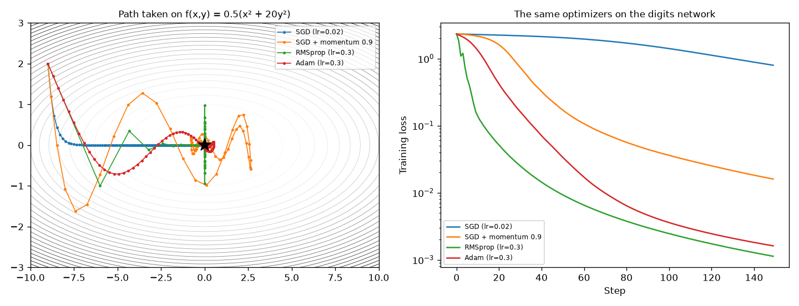
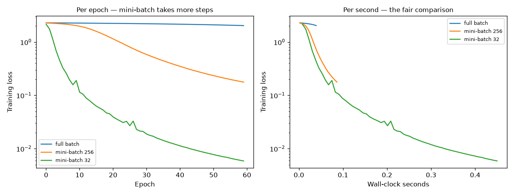
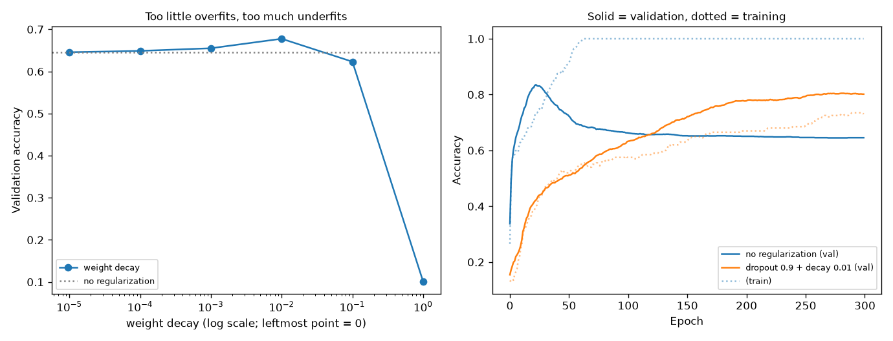
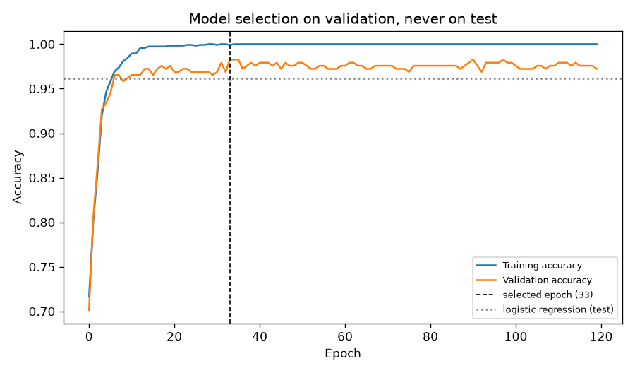

# 07 — Neural Networks in PyTorch

> **New to this?** Section 2 explains what a deep learning framework *is* and why one
> exists, before any code or maths. Every equation in §4 has a "reading it aloud" line,
> a symbol table, and a note on where it comes from.

## 1. What you'll build

The same network as project 06 — but PyTorch computes the gradients. The first
experiment proves that "computes the gradients" means *exactly what you derived by
hand*, and the rest covers everything the scratch version left out: optimizers,
mini-batches, regularization, and a training pipeline that respects project 03.

| Part | The claim | How it's proven |
|---|---|---|
| 1 | Autograd computes **your** gradients, not magic ones | Scratch vs. `.backward()` agree to **6.9e-17** |
| 2 | Autograd is the chain rule plus bookkeeping | Hand-derived vs. autograd: **6.7e-18** |
| 3 | Plain SGD struggles on stretched surfaces | 264 steps vs. **19** for RMSprop on the same problem |
| 4 | Mini-batches win because they take more *steps* | 60 epochs: full-batch 0.578, batch-32 **0.973** |
| 5 | Regularization strength has an optimum, not an "on" | Dropout 0.646 → **0.805**; weight decay 1.0 → **0.101** |
| 6 | Project 06's network wasn't too small — it was under-trained | Same architecture, 0.9722 → **0.9833** |

## 2. What is PyTorch, why do we need it, and where is it used?

### What it is

PyTorch is a library that does three things:

1. **Tensors** — like numpy arrays, but they can live on a GPU.
2. **Autograd** — it *watches* every operation you perform and can then compute the
   derivative of any result with respect to any input, automatically.
3. **Building blocks** — layers, activations, losses, and optimizers, pre-written and
   pre-tested.

Number 2 is the one that matters, and it's worth being precise about what it replaces.
In project 06 you wrote this by hand:

```
delta = (activations[-1] - Y) / n
for l in reversed(range(len(weights))):
    dW[l] = activations[l].T @ delta
    db[l] = delta.sum(axis=0)
    if l > 0:
        delta = (delta @ weights[l].T) * relu_deriv(pre_activations[l-1])
```

In PyTorch, all of that becomes:

```python
loss.backward()
```

Not similar — **identical**, to 17 decimal places. Part 1 proves it.

### Why we need it

Project 06's backward pass was hand-derived for one specific architecture:
fully-connected layers, ReLU, softmax output. Change *anything* — add a skip
connection, swap in a convolution, branch on an if-statement — and you must re-derive
it, re-implement it, and re-verify it.

That is unworkable. A modern transformer has hundreds of layers of a dozen different
kinds. Nobody derives their gradients on paper.

**Autograd inverts the problem.** Instead of deriving the gradient of an
*architecture*, it stores the derivative of each *primitive operation* — matmul,
tanh, add — and records the order you applied them. The chain rule then assembles the
gradient of whatever you built. You write only the forward pass; the backward pass is
generated.

Three more things you'd otherwise write yourself:

- **GPU execution.** `model.to('cuda')` and the same code runs 10–100× faster. Writing
  that by hand means writing CUDA kernels.
- **Optimizers.** Project 06 used plain gradient descent. §4.2 derives Adam, which is
  what people actually use — and Part 3 shows why.
- **Correct, tested layers.** Dropout that switches off at evaluation time, numerically
  stable softmax, correct weight initialization by default.

### Where it's actually used

PyTorch (and its main alternative, JAX; TensorFlow is now largely legacy) is what
essentially all AI research and most AI production runs on:

- **Every large language model** you've used — GPT, Claude, Llama — was trained with
  one of these frameworks.
- **Research** — practically every paper at NeurIPS/ICML ships PyTorch code.
- **Production inference** at scale, via TorchScript, ONNX or `torch.compile`.
- **Hugging Face**, the standard library for pretrained models (which you'll use from
  project 11 onward), is built on PyTorch.

**When *not* to reach for it:** for tabular data, sklearn and gradient-boosted trees
(project 04) are simpler, faster, and usually more accurate. PyTorch earns its
complexity when you need GPUs, custom architectures, or very large data.

### Why you built project 06 first

You could have started here and never known what `.backward()` does. The reason not to
is that when training goes wrong — and it will — the error messages point at a
gradient, an exploded weight, a vanished signal. **Debugging what you cannot picture is
guesswork.** Project 06 gives you the picture; this project gives you the tool.

## 3. The core idea

Autograd rests on one observation: **every computation you write is a graph.**

```
   x ──┐
       ├─▶ [matmul] ──▶ z ──▶ [tanh] ──▶ a ──▶ [square] ──▶ [sum] ──▶ J
   W ──┘        ▲
                │
   b ───────[add]
```

Two directions matter:

- **Forward** (left to right) computes the value. This is the code you write.
- **Backward** (right to left) computes derivatives, by multiplying each operation's
  local derivative as it goes. This is the chain rule, and PyTorch does it for you.

The critical design decision is that PyTorch **records the graph as you run**
("define-by-run"). The graph isn't declared in advance — it's whatever your Python code
happened to do this time. That's why loops, conditionals, and recursion in a `forward()`
just work.

## 4. The math

### 4.1 What autograd computes

For each tensor $t$ in your graph, autograd computes:

$$\frac{\partial J}{\partial t}$$

where $J$ is the scalar you called `.backward()` on. It does this by the chain rule: if
$J$ depends on $t$ only through $u$, then

$$\frac{\partial J}{\partial t} = \frac{\partial J}{\partial u}\cdot\frac{\partial u}{\partial t}$$

> **Reading it aloud:** *"The partial of J with respect to t equals the partial of J
> with respect to u, times the partial of u with respect to t."*
>
> | Symbol | Say it | What it means here |
> |---|---|---|
> | $J$ | "J" | The **scalar** you differentiate — usually the loss. It must be a single number, which is why you call `.backward()` on a loss and not on a layer's output. |
> | $t$, $u$ | "t", "u" | Any **intermediate tensors** in the graph. |
> | `grad_fn` | "grad fun" | The pointer each computed tensor keeps back to **the operation that produced it**. Following these pointers backwards *is* the backward pass. |
> | `requires_grad` | — | Marks a tensor as something to compute a gradient **for**. Model parameters have it; your input data usually doesn't. |
> | `.detach()` | — | Cuts a tensor out of the graph — "treat this as a constant". |
>
> **Where it comes from:** it is *exactly* project 06's equation (10), with the
> bookkeeping automated. Autograd contributes no new mathematics whatsoever. Its
> contribution is that it knows $\partial(\text{tanh})/\partial z$, $\partial(\text{matmul})/\partial W$ and so on
> for every primitive, and can therefore chain them for any composition you write.

### 4.2 Optimizers — four ways to use a gradient

Project 06 used the simplest possible rule. Each optimizer below changes only how the
gradient becomes a step.

**Plain SGD** (projects 01, 02, 06):

$$\theta_{t+1} = \theta_t - \alpha g_t$$

> $\theta$ ("theta") is the standard symbol for **all the parameters at once**;
> $g_t = \partial J/\partial\theta$ is the gradient at step $t$; $\alpha$ is the learning rate.
> **The problem:** the step is proportional to the gradient, so a direction with a
> steep, narrow valley gets huge oscillating steps while a shallow direction crawls.

**Momentum** — accumulate a velocity instead of stepping on the raw gradient:

$$v_{t+1} = \beta v_t + g_t \qquad\qquad \theta_{t+1} = \theta_t - \alpha v_{t+1}$$

> $v$ is the **velocity**; $\beta$ ("beta", typically 0.9) is how much of it survives
> each step. Consistent directions accumulate and get faster; oscillating directions
> cancel out. The physical analogy is real: a ball rolling downhill doesn't reverse
> instantly when the slope wobbles.

**RMSprop** — give each parameter its own learning rate, scaled by its recent gradient
size:

$$s_{t+1} = \beta s_t + (1-\beta)g_t^2 \qquad\qquad \theta_{t+1} = \theta_t - \frac{\alpha}{\sqrt{s_{t+1}} + \epsilon}g_t$$

> $s$ is a running average of the **squared** gradient — a measure of "how big have this
> parameter's gradients been lately". Dividing by $\sqrt{s}$ means consistently-large
> gradients get *smaller* steps and consistently-tiny ones get *larger* steps. $\epsilon$
> (about $10^{-8}$) only prevents division by zero. Note $g_t^2$ is **element-wise**, so
> every parameter gets its own scaling.

**Adam** — both ideas at once, and the default in practice:

$$m_t = \beta_1 m_{t-1} + (1-\beta_1)g_t \qquad v_t = \beta_2 v_{t-1} + (1-\beta_2)g_t^2$$
$$\hat{m}_t = \frac{m_t}{1-\beta_1^t} \qquad \hat{v}_t = \frac{v_t}{1-\beta_2^t} \qquad \theta_{t+1} = \theta_t - \frac{\alpha\,\hat{m}_t}{\sqrt{\hat{v}_t}+\epsilon}$$

> | Symbol | Say it | What it means here |
> |---|---|---|
> | $m_t$ | "m sub t" | The **momentum** term — a running average of the gradient (the "first moment"). |
> | $v_t$ | "v sub t" | The **RMSprop** term — a running average of the squared gradient (the "second moment"). |
> | $\beta_1,\beta_2$ | "beta one, beta two" | Decay rates, defaulting to **0.9** and **0.999**. $\beta_2$ is closer to 1 because a variance estimate needs a longer window than a mean. |
> | $\hat{m}, \hat{v}$ | "m hat, v hat" | **Bias-corrected** versions. Both averages start at 0, so early on they're biased toward 0; dividing by $1-\beta^t$ undoes exactly that. As $t$ grows, $\beta^t \to 0$ and the correction fades. |
> | $\beta_1^t$ | "beta one to the t" | Here the superscript **is** a power, unlike layer indices in project 06. |
>
> **Where it comes from:** Adam is *engineering*, not a derivation — momentum and
> RMSprop combined, with a correction for their initialization bias. It usually works
> well with no tuning, which is why it's the default. Part 3 shows a case where plain
> RMSprop still beats it.

### 4.3 Mini-batch gradient descent

Computing the gradient over *all* $n$ samples is expensive and often unnecessary. Use a
random subset $B$ instead:

$$g_t \approx \frac{1}{|B|}\sum_{i \in B}\nabla J_i(\theta)$$

> $B$ is the **mini-batch**, $|B|$ its size (32, 64, 256…), and $\nabla$ ("nabla" or
> "grad") is the vector of all partial derivatives at once. Because $B$ is sampled
> uniformly, this is an **unbiased estimate** of the full gradient: right on average,
> noisy on any single step.
>
> **Where it comes from:** it is the definition of the full gradient with the average
> taken over a sample instead of the population — the same logic as estimating a
> population mean from a survey.

The tradeoff is genuinely favourable: with batch size 32 out of 1347 samples, each step
uses ~1/42 of the work but you take 42 steps per epoch. Part 4 measures which wins.

### 4.4 Regularization

**Weight decay (L2)** — add a penalty on weight size to the loss:

$$J_{\text{reg}} = J + \lambda\sum_j w_j^2 \qquad\Longrightarrow\qquad \frac{\partial J_{\text{reg}}}{\partial w_j} = \frac{\partial J}{\partial w_j} + 2\lambda w_j$$

> $\lambda$ ("lambda") is the **penalty strength**. The gradient gains a term pulling
> every weight toward zero on every step — hence "decay". **This is the exact same L2
> penalty you added by hand in projects 01 and 02**, now `weight_decay=1e-4`.

**Dropout** — during each training step, randomly zero a fraction $p$ of the units:

$$a^{l}_{\text{train}} = \frac{m \odot a^{l}}{1-p}, \qquad m_j \sim \text{Bernoulli}(1-p)$$

> $m$ is a random **mask** of 0s and 1s, freshly drawn each step; $\odot$ is element-wise
> multiplication. Dividing by $1-p$ keeps the average magnitude unchanged so that
> training and evaluation see the same scale — which is why dropout must be **switched
> off** at evaluation (`model.eval()`).
>
> **Where it comes from:** the intuition is that no unit can rely on any particular
> other unit being present, so the network is forced to build redundant representations.
> It can also be read as cheaply training an ensemble of many sub-networks — project
> 04's bagging idea, inside one model.

**Neither is free.** Part 5 sweeps both and finds real optima, with over-regularization
collapsing accuracy to near chance.

## 5. From formula to code

| Concept | Project 06 (by hand) | PyTorch |
|---|---|---|
| Layer | `z = a @ W + b` | `nn.Linear(in, out)` |
| Activation | `np.maximum(0, z)` | `nn.ReLU()` |
| Softmax + cross-entropy | `softmax()` then `-mean(sum(Y*log(p)))` | `nn.CrossEntropyLoss()` (fused, stable) |
| **The entire backward pass** | ~9 lines of equations (7)–(10) | `loss.backward()` |
| Parameter update | `W -= lr * dW` | `optimizer.step()` |
| Clearing gradients | (not needed — recomputed) | `optimizer.zero_grad()` |

Two gotchas that cause real bugs:

- **`zero_grad()` is mandatory.** PyTorch *accumulates* gradients into `.grad` rather
  than overwriting them. Forget it and step $t$ uses the sum of all gradients so far.
  (The accumulation behaviour exists on purpose — it's how you simulate a large batch
  on a small GPU.)
- **`nn.Linear` stores $W$ transposed.** It computes $xW^T + b$, so its `weight` is the
  transpose of project 06's. Part 1's comparison code transposes when copying weights
  across — a detail that will bite you if you ever port weights between frameworks.

## 6. The data

Handwritten digits again (8×8, sklearn) for Parts 3–6, deliberately: **you already know
what good looks like on it** from projects 05 and 06, so the comparisons are meaningful.
Parts 1 and 2 use random tensors, since gradient correctness has nothing to do with what
the data means. Part 3 also uses a 2D quadratic, because optimizer *paths* can only be
drawn in two dimensions.

## 7. Results — what each experiment shows

### Part 1 — autograd computes your gradients

```
Loss   — scratch: 1.619097720124
       — PyTorch: 1.619097720124
       — difference: 0.000e+00

Layer         max |scratch - autograd| (W)             (b)
1                                3.816e-17       1.388e-17
2                                5.551e-17       3.123e-17
3                                6.939e-17       3.469e-17
```

Project 06's hand-derived backward pass and PyTorch's `.backward()` are given the same
network, the same weights, and the same data. **Every gradient agrees to 7e-17** —
below the precision of a float64, i.e. as identical as two computations can be.

This is the point of the whole project. Autograd is not doing something clever you
don't understand; it is doing *precisely* what you wrote in project 06. What you give
up is writing the backward pass. What you get is the freedom to change the forward pass
without re-deriving anything.

### Part 2 — the graph, and one derivative by hand

```
  z.grad_fn = <AddBackward0 object at 0x...>
  a.grad_fn = <TanhBackward0 object at 0x...>
  J.grad_fn = <SumBackward0 object at 0x...>
  and J.grad_fn's parent: <PowBackward0 object at 0x...>
```

Every computed tensor carries a `grad_fn` naming the operation that made it. Those
pointers form the graph — `SumBackward` → `PowBackward` → `TanhBackward` → `AddBackward`
is the expression $J = \sum(\tanh(xW+b))^2$ read backwards.

Differentiating that by hand — $\partial J/\partial W = x^T\big(2a(1-a^2)\big)$ — and comparing:

```
Quantity                         by hand                  autograd
dJ/dW[1,1]               -1.484932751930           -1.484932751930

max |hand - autograd|: 6.722e-18
```

(Run in float64 on purpose. In float32 the same comparison shows ~7e-08 — not an error,
just the ~7 significant digits float32 carries. Worth knowing before you panic at a
"mismatch" of 1e-7 in your own code.)

### Part 3 — why nobody uses plain SGD



```
Optimizer                  steps to f < 1e-3       final f
SGD (lr=0.02)                            264      3.88e-06
SGD + momentum 0.9                        84      3.91e-17
RMSprop (lr=0.3)                          19      2.57e-04
Adam (lr=0.3)                            107      1.88e-17
```

The surface $f(x,y) = 0.5(x^2 + 20y^2)$ is **20× steeper across the valley than along
it** — a mild version of what real loss surfaces look like. In the left plot, plain SGD
zig-zags: its step is proportional to the gradient, so it takes large oscillating steps
across the valley and tiny ones along it, in the direction it actually needs to go. 264
steps.

Momentum accumulates the consistent downhill direction while the oscillations cancel:
84 steps. RMSprop and Adam rescale *each coordinate* by its own recent gradient
magnitude, so the flat direction gets a big step and the steep one a small step —
RMSprop arrives in **19**.

Note that **RMSprop beats Adam here**, though Adam is the usual default. Adam's momentum
term overshoots slightly on a surface this simple. The right panel shows the same four
on the actual digits network, where the ordering differs again. The honest takeaway:
Adam is a good default, not a guaranteed winner, and the learning rates that work differ
per problem — note the toy uses lr=0.3 and the network lr=0.005.

### Part 4 — mini-batches



```
Batch size            weight updates   final loss   test acc   seconds
full batch                        60       2.0364     0.5778      0.04
mini-batch 256                   360       0.1770     0.9311      0.09
mini-batch 32                   2580       0.0059     0.9733      0.44
```

Same network, same optimizer, same 60 epochs over the same data. The full-batch model
reaches 57.8% accuracy; batch-32 reaches **97.3%**.

The reason is in the "weight updates" column. An *epoch* is one pass over the data, but
the number of **steps** per epoch is $n/|B|$. Full-batch takes 1 step per epoch; batch-32
takes 43. After the same 60 epochs — and roughly the same total arithmetic — one model
has taken 60 steps downhill and the other 2,580.

Each mini-batch gradient is a *noisy* estimate computed from 32 samples instead of 1347.
That noise is usually a feature: it costs a little per-step accuracy and buys many more
steps, and the jitter helps escape bad regions (project 05's local-minimum problem
again). The right panel plots loss against **wall-clock seconds**, which is the fair
comparison — mini-batch still wins.

### Part 5 — regularization has an optimum, not an on-switch



To make this measurable I had to *force* overfitting: 200 training samples, a 256-256
network, and **30% of the training labels randomly corrupted**. (An earlier version of
this experiment used clean labels and 200 samples — regularization changed validation
accuracy by 0.003, and honestly reporting that would have taught nothing. If your
experiment can't detect an effect, fix the experiment before writing the conclusion.)

```
  weight decay    train      val      gap     dropout    train      val      gap
         0e+00    1.000    0.646    0.354        0.00    1.000    0.646    0.354
         1e-03    1.000    0.655    0.345        0.25    1.000    0.658    0.342
         1e-02    1.000    0.678    0.322        0.50    1.000    0.678    0.322
         1e-01    0.585    0.623   -0.038        0.70    0.960    0.723    0.237
         1e+00    0.125    0.101    0.024        0.90    0.735    0.805   -0.070
```

Three things to read here:

1. **Without regularization the network hits 1.000 training accuracy** — it memorized
   labels that are 30% *wrong*. Training accuracy is worthless as a signal.
2. **Weight decay peaks then collapses.** Best at 1e-2 (0.678); by 1.0 accuracy is
   **0.101**, which is chance on 10 classes. The penalty crushed the weights until the
   network could represent nothing. Too much regularization is underfitting — project
   03's tradeoff with a new knob.
3. **Dropout is still improving at 0.9**, the largest value I swept. That means the
   optimum lies outside my search range, and the sweep was too narrow. An optimum
   sitting at the edge of your grid is always a signal to widen it — worth stating
   rather than quietly reporting 0.9 as "the best".

Dropout at 0.9 takes validation accuracy from 0.646 to **0.805** — a large, real gain,
because with 30% corrupted labels there is a great deal of memorization to prevent.

### Part 6 — the payoff, measured honestly



```
All three trained and evaluated on the SAME split:

Model                                                  Test accuracy
Logistic regression                                           0.9611
Network, project-06 style (full-batch SGD, no reg)            0.9722
Network, Adam + dropout + early stopping                      0.9833
```

Project 06 ended with the network **losing** to logistic regression, and left it as an
exercise to fix. Here it is fixed — and the diagnosis is specific: **the architecture
was never the problem.** The same layer sizes, trained with Adam instead of plain SGD,
mini-batches instead of full-batch, dropout and weight decay, and stopped at the best
validation epoch, go from 0.9722 to 0.9833.

Two points of method matter more than the number:

- **All three rows come from the same split.** Project 06 reported 0.9667 on a
  *different* test split, so quoting it in this table would compare across test sets.
  That row was replaced with a baseline retrained here. Cross-split comparisons are one
  of the easiest ways to fool yourself, and they look perfectly reasonable in a table.
- **The epoch was chosen on validation; the test set was touched once.** Selecting the
  best *test* epoch would report a higher number that means nothing. That's project 03's
  Part 5 leakage — and it's far easier to commit by accident inside a training loop
  than in a feature-selection step, because "just check test accuracy each epoch" feels
  so harmless.

## 8. Run it

```bash
cd 07-neural-network-pytorch
python3 -m venv .venv
source .venv/bin/activate
pip install -r requirements.txt
python pytorch_networks.py
```

About 15 seconds on CPU; writes four plots to `outputs/`. Everything runs on CPU for
reproducibility. If your machine has a GPU (`torch.cuda.is_available()`, or
`torch.backends.mps.is_available()` on Apple Silicon), moving there is `model.to(device)`
plus the same for each batch — but on 64-feature data it would be *slower*, since the
transfer costs more than the work. It starts mattering in project 08.

## 9. Exercises

1. **Break `zero_grad()`.** Delete `opt.zero_grad()` from Part 4's loop and watch the
   loss diverge. Then print `p.grad.norm()` each step to see it grow without bound —
   gradients are accumulating across steps. This is the single most common PyTorch bug.
2. **Verify your own gradient.** Write any expression you like — say
   `J = (x.exp() * W).sum()` — differentiate it on paper, and check against autograd the
   way Part 2 does. Use `dtype=torch.float64` or you'll chase float32 noise.
3. **Find where momentum stops helping.** In Part 3, change the `20.0` in $f(x,y)$ to
   1.0 (a perfectly round bowl). All four optimizers should now perform similarly.
   Momentum and adaptive methods fix *anisotropy* — when the surface is equally steep
   in every direction there is nothing to fix.
4. **Widen the dropout sweep.** Part 5's optimum sat at the edge of the grid. Extend it
   to 0.95 and 0.99 and find the actual peak. Then reduce the label corruption from 30%
   to 0% and re-run — the optimum should move sharply toward 0. Regularization strength
   depends on how much overfitting there is to prevent.
5. **Leak the test set on purpose.** In Part 6, select the best epoch using the *test*
   set instead of validation, and report that number. Note how much it improves and how
   completely meaningless it is. Then check: does the validation-selected model or the
   test-selected model do better on a *third*, fresh split?
6. **Write a custom `nn.Module`.** Replace Part 6's `nn.Sequential` with a class
   subclassing `nn.Module` with `__init__` and `forward`, and add a skip connection
   (`return self.layer2(h) + h`). Autograd handles it with no extra work — this is
   precisely what project 06's hand-derived backward pass could not have done without a
   fresh derivation, and skip connections are the central idea of ResNets in project 08.

## 10. What's next

Project 08 introduces **convolutional networks**. Both projects 06 and 07 flattened an
8×8 image into 64 unrelated numbers, throwing away the fact that pixels have
*neighbours*. A convolution builds that structure into the architecture: it looks at
small patches, and reuses the same weights across every position. You'll derive why
weight sharing cuts the parameter count enormously while *improving* accuracy, and
measure a real gap over the fully-connected networks you've built — the gap that this
project's digits data was too easy to show.
