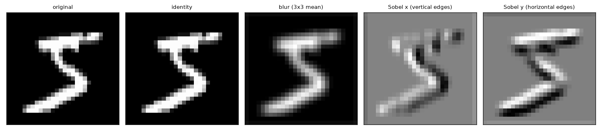
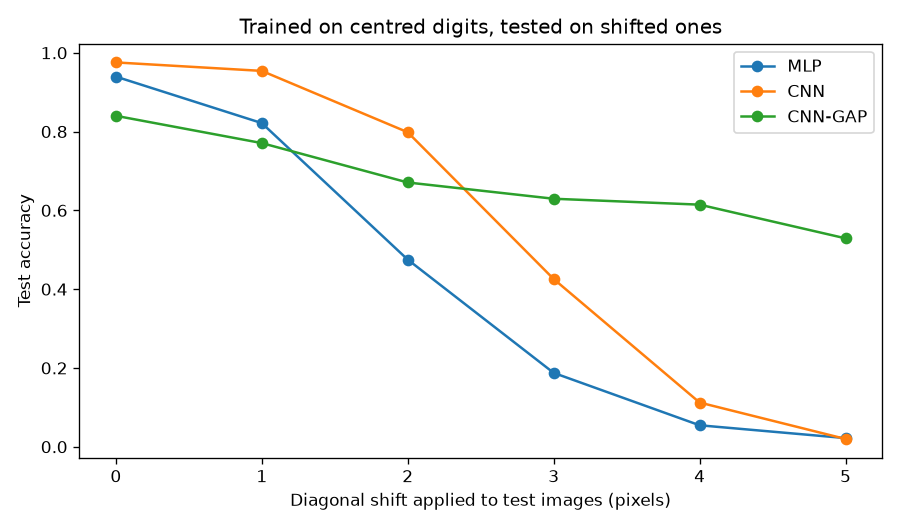
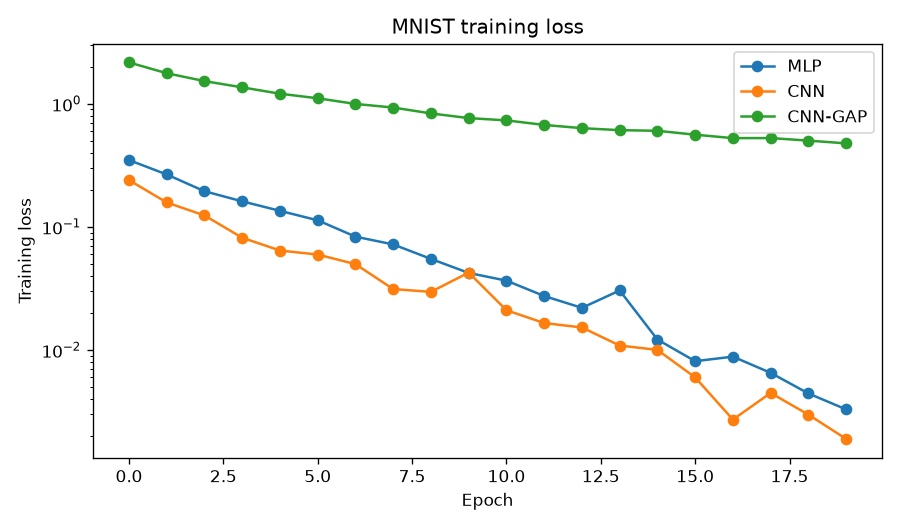
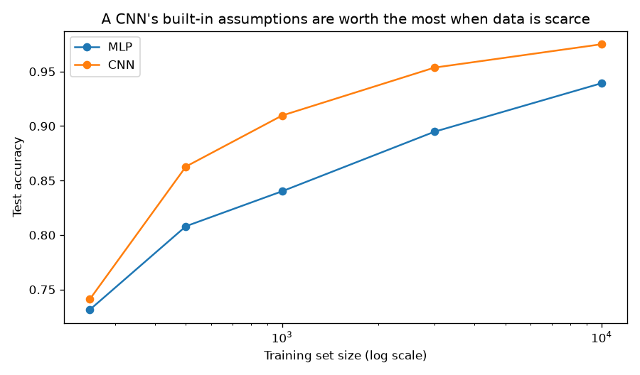
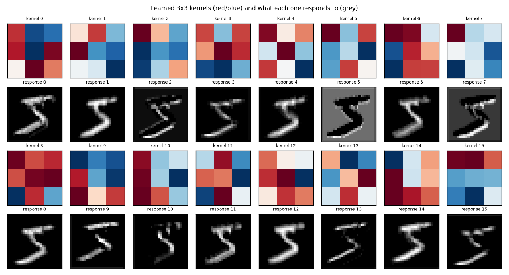

# 08 — CNN Image Classifier

> **New to this?** Section 2 explains what a convolution *is* with a worked
> arithmetic example before any notation. Every equation in §4 has a "reading it
> aloud" line, a symbol table, and a note on where it comes from.

## 1. What you'll build

The convolution operation implemented from scratch and checked against PyTorch, then
five experiments on real MNIST digits that test what convolution actually buys.

| Part | The claim | How it's proven |
|---|---|---|
| 1 | A convolution is a sliding weighted sum, nothing more | Scratch loops vs. `F.conv2d`: **0.0** difference |
| 2 | Weight sharing makes convolutions absurdly cheap | First layer: **160** params vs. the MLP's **100,480** |
| 3 | The fully-connected head is where invariance dies | At a 4px shift: CNN **0.112**, GAP-CNN **0.615** |
| 4 | Convolution buys accuracy on images | Error rate **6.05% → 2.45%** at the same parameter count |
| 5 | The CNN wins at every training-set size | Error ratio 1.04× → **2.43×** as data grows |
| 6 | The network rediscovers edge detectors by itself | 8 of 16 kernels match Sobel with cosine > 0.5 |

Part 3's result surprised me and is the most interesting thing here — see §7.

## 2. What is a convolution, why do we need it, and where is it used?

### What it is

A convolution slides a small grid of numbers (a **kernel**) across an image. At each
position it multiplies the overlapping values and adds them up. That single number
becomes one pixel of the output.

Here is the entire operation, done by hand. A 3×3 kernel sitting on the top-left of an
image:

```
   image patch          kernel           multiply, then add
  ┌───┬───┬───┐      ┌───┬───┬───┐
  │ 0 │ 0 │ 8 │      │-1 │ 0 │ 1 │      (0×-1) + (0×0) + (8×1)
  ├───┼───┼───┤      ├───┼───┼───┤    + (0×-2) + (9×0) + (7×2)
  │ 0 │ 9 │ 7 │  ⊛   │-2 │ 0 │ 2 │  = + (0×-1) + (6×0) + (5×1)
  ├───┼───┼───┤      ├───┼───┼───┤
  │ 0 │ 6 │ 5 │      │-1 │ 0 │ 1 │      = 8 + 14 + 5  =  27
  └───┴───┴───┘      └───┴───┴───┘
```

Then slide one pixel right and repeat, across the whole image. The result is a
**feature map**: a picture of where in the image that pattern occurred.

The kernel above is a **Sobel filter**. Its left column is negative and its right
column positive, so it produces a big number wherever the image is dark on the left and
bright on the right — a vertical edge. Part 1 applies exactly this and plots the result.

**The idea of a CNN is to stop designing kernels and learn them.** Make those nine
numbers weights, and let gradient descent choose them. Part 6 shows what it picks — and
it picks something remarkably close to Sobel, without being told.

### Why we need it — what's wrong with what we have?

Projects 06 and 07 fed images to a fully-connected network, which starts with
`nn.Flatten()`. That single line does something quietly catastrophic:

```
  28x28 image                      784 numbers in a row
  ┌─────────────┐
  │  ███        │                  [0, 0, 0, ..., 8, 9, 7, ...]
  │  ███  ██    │   ──flatten──▶
  │  ███████    │                   ↑
  │       ██    │                   pixel 350 and pixel 351 were neighbours.
  └─────────────┘                   Nothing in this list says so.
```

The network is handed 784 unrelated numbers. It has no idea that pixel 350 sits next to
351, or directly above 378. Every spatial relationship in the image — which is *all* the
information in an image — must be rediscovered from data.

Three specific consequences:

1. **Parameters explode.** A 224×224 colour photograph is 150,528 numbers. One
   fully-connected hidden layer of 1000 units needs **150 million weights** — for one
   layer. This is why no competitive fully-connected image classifier has ever existed.
2. **No translation robustness.** The network learns "pixel 350 is bright for a 7". Shift
   the 7 three pixels right and that evidence is gone. Part 3 measures the damage.
3. **Nothing is reused.** A network that learns to detect an edge in the top-left corner
   stores that knowledge *separately* from the identical edge detector in the bottom-right.

A convolution fixes all three with one idea: **use the same small kernel everywhere.**

### Where it's actually used

- **Medical imaging** — tumour detection in X-rays, MRI and CT; often at or above
  radiologist accuracy on narrow tasks.
- **Self-driving cars** — pedestrian, lane and sign detection.
- **Face recognition** — phone unlock, photo tagging.
- **Manufacturing QC** — spotting defects on a production line.
- **Satellite and agricultural imagery** — crop health, deforestation, disaster mapping.
- **Audio** — spectrograms are images, so CNNs are widely used for speech and music.
- **AlphaFold, protein and molecule models** — convolutions over structured grids.

**When *not* to use one:** on tabular data, where columns have no spatial ordering —
"column 5 is next to column 6" is meaningless, so the assumption convolution encodes is
simply false. Use project 04's trees. And note that since 2020 **Vision Transformers**
(project 10's architecture applied to images) match or beat CNNs when data is plentiful
— though CNNs remain stronger when it isn't, for exactly the reason Part 5 measures.

## 3. The core idea

Two assumptions about images, built directly into the architecture:

1. **Locality** — to recognize an edge you only need to look at a few neighbouring
   pixels, not all 784. So connect each output to a small patch of input.
2. **Translation equivariance** — a pattern worth detecting in one place is worth
   detecting everywhere. So use *the same weights* at every position.

Everything else — stride, padding, pooling, channels — is bookkeeping around those two
ideas. And notice they're *assumptions*: they're true of photographs, false of
spreadsheets. That's why §2 has a "when not to use it".

## 4. The math

### 4.1 The convolution

$$\text{out}[i,j] = \sum_{u=0}^{k-1}\sum_{v=0}^{k-1} \text{image}[i \cdot s + u - p,\ j \cdot s + v - p]\cdot \text{kernel}[u,v]$$

> **Reading it aloud:** *"Output at i, j equals the sum over u and over v, of the image
> at (i times s plus u minus p, j times s plus v minus p), times the kernel at u, v."*
>
> | Symbol | Say it | What it means here |
> |---|---|---|
> | $\text{out}[i,j]$ | "out at i j" | One pixel of the **feature map** — the result at output position $(i,j)$. |
> | $u, v$ | "u, v" | Position **within the kernel**, from 0 to $k-1$. The double sum walks over all $k^2$ kernel entries. |
> | $k$ | "k" | **Kernel size** (3 means 3×3). Almost always odd, so there's a well-defined centre. |
> | $s$ | "s" | **Stride** — how far the kernel jumps between positions. $s=1$ visits every pixel; $s=2$ skips every other, halving the output size. |
> | $p$ | "p" | **Padding** — rings of zeros added around the image so the kernel can sit on the edges. |
> | $i \cdot s$ | "i times s" | Where the kernel's top-left corner sits for output pixel $i$. This is what "sliding" means arithmetically. |
>
> **Where it comes from:** it is the *definition* of cross-correlation, borrowed from
> signal processing. (Strictly, "convolution" flips the kernel first; since the kernel
> here is **learned**, the flip is irrelevant — the network just learns the flipped
> version — and everyone calls it convolution anyway.)

### 4.2 Output size

$$\text{out\_size} = \left\lfloor\frac{\text{in\_size} + 2p - k}{s}\right\rfloor + 1$$

> $\lfloor\ \cdot\ \rfloor$ is the **floor** — round down to a whole number, because a
> partial kernel position doesn't exist.
>
> **Where it comes from:** simple counting. The padded image is $\text{in} + 2p$ wide;
> the kernel's last valid start is $k$ from the end; you take steps of $s$. Part 1
> checks this formula against reality for five configurations.

The special case worth memorizing: **$p = (k-1)/2$ with $s=1$ keeps the size unchanged**
("same" padding). Without it every layer shrinks the image, which caps how deep you can
go.

### 4.3 Channels

Real convolutional layers stack many kernels and handle multi-channel input:

$$\text{out}[c_{\text{out}}, i, j] = b_{c_{\text{out}}} + \sum_{c_{\text{in}}}\sum_{u}\sum_{v}\text{image}[c_{\text{in}}, i+u, j+v]\cdot\text{kernel}[c_{\text{out}}, c_{\text{in}}, u, v]$$

> A **channel** is one feature map. The input image has 1 channel (greyscale) or 3 (RGB).
> A layer with 16 output channels holds 16 separate kernels, each producing its own
> feature map — 16 different patterns detected in parallel. The kernel tensor therefore
> has shape $(c_{\text{out}}, c_{\text{in}}, k, k)$, and the parameter count is
> $c_{\text{out}} \times c_{\text{in}} \times k^2 + c_{\text{out}}$.
>
> **Where it comes from:** the same sliding sum, extended over input channels and
> repeated per output channel. Nothing conceptually new.

### 4.4 Pooling

$$\text{maxpool}(X)[i,j] = \max_{u,v \in \text{window}} X[2i+u,\ 2j+v]$$

> Take the largest value in each 2×2 block, halving both dimensions. It has **no
> parameters** — it's a fixed operation.
>
> **Where it comes from:** a design choice with two purposes. It shrinks the feature map
> (cheaper, and it widens the *receptive field* — how much of the original image each
> later unit can see). And it discards *where within the window* the activation
> occurred, keeping only that it occurred, which converts a little equivariance into
> invariance.

### 4.5 Equivariance vs. invariance — the distinction Part 3 turns on

$$\text{conv}(\text{shift}(x)) = \text{shift}(\text{conv}(x)) \qquad\text{(equivariance)}$$

> **Reading it aloud:** *"Convolution of a shifted input equals a shift of the convolved
> input."*
>
> Shift the image, and the feature map shifts identically — the *features* move but
> aren't lost. That's **equivariance**, and it's exact for convolution.
>
> **Invariance** is stronger: the *output does not change at all*. Convolution alone
> does not give you this; pooling gives a little of it. **Global average pooling gives
> it exactly**, because averaging over all positions discards position entirely:
>
> $$\frac{1}{HW}\sum_{i,j}\text{shift}(F)[i,j] = \frac{1}{HW}\sum_{i,j}F[i,j]$$
>
> (up to what falls off the edge). Hold onto this — it's the mechanism behind Part 3's
> most surprising result.

## 5. From formula to code

| # | Formula | Code |
|---|---|---|
| (1) | the sliding sum | `conv2d_scratch()`, verified against `F.conv2d` |
| (2) | output size | checked against `conv2d_scratch(...).shape` for 5 configs |
| §4.3 | multi-channel conv | `nn.Conv2d(in_ch, out_ch, kernel_size=3, padding=1)` |
| §4.4 | max pooling | `nn.MaxPool2d(2)` |
| §4.5 | global average pooling | `nn.AdaptiveAvgPool2d(1)` in `CNNGlobalPool` |

Three architectures are compared throughout: `MLP` (project 06/07's, flattening the
image), `CNN` (conv trunk + fully-connected head), and `CNNGlobalPool` (the same trunk
with the head replaced by global average pooling).

## 6. The data

**MNIST** — 28×28 greyscale handwritten digits, downloaded automatically on first run
(~11 MB into `./data`, gitignored). 10,000 training and 4,000 test images are used so
the whole script runs in about two minutes on a CPU.

MNIST is deliberately *easy* — it's nearly linearly separable, as project 07 found. That
makes it a **conservative** setting for this project: the CNN advantage measured here is
a floor, not a ceiling. On colour photographs the comparison isn't close.

The script sets `SSL_CERT_FILE` from `certifi` automatically, because macOS python.org
builds otherwise fail the download with `CERTIFICATE_VERIFY_FAILED` (see
[`_shared/setup.md`](../_shared/setup.md)).

## 7. Results

### Part 1 — the convolution, and what kernels do



```
Kernel                          output shape    max |scratch - torch|
identity                            (28, 28)                0.000e+00
blur (3x3 mean)                     (28, 28)                8.882e-16
Sobel x (vertical edges)            (28, 28)                0.000e+00
Sobel y (horizontal edges)          (28, 28)                0.000e+00
```

Explicit Python loops and PyTorch's optimized kernel agree exactly. There is no
sophistication hidden in `F.conv2d` — just the same multiply-and-add, executed faster.

The plot is the point: **same image, four kernels, four completely different outputs.**
Blur smooths, Sobel-x lights up vertical strokes, Sobel-y horizontal ones. Nine numbers
decide what the operation detects.

The output-size formula checks out too:

```
   in  kernel  stride   pad  predicted   actual
   28       3       1     0         26       26
   28       3       1     1         28       28      <- "same" padding
   28       3       2     1         14       14      <- stride 2 halves it
```

### Part 2 — where a CNN's parameters actually live

```
MLP (784 -> 128 -> 64 -> 10)                 109,386
CNN (conv trunk + fully-connected head)      105,866
CNN with global average pooling                5,130
```

**The first two are nearly equal** — so "CNNs use fewer parameters", stated plainly, is
false here. I expected a large gap and didn't get one. Where the weights sit is the
real story:

```
Layer                                       parameters     share
MLP: first layer (784 x 128)                   100,480     91.9%
CNN: first conv (16 kernels of 3x3)                160      0.2%
CNN: second conv (16->32 channels)               4,640      4.4%
CNN: fully-connected head (1568 -> 64 -> 10)   101,066     95.5%
```

The **convolutions are astonishingly cheap**: 160 parameters where the MLP's first layer
needs 100,480 — **628× fewer** — because 16 kernels of 9 weights are reused at all 784
positions.

But the CNN's fully-connected **head holds 95.5% of its parameters** and cancels the
entire saving. That's why modern architectures (ResNet onward) replace it with global
average pooling: third row, **5,130 parameters, 21× fewer than the MLP**.

### Part 3 — the most interesting result here



All three models trained **only on centred digits**, then tested on shifted ones:

```
  shift (px)           MLP           CNN       CNN-GAP
           0        0.9395        0.9755        0.8400
           1        0.8215        0.9540        0.7707
           2        0.4750        0.7983        0.6708
           3        0.1875        0.4257        0.6295
           4        0.0545        0.1123        0.6145
           5        0.0220        0.0198        0.5290
```

The MLP collapses immediately — by 2 pixels it's at 47.5%. Expected: flattening
destroyed the notion that pixels have neighbours, so "pixel 350 is bright for a 7" stops
being true the moment the 7 moves.

**Now read the third column, which I did not expect.** CNN-GAP is the *worst* model on
centred digits (0.8400) and by far the *best* on shifted ones. At a 4-pixel shift it
scores **0.6145 while the plain CNN has collapsed to 0.1123** — five times better, from
the model that looked worst in Part 4.

The mechanism is exact, and it's §4.5. Global average pooling averages each channel over
**every** spatial position, so its output *cannot* depend on where a feature was found —
that information is summed away. The plain CNN's `Flatten` + `Linear` head does the
opposite: it reads the 7×7 map position by position, **reintroducing precisely the
location-dependence the convolutions had avoided**.

So the fully-connected head is where a CNN's translation invariance goes to die. That
reframes Part 4's result: CNN-GAP isn't simply "smaller and worse", it's making a
different trade — peak accuracy on well-centred data against robustness when things
move.

All three fail by 5 pixels, though. At that point the digit is falling off the edge of a
28×28 frame, and no architecture classifies what isn't there.

### Part 4 — accuracy on MNIST



```
Model          parameters   test accuracy   error rate
MLP               109,386          0.9395       0.0605
CNN               105,866          0.9755       0.0245
CNN-GAP             5,130          0.8400       0.1600
```

Read the **error rate**, not the accuracy — at this end of the scale a 3-point accuracy
gap is a 2.5× difference in mistakes, at essentially the same parameter count.

CNN-GAP trails both, and it would be dishonest to present global average pooling as a
pure win. Two reasons: 32 numbers is genuinely less capacity than 1568, and a GAP head
converges much more slowly (at 8 epochs it managed only 0.68; it's still improving at
20). Exercise 5 asks you to give it a fair fight — and Part 3 shows what it's buying
with that capacity.

### Part 5 — data efficiency



```
  train size       MLP       CNN   CNN advantage   MLP error / CNN error
         250    0.7314    0.7410         +0.0096                    1.04x
         500    0.8081    0.8628         +0.0547                    1.40x
        1000    0.8402    0.9097         +0.0695                    1.77x
        3000    0.8948    0.9537         +0.0588                    2.27x
       10000    0.9393    0.9751         +0.0358                    2.43x
```

Each number is the mean of 3 seeds — a single run at 250 images is noisy enough to
invent a trend that isn't there. (An earlier single-seed version of this experiment
showed a non-monotone curve which was mostly seed noise.)

**The CNN wins at every size.** What it's buying is called **inductive bias**: the
architecture already "knows" that nearby pixels are related and position shouldn't
matter much, so it doesn't have to learn those facts from examples.

A caution on how far to push this: the textbook claim is that the advantage *shrinks* as
data grows, and the accuracy-difference column here is not a clean downward line. This
experiment is too small and noisy to demonstrate that effect — the defensible claim is
that the CNN is better at every size tested.

### Part 6 — what it learned



```
Each of the 16 learned 3x3 kernels vs. a Sobel edge detector (cosine similarity):
  best match : 0.880
  median     : 0.466
  kernels with similarity > 0.5: 8 of 16
```

**Half the learned kernels are edge detectors**, one matching Sobel at cosine 0.88 —
and nobody told the network what an edge is. It was given labelled digits and a loss,
and edge detection turned out to be the useful thing to compute first. The same
operation Part 1 applied by hand, rediscovered by gradient descent.

The rest aren't edge detectors — they respond to blobs, corners and textures, which is
why the median is only 0.466. In the plot, the top row of each pair shows the kernel
(red/blue = positive/negative weights) and the row below shows what it responds to.

This is the layered-representation idea in miniature: layer 1 finds edges, layer 2
combines them into corners and curves, deeper layers into object parts. In a large
vision model this continues for dozens of layers.

## 8. Run it

```bash
cd 08-cnn-image-classifier
python3 -m venv .venv
source .venv/bin/activate
pip install -r requirements.txt
python cnn_classifier.py
```

About 2.5 minutes on CPU. Downloads MNIST (~11 MB) to `./data` on first run and writes
five plots to `outputs/`.

## 9. Exercises

1. **Design your own kernel.** In Part 1, add a 3×3 kernel that detects diagonal edges
   and check the output looks right. Then try a 5×5 blur — how does the output size
   change, and does formula (2) predict it?
2. **Remove the pooling.** Delete both `nn.MaxPool2d(2)` from `CNN` (you'll need to fix
   the head's input size to `32*28*28`). Accuracy on centred digits should barely move,
   but re-run Part 3 — shift robustness should get *worse*, and the parameter count
   explodes. Pooling is buying both.
3. **Break weight sharing.** PyTorch has no "locally connected" layer, but you can
   approximate one: give the first conv layer `groups=1` and kernel size 28 with no
   padding — now it sees the whole image at once and is effectively fully connected.
   Watch both the parameter count and Part 3's robustness.
4. **Widen vs. deepen.** Compare `CNN(ch1=32, ch2=64)` against adding a third conv
   block at the original widths, at roughly matched parameter counts. Which wins? This
   is the question every architecture paper is arguing about.
5. **Give CNN-GAP a fair fight.** It's undertrained at 20 epochs. Train it for 60, try
   `lr=3e-3`, and widen `ch2` to 64 (which costs few parameters since there's no big
   head). Can it beat the MLP while staying 20× smaller? Then re-run Part 3 — does its
   shift robustness survive the extra capacity?
6. **Test rotation instead of translation.** Convolution is equivariant to shifts but
   **not** to rotation. Rotate the test digits by 15° and 30° (`torchvision.transforms.
   functional.rotate`) and compare all three models. Nothing in the architecture helps
   here, which is why data augmentation exists.

## 10. What's next

Convolution builds in the structure of *grids*. Project 09 builds in the structure of
**sequences** — data where order matters and length varies: text, speech, sensor
readings, stock prices. You'll implement a recurrent network from scratch, watch its
gradients vanish over long sequences exactly as project 06 predicted they would, and
derive the LSTM's gates as the specific fix. Then project 10 throws recurrence away
entirely and replaces it with attention.
