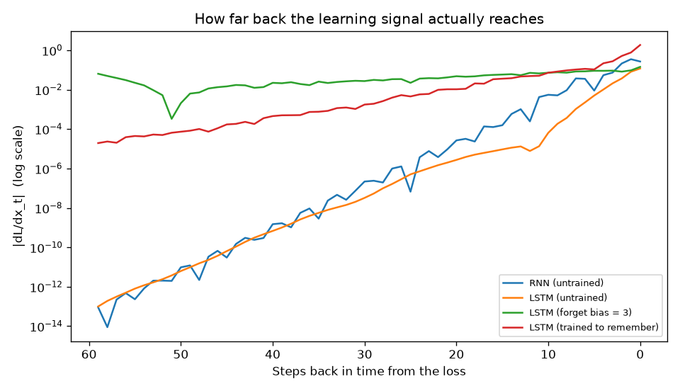
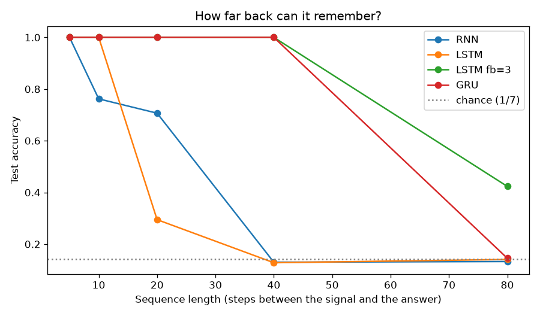
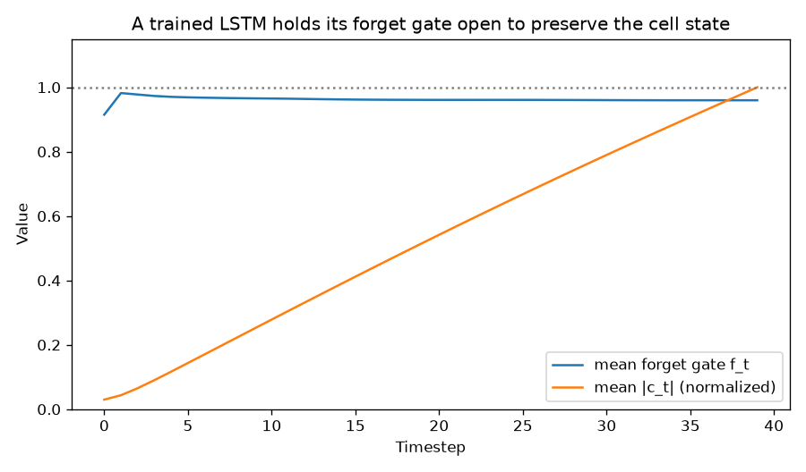
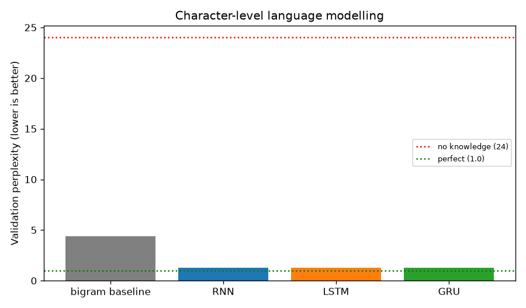

# 09 — RNN / LSTM Sequence Modeling

> **New to this?** Section 2 explains what "sequence data" means and why the previous
> architectures can't handle it, before any maths. Every equation in §4 has a "reading
> it aloud" line, a symbol table, and a note on where it comes from.

## 1. What you'll build

A recurrent network from scratch, the vanishing-gradient problem **measured** rather
than described, and the LSTM's gates derived as the specific fix — including a
correction to the usual story about them.

| Part | The claim | How it's proven |
|---|---|---|
| 1 | An RNN is one equation in a loop | Scratch loop vs. `nn.RNN`: **2.2e-16** |
| 2 | An **untrained LSTM vanishes as badly as an RNN** | Decay ratio 8.5e-13 vs. 3.4e-13 — the fix is the forget bias (**4.5e-01**) |
| 3 | Part 2's measurement predicts what can be learned | Default LSTM fails at 20 steps; fb=3 solves 40 perfectly |
| 4 | Gradients explode above spectral radius 1 | Clipping: final loss **2.98 → 0.96** |
| 5 | A working LSTM holds its forget gate open | Mean forget gate **0.947**, accuracy 1.000 |
| 6 | Next-character prediction learns structure by itself | Perplexity 4.39 → **1.28** vs. a bigram baseline |

**Part 2 is the one to read carefully.** The textbook line is "LSTMs solve the vanishing
gradient". Measured at initialization, that is false — and Part 3 confirms the
consequence by watching a default LSTM fail a task the fix solves perfectly.

## 2. What is sequence modeling, why do we need it, and where is it used?

### What it is

Some data is a **list where order matters and length varies**:

```
  "the cat sat on the mat"     ← 6 words. Reorder them and the meaning changes.
  [12.1, 12.4, 11.9, 13.6]     ← a temperature reading every hour
  ▁▂▃▅▇▅▃▂▁                    ← an audio waveform
```

Every architecture so far needed a **fixed-size** input. Project 06's `nn.Linear(784,
128)` accepts exactly 784 numbers — not 783, not 785. But sentences have different
lengths, and a model that can only read 6-word sentences is useless.

A recurrent network solves this by reading **one element at a time**, keeping a running
summary:

```
   x₁        x₂        x₃        x₄          ← inputs, one per step
    │         │         │         │
    ▼         ▼         ▼         ▼
  ┌────┐    ┌────┐    ┌────┐    ┌────┐
  │ h₁ │───▶│ h₂ │───▶│ h₃ │───▶│ h₄ │       ← hidden state, carried forward
  └────┘    └────┘    └────┘    └────┘
    ▲         ▲         ▲         ▲
   same      same      same      same        ← ONE set of weights, reused
  weights   weights   weights   weights
```

$h_t$ is a fixed-size summary of everything seen so far. Because the same weights are
applied at every step, **one model handles any length** — the sequence analogue of
project 08's weight sharing across space.

### Why we need it

Feeding a sentence to a fully-connected network forces you to pick a maximum length and
pad, and even then the network has no notion that word 3 comes *before* word 4. It would
have to learn word order separately for every position, from scratch.

Three things recurrence gives you:

1. **Variable length** — 5 words or 500, same model, same parameters.
2. **Order awareness** — "dog bites man" and "man bites dog" produce different hidden
   states, because they arrive in a different order.
3. **Memory** — $h_t$ carries information forward, so a word at the start can influence
   a prediction at the end. **How far** it carries is the entire subject of Parts 2–5,
   and the answer is less flattering than you might expect.

### Where it's actually used

Recurrent networks ran production NLP from roughly 2014 to 2018 — machine translation,
speech recognition, autocomplete. **Transformers (project 10) have since replaced them
for most language work**, and it's worth being straight about that rather than
pretending otherwise.

They remain the right tool where:

- **Streaming / real-time data** — an RNN processes one step at a time with constant
  memory, so it can run forever on a live sensor feed. A transformer must re-read its
  whole context window.
- **Very long sequences on small hardware** — attention costs $O(n^2)$ in sequence
  length; recurrence costs $O(n)$.
- **Time series** — sensor readings, demand forecasting, anomaly detection, ECG.
- **Embedded and on-device audio** — keyword spotting ("Hey Siri") on a tiny power budget.
- **Modern state-space models** (Mamba, S4) are recurrent networks redesigned around the
  gradient-flow problem this project measures, and are actively competitive with
  transformers on long sequences.

**Why learn them anyway if transformers won?** Because the *problem* they were built to
solve — how to carry information across many steps without the gradient dying — is the
problem attention solves differently. Project 10's design only makes sense once you have
felt this one fail.

## 3. The core idea

One equation, applied in a loop:

> Take the previous summary, mix in the new input, produce a new summary.

Everything else in this project follows from a single consequence of that loop: to get a
gradient from step 60 back to step 1, the chain rule must pass through **the same weight
matrix 59 times**. Repeated multiplication by one matrix is an exponential — and
exponentials either vanish or explode. There is very little middle ground, and Part 4
measures exactly how little.

## 4. The math

### 4.1 The recurrent cell

$$h_t = \tanh\left(x_t W_{xh} + h_{t-1}W_{hh} + b_h\right)$$

> **Reading it aloud:** *"h at time t equals tanh of: x at time t times W-x-h, plus h at
> time t-minus-1 times W-h-h, plus b."*
>
> | Symbol | Say it | What it means here |
> |---|---|---|
> | $t$ | "t" | **Timestep** — position in the sequence. Not a power. |
> | $x_t$ | "x sub t" | The input at step $t$: one word, one sensor reading, one character. |
> | $h_t$ | "h sub t" | The **hidden state** — a fixed-size vector summarizing everything up to step $t$. |
> | $h_{t-1}$ | "h sub t minus 1" | The **previous** hidden state. This is the loop: the layer's own past output is an input. |
> | $W_{xh}$ | "W x h" | Weights mapping **input → hidden**. Subscript reads "from x to h". |
> | $W_{hh}$ | "W h h" | Weights mapping **hidden → hidden**. This one matrix is applied at *every* step, and it is the source of every problem below. |
> | $\tanh$ | "tanh" | Squashes to $(-1, 1)$. Keeps the state bounded so it can't grow without limit. |
>
> **Where it comes from:** it is project 01's linear layer with **one term added** —
> $h_{t-1}W_{hh}$. That single term is the whole idea of recurrence. Note $h_0$ is
> conventionally zeros: before seeing anything, you know nothing.

### 4.2 Backpropagation through time (BPTT)

Unroll the loop and it becomes a very deep feed-forward network — 60 steps is a 60-layer
network — except every layer shares the same weights. Backprop then works exactly as in
project 06, summing the gradient contributions from every step:

$$\frac{\partial L}{\partial W_{hh}} = \sum_{t=1}^{T}\frac{\partial L}{\partial h_t}\cdot\frac{\partial h_t}{\partial W_{hh}}$$

> $T$ is the sequence length. The **sum** appears because $W_{hh}$ is used at every step,
> so it gets a gradient contribution from each — the same reason project 08's shared
> kernel accumulates gradients from every position.
>
> **Where it comes from:** the multivariable chain rule, nothing more. "BPTT" is just
> backprop applied to the unrolled loop.

### 4.3 Why the gradient vanishes — the key derivation

To get from the loss at step $T$ back to step $k$, the chain rule must pass through every
intermediate step:

$$\frac{\partial h_T}{\partial h_k} = \prod_{t=k+1}^{T}\frac{\partial h_t}{\partial h_{t-1}} = \prod_{t=k+1}^{T} W_{hh}^{T}\,\text{diag}\!\left(\tanh'(z_t)\right)$$

> | Symbol | Say it | What it means here |
> |---|---|---|
> | $\prod$ | "product over" | **Multiply** these together — one factor per timestep. Contrast with $\sum$. |
> | $\text{diag}(v)$ | "diagonal matrix of v" | A matrix with $v$ down the diagonal; multiplying by it scales each component independently. |
> | $\tanh'(z)$ | "tanh prime" | The derivative of tanh, which is **at most 1** and usually much less. |
>
> **Where it comes from:** derived by applying §4.1's derivative repeatedly. This single
> product explains everything in Parts 2–4.

Take the magnitude. If $\lambda$ is the largest eigenvalue of $W_{hh}$, this product
behaves roughly like

$$\left\|\frac{\partial h_T}{\partial h_k}\right\| \sim \lambda^{\,T-k}$$

and that is an **exponential in the distance**:

- $\lambda < 1$ → the gradient **vanishes**. $0.9^{60} \approx 0.002$; $0.5^{60} \approx 10^{-18}$.
- $\lambda > 1$ → the gradient **explodes**. $1.1^{60} \approx 300$.
- $\lambda = 1$ exactly → borderline, and unstable in practice.

**This is worse than project 06's deep network**, where each layer had a *different*
matrix and the factors could partly cancel. Here it's the same matrix every time, so the
product converges to a pure exponential. Part 4 measures this by rescaling $W_{hh}$ to
chosen spectral radii.

### 4.4 The LSTM — a gated highway for gradients

The LSTM adds a second state, the **cell state** $c_t$, updated by *addition* rather
than by matrix multiplication:

$$f_t = \sigma(\ldots) \qquad i_t = \sigma(\ldots) \qquad o_t = \sigma(\ldots) \qquad g_t = \tanh(\ldots)$$
$$c_t = f_t \odot c_{t-1} + i_t \odot g_t \qquad\qquad h_t = o_t \odot \tanh(c_t)$$

> **Reading it aloud:** *"c at time t equals f-t element-wise-times c-t-minus-1, plus i-t
> element-wise-times g-t."*
>
> | Symbol | Say it | What it means here |
> |---|---|---|
> | $c_t$ | "c sub t" | The **cell state** — long-term memory, a conveyor belt running through the sequence. |
> | $f_t$ | "f sub t" | The **forget gate**. A sigmoid, so between 0 and 1: 1 = "keep all of the old memory", 0 = "erase it". |
> | $i_t$ | "i sub t" | The **input gate** — how much of the new candidate to write in. |
> | $o_t$ | "o sub t" | The **output gate** — how much of the cell to expose as $h_t$. |
> | $g_t$ | "g sub t" | The **candidate** — the new information on offer, a tanh so it can be positive or negative. |
> | $\odot$ | "element-wise product" | Multiply matching entries. Each of the gates is a per-component valve. |
> | $\sigma$ | "sigmoid" | Project 02's sigmoid. Used because a gate must be between 0 and 1. |
>
> Each gate is computed from $x_t$ and $h_{t-1}$ by its own weight matrix — so an LSTM
> has **four times** an RNN's parameters. The "$\ldots$" above is
> $x_tW_x + h_{t-1}W_h + b$ for each gate's own weights.

**Now the crucial line.** Differentiate the cell update:

$$\frac{\partial c_t}{\partial c_{t-1}} = f_t$$

No weight matrix. No tanh derivative. **Just the forget gate.** So the gradient flowing
back through the cell state is multiplied by $f_t$ at each step instead of by
$W_{hh}\text{diag}(\tanh')$. If the network sets $f_t \approx 1$, the gradient passes
through essentially unchanged — an uninterrupted highway back through time.

> ⚠️ **And here is what the textbook version leaves out.** $f_t = \sigma(\ldots)$, and
> at initialization all those weights are small and the bias is **zero**, so
> $f \approx \sigma(0) = 0.5$. The cell state is *halved every step*:
> $0.5^{60} \approx 10^{-18}$. **An untrained LSTM vanishes just as badly as an RNN** —
> Part 2 measures exactly this.
>
> The LSTM doesn't remove the exponential; it makes its rate **learnable**. The fix is to
> start the valve open: set the forget gate's bias to +1, +2 or +3 so
> $\sigma(3) = 0.95$. Part 2 shows this improving gradient flow by twelve orders of
> magnitude, and Part 3 shows it turning a failing model into a perfect one.

### 4.5 Gradient clipping

Vanishing needs an architecture change. **Exploding** has a blunt fix:

$$\text{if } \|g\| > \tau: \quad g \leftarrow \tau\,\frac{g}{\|g\|}$$

> $g$ is the full gradient vector, $\|g\|$ its length, $\tau$ the threshold. Rescaling
> preserves the **direction** and caps only the **size**, so one unlucky batch can't
> destroy the weights.
>
> **Where it comes from:** pure engineering, and it's honest to call it a hack. It does
> nothing whatsoever for vanishing gradients.

## 5. From formula to code

| # | Formula | Code |
|---|---|---|
| (1) | $h_t = \tanh(x_tW_{xh} + h_{t-1}W_{hh} + b)$ | `rnn_forward_scratch()`, verified vs. `nn.RNN` |
| §4.3 | $\|\partial h_T/\partial h_k\| \sim \lambda^{T-k}$ | `gradient_flow_of()` measures it directly |
| §4.4 | $c_t = f_t \odot c_{t-1} + i_t \odot g_t$ | the hand-rolled LSTM loop in `run_lstm_gates_demo` |
| §4.4 | forget-bias init | `bias_ih_l0[H:2H].fill_(3.0)` |
| §4.5 | clipping | `nn.utils.clip_grad_norm_(params, 1.0)` |

PyTorch packs the four gates into one matrix in the order **i, f, g, o**, which is why
the forget gate is the second block of `hidden_size` rows. Part 5 unpacks them by hand
to read the gates out.

## 6. The data

Three synthetic tasks, each isolating one thing:

1. **The memory task** (Parts 2, 3, 5) — a symbol at step 0, then $N$ steps of nothing,
   then "what was the symbol?" Everything after step 0 is uninformative *by
   construction*, so accuracy is a direct measurement of memory span with no confound.
2. **Random sequences** (Parts 2, 4) — for measuring gradients, which don't care what
   the data means.
3. **A generated grammar** (Part 6) — sentences of the form
   `the ADJ NOUN VERB the ADJ NOUN .` Synthetic on purpose: real text needs a far larger
   model and corpus, whereas here the rules are known exactly, so "did it learn the
   structure?" is checkable with a regex instead of a vibe.

## 7. Results

### Part 1 — the whole model

```
max |scratch - nn.RNN| over all hidden states: 2.220e-16
```

Six lines of numpy match PyTorch's `nn.RNN` to machine precision. There is no hidden
machinery: `h = tanh(x @ W_xh + h @ W_hh + b)` in a loop *is* a recurrent network.

### Part 2 — the measurement that corrects the textbook



$|\partial L/\partial x_t|$ — how strongly a loss at step 60 depends on the input at
step $t$:

```
 steps back           RNN (untrained)          LSTM (untrained)
          0                 2.672e-01                 1.180e-01
         20                 2.659e-05                 2.727e-06
         40                 1.491e-09                 6.791e-10
         59                 9.001e-14                 9.989e-14

 steps back    LSTM (forget bias = 3)  LSTM (trained to remember)
          0                 1.424e-01                 1.838e+00
         20                 4.784e-02                 1.045e-02
         40                 2.213e-02                 4.542e-04
         59                 6.371e-02                 1.942e-05

Model                            gradient at t=1 / at t=60
RNN (untrained)                                   3.37e-13
LSTM (untrained)                                  8.47e-13
LSTM (forget bias = 3)                            4.47e-01
LSTM (trained to remember)                        1.06e-05
```

The RNN decays exponentially — a straight line on a log plot. By 40 steps back the signal
is $10^{-9}$ of its value at the end. An RNN doesn't "forget slowly"; **the gradient that
would teach it to remember never arrives**.

**Now compare the first two rows of the summary table.** The untrained LSTM is
*8.47e-13* against the RNN's *3.37e-13* — it is not better, it is marginally **worse**.
I expected the standard result and did not get it.

§4.4 explains why: at initialization the forget-gate bias is 0, so $f = \sigma(0) = 0.5$
and the cell state is halved every step. The additive highway exists, but it starts with
the valve half closed.

The last two rows are the actual fix. Setting the forget bias to 3 makes $f = 0.95$ from
the start and improves the decay ratio from **3.4e-13 to 4.5e-01** — twelve orders of
magnitude. Training on a task that *requires* memory achieves the same thing by learning
it (Part 5 shows the learned gate).

So the honest claim is **not** "LSTMs don't have vanishing gradients". It is: an LSTM
*can* keep gradients alive over long spans, because a **learnable** gate controls the
decay rate — whereas an RNN's decay is fixed by its weight matrix and can't be chosen
per timestep.

### Part 3 — the prediction, tested



Part 2 was a measurement. This is its consequence:

```
  seq length          RNN         LSTM    LSTM fb=3          GRU
           5        1.000        1.000        1.000        1.000
          10        0.762        1.000        1.000        1.000
              (0.29-1.00)  (1.00-1.00)  (1.00-1.00)  (1.00-1.00)
          20        0.707        0.295        1.000        1.000
              (0.12-1.00)  (0.16-0.48)  (1.00-1.00)  (1.00-1.00)
          40        0.130        0.128        1.000        1.000
          80        0.133        0.141        0.423        0.145
              (0.13-0.13)  (0.13-0.15)  (0.13-0.83)  (0.13-0.17)
```

Chance is 0.143. Mean of 3 seeds, with the min–max spread beneath — these runs are
genuinely noisy and a single seed would mislead.

- The **RNN** is unreliable by 10 steps (note the 0.29–1.00 spread) and at chance by 40.
- The **default LSTM fails at 20 steps — worse than the RNN.** Exactly as Part 2's
  measurement predicted, and not what the textbook summary would lead you to expect.
- **LSTM fb=3 and the GRU** solve 40 steps perfectly, on every seed.

So "LSTMs handle long dependencies" is really "**LSTMs can, if their forget gate is
initialized or trained to stay open**". The GRU gets there without the trick because its
update gate couples remembering and forgetting into a single term that starts in a
friendlier place.

At 80 steps everything collapses except one lucky fb=3 seed — read the 0.13–0.83 spread,
not the 0.423 mean. **Gating buys roughly an order of magnitude in span; it does not buy
unlimited memory.** That remaining limit is what project 10 removes.

### Part 4 — the other failure

```
  spectral radius      ||dL/dx|| at t=1           behaviour
              0.5             5.121e-16            vanishes
              0.9             6.939e-04              usable
              1.1             8.835e-01              usable
              1.5             3.059e+00            explodes
```

Rescaling $W_{hh}$ to a chosen largest eigenvalue confirms §4.3's prediction directly:
below 1 the signal dies, above 1 it grows. Only a narrow band is trainable, and tanh's
derivative pulls the effective factor further down — which is why plain RNNs vanish far
more often than they explode.

Clipping, on a run that genuinely explodes (spectral radius 2.5, 30 steps):

```
  no clipping    final loss           2.9788   largest gradient norm 3.85e+02
  clip at 1.0    final loss           0.9613   largest gradient norm 6.43e+02
```

Without clipping the loss ends **above** chance ($\log 7 = 1.946$) — training actively
destroyed the model. With clipping it reaches 0.96, well below chance. Same data, same
initialization, same learning rate.

> An earlier version of this demo used a short sequence and default weights, where the
> gradient never exceeded 0.7 — so clipping never triggered and the two runs were
> byte-identical. If your demonstration of a fix shows no difference, check that the
> problem is actually present before concluding the fix doesn't work.

### Part 5 — inside a working LSTM



```
Trained LSTM (forget bias 3) on the 40-step memory task: test accuracy 1.000

  step    mean forget gate   mean |cell state|
     0              0.9014              3.4648
     1              0.9608              5.0891
    10              0.9464             32.6586
    39              0.9459            115.8866
```

The forget gate averages **0.947** across the uninformative steps — the network has
learned to say "keep everything", because on this task the only useful strategy is to
memorize step 0 and ignore the rest.

That number *is* the gradient-flow mechanism. Since
$\partial c_t/\partial c_{t-1} = f_t$, a gate at 0.947 means the gradient is multiplied
by 0.947 per step rather than by a matrix — over 40 steps, $0.947^{40} \approx 0.11$
instead of $10^{-13}$.

(Note this inspection uses the forget-bias-initialized model. The default LSTM never
solved the 40-step task at all, and there is nothing to learn from reading the gates of
a model that failed.)

### Part 6 — a character-level language model



```
Model                    validation perplexity
bigram baseline                          4.385
RNN                                      1.279
LSTM                                     1.277
GRU                                      1.278
```

**Perplexity** = $e^{\text{cross-entropy}}$: "how many characters is the model effectively
choosing between at each step". 1.0 is perfect; the vocabulary size (24) is the score of
a model that has learned nothing.

The bigram baseline only sees the *previous* character, so at `the quiet r…` it has no
idea a noun is due. The recurrent models carry a hidden state and can track position
within the sentence — exactly what the grammar requires. All three land near 1.28; on a
grammar this regular the architectural differences that mattered in Part 3 simply don't
arise, because there are no long-range dependencies to carry.

Samples, generated one character at a time:

```
  RNN:  "the restless harbour hides the bright mountain ."
  LSTM: "the hollow mountain remembers the quiet meadow ."
  GRU:  "the restless sparrow remembers the distant lantern follows the golden meadow ."
```

Nothing told these models what a word is, that spaces separate words, or that sentences
end with a full stop. They saw a stream of characters and learned to predict the next
one — and word boundaries, spelling and word order fell out of that single objective.
(The GRU's sample runs two sentences together, which the grammar check counts as a
failure. The samples are two lines each; don't read much into 1/1 vs 0/2.)

**That is exactly the objective a large language model is trained on.** The differences
are scale — billions of characters instead of 58,000 — and architecture.

## 8. Run it

```bash
cd 09-rnn-lstm-sequences
python3 -m venv .venv
source .venv/bin/activate
pip install -r requirements.txt
python rnn_lstm.py
```

About 5 minutes on CPU (Part 3 trains 60 models) and writes four plots to `outputs/`.

## 9. Exercises

1. **Give the LSTM its fair chance earlier.** Part 3 shows fb=3 rescuing the LSTM. Sweep
   the forget bias over 0, 1, 2, 3, 5 at sequence length 40 and find where it starts
   working. Compare against Part 2's gradient-decay ratio for the same values — the two
   curves should tell the same story.
2. **Break the GRU's advantage.** The GRU matched fb=3 without any trick. Try sequence
   length 120 and 200 with more training. Does either survive? Where is the practical
   ceiling for gating?
3. **Watch the gates on a task that needs forgetting.** Change `make_memory_task` so the
   answer is the *last* non-zero symbol rather than the first. Re-run Part 5 — the forget
   gate should now drop below 1 when a new symbol arrives. The gate is not "always open";
   it's learned.
4. **Reproduce the exploding regime.** In Part 4, sweep the spectral radius finely
   between 0.95 and 1.15 and find where training first diverges. Then add clipping and
   see how much further you can push before it fails anyway.
5. **Predict before you run.** Section 4.3 says decay goes as $\lambda^{T-k}$. Measure
   the actual decay ratio at radius 0.9 over 60 steps and compare against $0.9^{60}$.
   They won't match exactly — work out which term in §4.3 accounts for the difference.
   (Hint: what is $\tanh'$ typically worth?)
6. **A harder language task.** Replace `make_corpus` with a grammar containing a
   long-range dependency — e.g. sentences that open with `if` must end with `then ...`,
   with filler in between. Now Part 3's architecture differences should appear in
   perplexity, where the regular grammar hid them.

## 10. What's next

Everything here is limited by one design decision: information from step 1 reaches step
60 only by being **passed through 59 intermediate states**. Gating controls how fast it
decays, but it still decays, and every step must wait for the previous one — so training
cannot be parallelized across the sequence.

Project 10 discards recurrence entirely. **Attention** lets step 60 read step 1
*directly*, in one operation, with no intermediate states to survive — a constant-length
path between any two positions, and all positions computable in parallel. You'll derive
scaled dot-product attention, prove why the $\sqrt{d_k}$ scaling is necessary by
measuring what happens without it, show that attention is permutation-invariant until
you add positional encoding, and build a small GPT that generates text.
