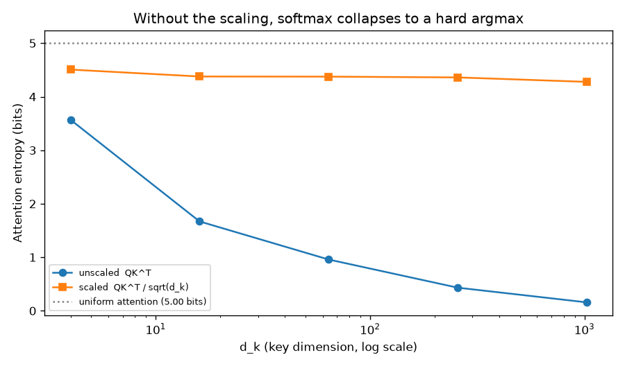
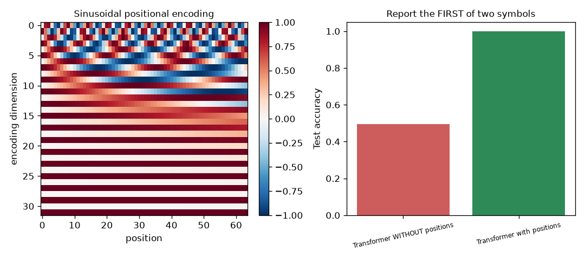
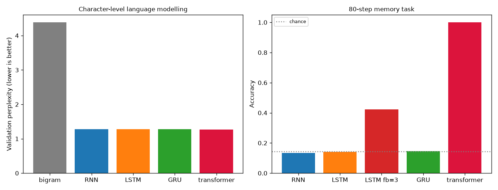

# 10 — Transformer from Scratch

> **New to this?** Section 2 explains what attention *is* with a worked example before
> any notation. Every equation in §4 has a "reading it aloud" line, a symbol table, and
> a note on where it comes from.

**This completes Phase 2.** Everything from project 06 onward has been building toward
this architecture — the one behind GPT, Claude, and essentially every modern AI system.

## 1. What you'll build

Scaled dot-product attention from scratch, then six experiments that each *test* a
design decision rather than accepting it on authority.

| Part | The claim | How it's proven |
|---|---|---|
| 1 | Attention is three matrices and a softmax | Scratch vs. `F.scaled_dot_product_attention`: **2.2e-16** |
| 2 | The $\sqrt{d_k}$ isn't cosmetic | Without it, attention entropy collapses **3.57 → 0.158 bits** |
| 3 | Attention cannot perceive order at all | Permuting inputs permutes outputs exactly: **6.7e-16** |
| 4 | So positional encoding is mandatory | Same model, same data: **0.495 → 0.999** |
| 5 | Causal masking leaks nothing | Corrupting the future changes earlier outputs by **0.000e+00** |
| 6 | Attention solves what recurrence couldn't | 80-step memory task: RNN 0.133, LSTM 0.141, **transformer 1.000** |

Part 6 is the payoff for project 09 — the exact task every recurrent model failed.

## 2. What is attention, why do we need it, and where is it used?

### What it is

Attention lets every position in a sequence **look directly at every other position**
and decide what's relevant.

Consider resolving "it" in: *"The animal didn't cross the street because **it** was too
tired."* To represent "it" properly, the model needs "animal" — 6 words back.

```
  The   animal   didn't   cross   the   street   because   it   was   tired
         ▲                                                  │
         └──────────────────────────────────────────────────┘
              one dot product: "it" reads "animal" directly
```

The mechanism is a **soft dictionary lookup**. Each position produces three vectors:

- a **query** — "what am I looking for?"
- a **key** — "what do I contain?"
- a **value** — "what will I pass on if selected?"

Match every query against every key by dot product, softmax the scores into weights that
sum to 1, and output the weighted average of the values. "it" emits a query meaning
*"I'm a pronoun, find me a noun"*; "animal" emits a matching key; their dot product is
large; so "it" ends up mostly reading "animal"'s value.

**Soft** is the important word: instead of picking one position, you take a weighted
blend — which is what makes it differentiable and therefore learnable.

### Why we need it

Project 09 ended at a wall. To relate step 1 and step 80, a recurrent network must pass
information through **79 intermediate hidden states**, and Parts 2–5 there measured the
consequences: gradients decaying by 13 orders of magnitude, and every recurrent
architecture stuck at chance on an 80-step memory task.

Attention removes the intermediate states entirely:

| | RNN | Attention |
|---|---|---|
| Path between positions $i$ and $j$ | $\lvert i-j\rvert$ steps | **1 step, always** |
| Gradient over distance | decays exponentially | no decay from distance |
| Parallel over the sequence? | **No** — step $t$ needs step $t-1$ | **Yes** — all positions at once |
| Cost in sequence length $n$ | $O(n)$ | $O(n^2)$ |

The first three rows are why transformers won. **The last row is the price**, and it's
real: doubling the context quadruples the compute. That's why context windows are finite
and why "long context" is an active research problem.

The parallelism matters as much as the gradients. An RNN's loop can't be parallelized
across time — you can't compute step 5 before step 4. A transformer computes every
position simultaneously, which is what makes training on internet-scale text possible at
all.

### Where it's actually used

- **Every large language model** — GPT, Claude, Llama, Gemini. Decoder-only
  transformers, exactly the architecture in Part 6, scaled up enormously.
- **Vision Transformers** — split an image into patches, treat them as a sequence.
  Match or beat CNNs (project 08) given enough data.
- **AlphaFold 2** — attention over amino acid pairs.
- **Speech** (Whisper), **music** generation, **protein design**, **code completion**.
- **Multimodal models** — the same mechanism handles text, images and audio together,
  because attention doesn't care what a "position" is.

**When *not* to use one:** short sequences on small data — the $O(n^2)$ cost and the
weak inductive bias (§4.3: it knows *nothing* about order until you tell it) mean CNNs
and even RNNs can win when data is scarce. And for streaming or very long sequences,
recurrence's $O(n)$ is still attractive, which is why state-space models (Mamba) are
being revisited.

## 3. The core idea

Project 08 built in the structure of grids. Project 09 built in the structure of
sequences. **Attention builds in almost no structure at all** — it just lets everything
look at everything and *learns* which relationships matter.

That sounds worse and is mostly better: fewer built-in assumptions means fewer wrong
assumptions, provided you have enough data to learn the right ones. It's project 08's
inductive-bias tradeoff pushed to the opposite extreme, and it's why transformers need
more data than CNNs but scale further.

The consequence, which Part 3 proves exactly, is that a transformer initially has no
concept of order — so order must be *added to the data*.

## 4. The math

### 4.1 Scaled dot-product attention

$$\text{Attention}(Q,K,V) = \text{softmax}\!\left(\frac{QK^{\top}}{\sqrt{d_k}}\right)V$$

> **Reading it aloud:** *"Attention of Q, K, V equals softmax of Q times K-transpose over
> the square root of d-k, all times V."*
>
> | Symbol | Say it | What it means here |
> |---|---|---|
> | $Q$ | "Q" / queries | One row per position: "what this position is looking for". Shape $(n, d_k)$. |
> | $K$ | "K" / keys | One row per position: "what this position offers". Shape $(n, d_k)$. |
> | $V$ | "V" / values | One row per position: "what this position passes on if selected". |
> | $K^{\top}$ | "K transpose" | Flipped, so $QK^{\top}$ is $(n,d_k)\times(d_k,n) = (n,n)$ — **every position's score against every other**. |
> | $n$ | "n" | Sequence length. The $(n,n)$ score matrix is where $O(n^2)$ comes from. |
> | $d_k$ | "d k" | Dimension of each query/key vector. |
> | softmax | "soft max" | Turns each row of scores into weights that are positive and sum to 1. |
> | $\sqrt{d_k}$ | "root d k" | The scaling factor. §4.2 derives why it must be there. |
>
> $Q$, $K$ and $V$ are themselves produced from the input by learned projections:
> $Q = XW_Q$, $K = XW_K$, $V = XW_V$. Those three matrices are what training actually
> learns; attention itself has no parameters.
>
> **Where it comes from:** the dot product is the natural similarity measure between
> vectors ($q\cdot k$ is large when they point the same way), and softmax is the standard
> way to turn arbitrary scores into a distribution — the same softmax as project 06's
> output layer. The only non-obvious ingredient is the $\sqrt{d_k}$.

### 4.2 Why $\sqrt{d_k}$ — derived

Suppose the entries of $q$ and $k$ are independent with mean 0 and variance 1. Their dot
product is a sum of $d_k$ such products:

$$q\cdot k = \sum_{i=1}^{d_k} q_i k_i \qquad \mathbb{E}[q\cdot k] = 0, \qquad \text{Var}(q\cdot k) = d_k$$

> Variances of independent terms **add**, and each term $q_ik_i$ has variance
> $1\times 1 = 1$. So the sum of $d_k$ of them has variance $d_k$, and standard deviation
> $\sqrt{d_k}$.

So with $d_k = 1024$, the raw scores have a standard deviation of about **32**. Feeding
numbers of that size into a softmax makes it saturate: $e^{32}$ dwarfs $e^{-32}$, so
essentially all the weight lands on one position and the softmax becomes a hard argmax.

**Why that's fatal.** Softmax's derivative involves $p(1-p)$ for each entry. When $p$ has
collapsed to 1 for one position and 0 elsewhere, $p(1-p) \approx 0$ everywhere — **no
gradient flows back to $Q$ and $K$ at all**. This is project 02's saturated sigmoid and
project 06's vanishing gradient in a third costume.

Dividing by $\sqrt{d_k}$ makes the scores' standard deviation exactly 1 regardless of
dimension. **Part 2 measures all of this.**

### 4.3 Permutation equivariance — and why positional encoding must exist

$$\text{Attention}(PX) = P\,\text{Attention}(X) \quad \text{for any permutation matrix } P$$

> **Reading it aloud:** *"Attention of P-X equals P times attention of X."*
>
> A **permutation matrix** $P$ just reorders rows. So: shuffle the inputs and the outputs
> shuffle identically, with their *contents unchanged*.
>
> **Where it comes from:** every position is compared with every other by a dot product,
> and $\{$dot products$\}$ is a **set** — nothing in the formula references position at
> all. Part 3 verifies this to 6.7e-16.

The consequence is stark: **attention cannot distinguish "dog bites man" from "man bites
dog".** Order must be injected as data.

$$\text{PE}[\text{pos}, 2i] = \sin\!\left(\frac{\text{pos}}{10000^{2i/d}}\right), \qquad \text{PE}[\text{pos}, 2i+1] = \cos\!\left(\frac{\text{pos}}{10000^{2i/d}}\right)$$

> | Symbol | Say it | What it means here |
> |---|---|---|
> | pos | "position" | Which position in the sequence, 0, 1, 2, … |
> | $i$ | "i" | Which dimension pair of the encoding vector. |
> | $10000^{2i/d}$ | — | A **wavelength** that grows with $i$: low dimensions oscillate fast (fine position), high ones slowly (coarse position). |
>
> Think of it as writing the position number in a strange base — fast digits for detail,
> slow digits for magnitude — then **adding** that vector to the token embedding.
>
> **Where it comes from:** partly derived, partly designed. Sinusoids were chosen so that
> the encoding of position $p+k$ is a fixed **linear function** of the encoding of
> position $p$, which makes *relative* offsets easy for attention's dot product to detect.
> Being a fixed function rather than learned parameters, it also extends to sequences
> longer than any seen in training. Modern models often use learned or rotary (RoPE)
> encodings instead, but the requirement is the same.

### 4.4 Multi-head attention

$$\text{MultiHead}(X) = \left[\text{head}_1;\ \ldots;\ \text{head}_h\right]W_O, \qquad \text{head}_i = \text{Attention}(XW_Q^i, XW_K^i, XW_V^i)$$

> $[\ ;\ ]$ means **concatenate**; $h$ is the number of heads; $W_O$ mixes the results
> back together. Each head gets its own $W_Q, W_K, W_V$ and works in a smaller dimension
> $d_k = d_{\text{model}}/h$, so total cost is unchanged.
>
> **Where it comes from:** a single softmax produces *one* weighted average, so one head
> can only look for one kind of relationship at a time. With 8 heads the model can
> simultaneously track syntax, coreference, and topic. It's the same motivation as
> project 08's 16 kernels per layer: multiple feature detectors in parallel.

### 4.5 Causal masking

$$\text{scores}_{ij} \leftarrow -\infty \quad \text{for } j > i$$

> Set every score that looks **forward** to negative infinity *before* the softmax.
> Since $e^{-\infty} = 0$, those positions receive **exactly zero** weight — not a small
> number, an exact zero. Part 5 verifies this by corrupting a future token and confirming
> earlier outputs change by 0.000e+00.
>
> **Where it comes from:** a necessity of the training objective. Predicting the next
> token means position $t$ may use only positions $\le t$; without the mask the model
> would see the answer in its input and learn nothing — project 03's data leakage, built
> into the architecture.
>
> The payoff is enormous: **one forward pass over a length-$n$ sequence yields $n$
> training examples at once**, every position predicting its own next token, all in
> parallel. Project 09's RNN could never do this.

## 5. From formula to code

| # | Formula | Code |
|---|---|---|
| (1)–(3) | $\text{softmax}(QK^\top/\sqrt{d_k})V$ | `attention_scratch()`, verified vs. PyTorch |
| §4.2 | the scaling | measured by sweeping `d_k` and reading entropy + gradients |
| §4.3 | permutation equivariance | `attend(X)[perm]` vs. `attend(X[perm])` |
| (4) | sinusoidal encoding | `sinusoidal_encoding()` |
| §4.4 | multi-head | `nn.TransformerEncoderLayer(d_model, n_heads, ...)` |
| §4.5 | causal mask | `scores.masked_fill(mask == 0, -inf)` |

`TinyTransformer` assembles these: embed → add positions → $N$ attention blocks →
linear head. Note `norm_first=True` (pre-norm), which is what modern models use — it
makes deep stacks trainable, for the same reason project 06's initialization mattered.

## 6. The data

- **Random tensors** (Parts 1–3, 5) — correctness and gradient properties don't depend
  on data meaning anything.
- **An order task** (Part 4) — two symbols at random positions; report which came first.
  Designed so it is *only* solvable using position.
- **The grammar corpus from project 09** (Part 6), unchanged, so perplexities are
  **directly comparable** against the RNN/LSTM/GRU numbers.
- **The 80-step memory task from project 09** (Part 6), unchanged, for the same reason.

## 7. Results

### Part 1 — attention, verified

```
Unmasked:  max |scratch - F.scaled_dot_product_attention| = 2.220e-16
Causal:    max |scratch - F.scaled_dot_product_attention| = 2.220e-16
Attention weights sum to 1:  max |row sum - 1| = 2.220e-16
```

Three lines of tensor algebra reproduce PyTorch's fused kernel exactly. The operation at
the heart of every modern language model fits in a four-line function.

### Part 2 — why the scaling is not cosmetic



```
   d_k  score std (unscaled)   max attn weight   entropy (bits)  scaled entropy
     4                  1.85            0.5897            3.570           4.507
    16                  3.93            0.9960            1.670           4.378
    64                  7.97            0.9999            0.958           4.375
   256                 15.80            1.0000            0.432           4.360
  1024                 31.99            1.0000            0.158           4.277
```

**The theory predicts the second column exactly.** §4.2 says the scores' standard
deviation should be $\sqrt{d_k}$: $\sqrt{1024} = 32$, measured **31.99**. Every row
matches.

The consequence is in the entropy. Maximum possible is $\log_2 32 = 5$ bits (attention
spread evenly); 0 bits means everything collapsed onto one position. **Unscaled, entropy
falls from 3.57 to 0.158 bits** — the softmax has become a hard argmax, with a single
attention weight of 1.0000. Scaled, entropy holds near 4.3 bits at every dimension.

And the gradient table shows why that's fatal rather than merely untidy: with the
softmax saturated, $p(1-p) \approx 0$ and essentially no gradient reaches $Q$ and $K$.
This is the same failure as project 02's saturated sigmoid, and the fix has the same
shape — keep the pre-activation where the nonlinearity still has a slope.

### Part 3 — attention is blind to order

```
Shuffle order: [1, 6, 4, 2, 7, 3, 5, 0]

  attention(X) then permute   vs   attention(permuted X)
  max |difference| = 6.661e-16

Repeating the test WITH positional encoding added:
  max |difference| = 1.746e+00
```

Identical to machine precision. Attention is **permutation-equivariant**: shuffle the
inputs and the outputs shuffle the same way, contents unchanged. The mechanism literally
cannot tell "dog bites man" from "man bites dog".

Add positional encoding and the difference jumps to 1.75 — the model can finally
distinguish the orderings. This isn't a nice-to-have; §4.3's property makes it
structurally required.

### Part 4 — the task that proves it



```
Model                                test accuracy
Transformer WITHOUT positions               0.4950
Transformer with positions                  0.9987
```

Two distinct symbols at random positions; report **which came first**. Same
architecture, same data, same training — the only difference is whether position vectors
were added to the inputs. Without them the model sits at 0.495, i.e. **guessing between
the two symbols it can see but cannot order**, exactly as §4.3 predicts.

> **This experiment took two attempts, and the first was wrong in an instructive way.**
> Originally I put one symbol at position 0 and the other at the final position, reading
> the answer from that final position. *Both* models scored 1.000. The task was solvable
> without position information, because the final position can see its own token through
> the residual stream and answer "the other one". The fix was to place both symbols at
> random *interior* positions and read the answer from a blank final position. If a
> control condition performs as well as the treatment, suspect the task before the theory.

### Part 5 — masking, verified exactly

```
Causal attention weight matrix (row = query, column = attended-to):
               0       1       2       3       4       5
  pos 0:    1.000   0.000   0.000   0.000   0.000   0.000
  pos 3:    0.040   0.098   0.243   0.619   0.000   0.000
  pos 5:    0.313   0.065   0.172   0.023   0.137   0.290

Sum of attention paid to the future: 0.000e+00
```

The matrix is lower-triangular by construction. But the real test is behavioural —
corrupt the **last** position's key and value, then check whether earlier outputs move:

```
  position      max |change|
         0         0.000e+00
         1         0.000e+00
         4         0.000e+00
         5         5.506e-01
```

Positions 0–4 are **bit-identical**. Only the tampered position changed. That's an exact
zero because $e^{-\infty} = 0$ exactly, not a small number that might leak.

This guarantee is what makes efficient training possible: one forward pass over $n$
tokens yields $n$ supervised examples simultaneously.

### Part 6 — the payoff



A 103,064-parameter mini-GPT — 2 layers, 4 heads, causal masking — on project 09's exact
corpus:

```
Model                                validation perplexity
bigram baseline (project 09)                         4.385
LSTM (project 09)                                    1.277
this transformer                                     1.263
```

Slightly better than the LSTM, which is unremarkable — this grammar has no long-range
dependencies, so there's little for attention to exploit. Its samples are fluent:

```
    "the hollow river answers the restless harbour ."
    "the distant sparrow answers the restless meadow ."
```

**Now the comparison that matters.** Project 09's 80-step memory task, where every
recurrent architecture failed:

```
Model                                     accuracy at 80 steps
RNN (project 09)                                         0.133
LSTM (project 09)                                        0.141
LSTM forget-bias=3 (project 09)                          0.423
GRU (project 09)                                         0.145
Transformer (mean of 3 seeds)                            1.000    (min 1.00, max 1.00)
```

Chance is 0.143. Project 09's models were at or near it — the information sits 80 steps
back and the gradient can't reach. Project 09's best trick, forget-bias initialization,
got to 0.423 with a 0.13–0.83 spread across seeds: unreliable.

**The transformer scores 1.000 on every seed.** It doesn't have to reach back. Position
80 computes a dot product with position 0 directly — one operation, not eighty. Distance
is simply irrelevant to attention.

That is the entire argument for the architecture, measured on the exact task the
previous project failed.

## 8. Run it

```bash
cd 10-transformer-from-scratch
python3 -m venv .venv
source .venv/bin/activate
pip install -r requirements.txt
python transformer.py
```

About 2 minutes on CPU; writes three plots to `outputs/`.

## 9. Exercises

1. **Delete the scaling.** Remove `/ math.sqrt(d_k)` from `attention_scratch` and train
   Part 6's mini-GPT. Perplexity should get clearly worse. Then reduce `d_model` to 16
   and try again — the damage should shrink, because §4.2's problem is proportional to
   dimension.
2. **Visualize what the heads learn.** Return the attention weights from `TinyTransformer`
   and plot the $(n,n)$ matrix for each head on a generated sentence. Do any heads
   specialize — one tracking "the" → noun, another the verb position?
3. **Break causality.** Set `causal=False` in Part 6's mini-GPT and retrain. Validation
   perplexity should collapse toward 1.0 — and the model will generate nonsense, because
   it learned to predict a token it was allowed to see. This is project 03's leakage in
   its purest form.
4. **Learned vs. sinusoidal positions.** Replace the fixed encoding with
   `nn.Embedding(max_len, d_model)`. Compare on Part 4's task, then test both on
   sequences *longer* than any seen in training — sinusoids extrapolate, learned
   embeddings cannot.
5. **Measure the $O(n^2)$ cost.** Time one forward pass at sequence lengths 64, 128, 256,
   512, 1024 and plot time against length. Confirm the quadratic. Then do the same for
   project 09's LSTM and see the linear scaling. This is the trade in one plot.
6. **Scale a head count.** Hold `d_model=64` fixed and try 1, 2, 4, 8, 16 heads on Part
   4's order task. More heads means each has fewer dimensions ($d_k = d_{\text{model}}/h$)
   — find where the tradeoff turns, and relate it to §4.2's dependence on $d_k$.

## 10. What's next — and the end of Phase 2

**Phase 2 is complete.** You have built, by hand and verified against PyTorch: a neural
network and backprop (06), autograd (07), convolution (08), recurrence and gating (09),
and attention (10). Every architecture in modern AI is a composition of these.

Look back at the pattern. Each project asked *what structure does my data have?* and
built it into the model — grids for images, order for sequences, and finally, in this
project, **almost nothing**, letting the model learn relationships instead. That last
move is why transformers scale: fewer built-in assumptions means fewer wrong ones,
provided you can supply the data.

**Phase 3 begins at project 11**, and the subject changes from *building* models to
*using* them. You'll work with pretrained transformers rather than training your own:
tokenization and sampling (11), embeddings and vector search (12), retrieval-augmented
generation from scratch (13) and with LangChain (14), agents and tool use (15),
evaluation (16), and fine-tuning (17) — ending in a capstone that combines them.

The mini-GPT you just built is the same architecture, differing only in scale. When
project 11 explains temperature, top-k and top-p sampling, it will be sampling from the
softmax you wrote in Part 6.
