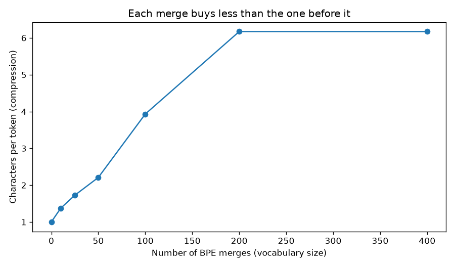
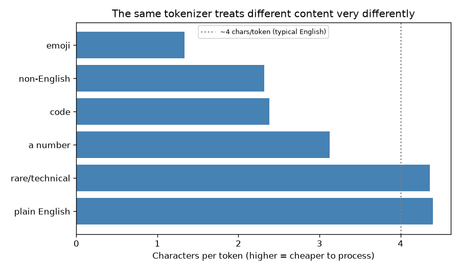
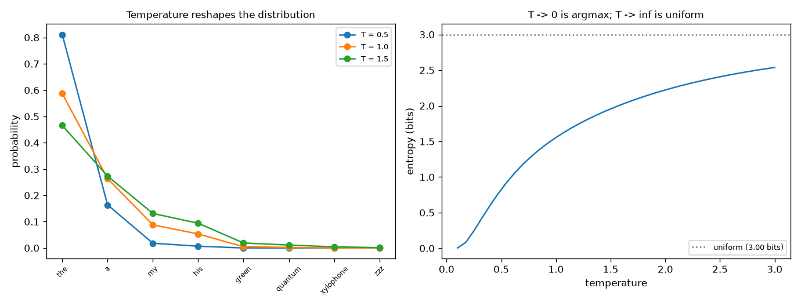
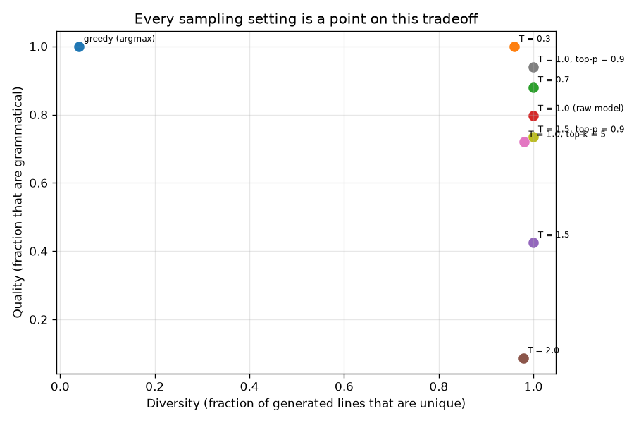

# 11 — LLM Fundamentals: Tokenization & Sampling

> **New to this?** Section 2 explains what tokenization and sampling *are* before any
> notation. Every equation in §4 has a "reading it aloud" line, a symbol table, and a
> note on where it comes from.

**Phase 3 starts here**, and the subject changes: from *building* models to *using*
them. This project covers the two things that sit either side of every LLM — how text
becomes numbers going in, and how numbers become text coming out.

**No API key needed, deliberately.** Sampling operates on the full probability vector
over the whole vocabulary, which a hosted API never exposes. Everything here runs
locally on the transformer you built in project 10.

## 1. What you'll build

| Part | The claim | How it's proven |
|---|---|---|
| 1 | BPE learns its vocabulary from data | Round-trip exact; compression 1.00 → **6.17** chars/token |
| 2 | Subword tokenization beats word and character | Word-level: **4 of 16** test tokens unknown. BPE: 0 |
| 3 | Tokenization explains LLM failure modes | `strawberry` → `['st','raw','berry']` — the model never sees letters |
| 4 | Temperature/top-k/top-p reshape the distribution | Entropy 1.555 → **0.826** bits at T=0.5 |
| 5 | Sampling is a quality/diversity tradeoff | Grammar **1.00 → 0.09** as T goes 0.3 → 2.0 |
| 6 | Greedy decoding gets stuck | **55.6%** repeated lines vs. 0% with top-p |

## 2. What are tokenization and sampling, and why do they matter?

### The sandwich

A language model can only handle numbers. So every LLM interaction is three stages:

```
   "the cat sat"
        │
        ▼  TOKENIZER            text → integers
   [1169, 3797, 3332]
        │
        ▼  TRANSFORMER          project 10's architecture
   logits over 50,257 tokens:  [2.1, -0.4, 6.8, ...]
        │
        ▼  SAMPLER              a distribution → one token
   "down"
```

You built the middle stage in project 10. **This project is the two ends** — and they
are where a surprising number of real-world LLM behaviours actually come from.

### Tokenization — why not just use letters or words?

A **token** is the unit the model reads. Three choices, each broken in its own way:

- **Words** — short sequences, but the vocabulary is unbounded. Every unseen word
  (a name, a typo, a compound) becomes `<UNK>` and its information is destroyed.
- **Characters** — a tiny vocabulary that never fails, but sequences become ~5× longer.
  Since attention costs $O(n^2)$ (project 10), 5× longer is **25× the work**.
- **Subwords** — the compromise everyone uses. Common words get one token; rare words
  break into pieces. Fixed vocabulary, nothing is ever unrepresentable.

Part 2 measures all three.

Why you should care beyond the mechanics: **tokenization explains several famous LLM
failures**. "How many r's in strawberry?" is hard because the model never sees letters
— it sees `['st', 'raw', 'berry']`, three opaque IDs. Arithmetic is unreliable because
`1234567890` splits into `['123','45','678','90']`, chunks that don't align with place
value. Neither is a reasoning failure; both are tokenization artifacts.

It's also where cost and bias hide. English gets ~4.4 characters per token; Spanish gets
2.3. **The same sentence costs roughly twice as much in Spanish**, and API pricing is
per token.

### Sampling — the model doesn't output text

This surprises people: a language model never outputs a word. It outputs a **probability
distribution over every token in its vocabulary**, all 50,257 of them. Turning that into
one actual token is a separate decision, made by code you control:

```
  P(next token)
   0.59 │ ██████████████  "the"
   0.26 │ ██████          "a"
   0.09 │ ██              "my"
   0.05 │ █               "his"
   0.01 │                 ... 50,253 more, mostly nonsense
```

Take the most likely one every time (greedy) and you get repetitive text. Sample
proportionally and you occasionally draw from that long tail of nonsense. **Temperature,
top-k and top-p are the knobs that manage this**, and they are why the same model can
feel creative or robotic depending on settings you choose.

### Where this matters in practice

- **Every API parameter you'll ever set** — `temperature`, `top_p`, `max_tokens` are
  exactly the mechanisms in §4.
- **Cost estimation and context limits** — both counted in tokens, not words.
- **Prompt engineering** — a trailing space in your prompt genuinely changes behaviour,
  because ` hello` and `hello` are *different tokens* (Part 3).
- **Choosing settings per task** — low temperature for code and factual answers, higher
  for brainstorming. Part 5 measures the tradeoff you're making.
- **Debugging weird failures** — before blaming the model's reasoning, check how the
  input tokenized.

## 3. The core idea

Two compression problems, in opposite directions.

**Tokenization** compresses text into as few symbols as possible while keeping every
possible string representable. BPE does this greedily: repeatedly merge the most
frequent adjacent pair.

**Sampling** compresses a 50,257-way probability distribution into one choice. The whole
art is *how much of the tail to keep* — too much and you sample nonsense, too little and
you get repetition.

## 4. The math

### 4.1 Byte-Pair Encoding

```
1. start with every character as its own token
2. count all adjacent pairs; merge the most frequent into one new token
3. repeat until the vocabulary reaches the size you want
```

$$\text{merge} = \arg\max_{(a,b)} \; \text{count}(a,b)$$

> **Reading it aloud:** *"The merge is the argmax over pairs a-b of the count of a-b."*
>
> | Symbol | Say it | What it means here |
> |---|---|---|
> | $(a,b)$ | "the pair a b" | Two **adjacent** symbols in the corpus, e.g. `t` followed by `h`. |
> | $\arg\max$ | "arg max" | *Which* pair scores highest (project 05's argmin, mirrored). |
> | count | — | How many times that pair occurs across the whole corpus. |
>
> **Where it comes from:** it's a **greedy compression algorithm** borrowed from 1994
> data compression, repurposed for text in 2015. Greedy exactly as project 04's decision
> tree was: take the best merge now, never reconsider. Nobody designs the vocabulary —
> it's learned from the corpus, which is why a tokenizer trained mostly on English
> compresses English well and everything else badly.

The order of merges is part of the model: encoding replays them in the order learned, so
earlier merges bind first.

### 4.2 Softmax with temperature

$$p_i = \frac{\exp(z_i / T)}{\sum_j \exp(z_j / T)}$$

> **Reading it aloud:** *"p-i equals e to the z-i over T, divided by the sum over j of e
> to the z-j over T."*
>
> | Symbol | Say it | What it means here |
> |---|---|---|
> | $z_i$ | "z sub i" | The **logit** for token $i$ — the model's raw output score, any real number. |
> | $p_i$ | "p sub i" | The resulting **probability** for token $i$. All the $p_i$ sum to 1. |
> | $T$ | "temperature" | The knob. $T=1$ leaves the model's distribution untouched. |
> | $\sum_j$ | "sum over j" | Over the **whole vocabulary** — 50,257 terms for GPT-2. |
>
> **Where it comes from:** it is project 06's softmax with one addition — dividing the
> logits by $T$ *before* exponentiating. The name is borrowed from statistical physics,
> where the same expression (the Boltzmann distribution) describes how particle energies
> spread at a given temperature.

**Why dividing changes the shape.** Dividing by $T < 1$ multiplies every *gap* between
logits, so the leader pulls further ahead. Dividing by $T > 1$ shrinks the gaps. Two
limits worth knowing:

- $T \to 0$: the largest logit dominates completely → **argmax** (greedy).
- $T \to \infty$: all logits become equal → **uniform** random.

Part 4 measures entropy across this range.

### 4.3 Top-k and top-p (nucleus)

$$\text{top-}k: \quad \text{keep the } k \text{ largest } p_i, \text{ set the rest to } 0, \text{ renormalize}$$

$$\text{top-}p: \quad \text{keep the smallest set } S \text{ with } \sum_{i \in S} p_i \ge p, \text{ renormalize}$$

> | Symbol | Say it | What it means here |
> |---|---|---|
> | $k$ | "k" | A **count** — how many candidate tokens to keep (typically 40–50). |
> | $p$ | "p" | A **probability mass** — how much of the distribution to keep (typically 0.9). |
> | $S$ | "S" | The kept set, the "**nucleus**". Its size changes from token to token. |
> | renormalize | — | Divide by the new sum so it's a valid distribution again. |
>
> **Where it comes from:** both are engineering fixes for the same problem. Each
> individual tail token has tiny probability, but there are **tens of thousands of
> them**, so their combined mass is not tiny. Sample long enough and you will draw one,
> and one bad token corrupts everything generated after it.
>
> The difference is adaptivity. top-$k$ keeps a **fixed count**, which is wrong in both
> directions — too permissive when the model is confident, too restrictive when it is
> genuinely uncertain. top-$p$ keeps a **fixed mass**, so the candidate count expands and
> contracts with the model's confidence. That's why nucleus sampling is the more common
> default, and Part 5 measures the difference.

### 4.4 Entropy, to measure all this

$$H(p) = -\sum_i p_i \log_2 p_i$$

Project 04's entropy, reused as a measuring instrument: **how uncertain is the model
about the next token?** 0 bits means completely decided; $\log_2 V$ bits means uniform
over the vocabulary.

## 5. From formula to code

| # | Formula | Code |
|---|---|---|
| §4.1 | $\arg\max_{(a,b)}\text{count}(a,b)$ | `BPETokenizer.train()` |
| §4.1 | replay merges in order | `BPETokenizer.encode()` |
| (2) | $p_i = e^{z_i/T}/\sum e^{z_j/T}$ | `softmax_with_temperature()` |
| (3) | top-k | `top_k_filter()` |
| (4) | top-p | `top_p_filter()` |
| §4.4 | $H(p)$ | `entropy_bits()` |

## 6. The data

- **A generated grammar corpus** (Parts 1, 2, 5, 6) — sentences of the form
  `the ADJ NOUN VERB the ADJ NOUN .` Synthetic on purpose: a regex can check whether a
  *generated* sentence is grammatical, so Part 5's quality axis is **measured, not
  judged**. That's the whole reason for using a toy grammar rather than real text.
- **GPT-2's real tokenizer** (Part 3) via `tiktoken` — 50,257 tokens learned from web
  text. One small download; the rest of the project is offline, and Part 3 skips
  gracefully if it fails.
- **A mini-GPT** (Parts 5, 6) — project 10's transformer, trained here on the grammar.

## 7. Results

### Part 1 — BPE learns its own vocabulary



The first merges it learns, in order:

```
  merge   1: ('t', 'h')     seen 2192 times  ->  'th'
  merge   2: ('th', 'e')    seen 2034 times  ->  'the'
  merge   3: ('the', '_')   seen 1800 times  ->  'the_'
  merge   4: ('s', '_')     seen 1250 times  ->  's_'
```

It discovers `th` → `the` → `the ` (with the trailing space) by frequency alone. Nobody
told it that "the" is a word.

```
  merges   vocab size   tokens for corpus   chars/token
       0           25              44,441          1.00
      25           50              25,746          1.73
     100          125              11,304          3.93
     200          168               7,200          6.17
     400          168               7,200          6.17
```

Round trip verified: `decode(encode(x)) == x` exactly.

More merges → bigger vocabulary → shorter sequences. That's the tradeoff: short
sequences are cheap (attention is $O(n^2)$) but a large vocabulary means a large
embedding table and output softmax, and rare tokens get too few examples to learn from.

> **Read the last two rows carefully — they are not diminishing returns, they are
> exhaustion.** This grammar uses only 30 distinct words, so BPE literally runs out of
> pairs to merge at around 143, and further merges do nothing at all. Real text has an
> effectively unbounded supply of pairs, so the curve keeps creeping upward and where to
> stop is a genuine choice. Production tokenizers land around 32k–128k merges.

### Part 2 — the three-way tradeoff

```
Tokenizer         vocab size   tokens   OOV / unknown   can represent?
word-level                32       16         4 of 16               NO
character                 25      111               0              yes
BPE (100 merges)         125       59               0              yes
```

A test sentence containing four words never seen in training. **Word-level loses 4 of 16
tokens entirely** — they become `<UNK>` and their information is gone. Character-level
never fails but needs 111 tokens where words needed 16. BPE handles the unseen words by
falling back to pieces:

```
  'unbelievable' -> ['u','n','b','e','l','ie','v','a','b','l','e','_']
```

at 59 tokens — closer to word-level than character-level, with zero unknowns. That's why
every modern LLM uses subword tokenization.

Note it isn't free: unfamiliar words cost several tokens each, so text unlike the
training corpus is genuinely more expensive.

### Part 3 — what a real tokenizer explains



GPT-2's actual tokenizer, 50,257 tokens:

```
Content             chars  tokens   chars/token
plain English          44      10          4.40
a number               25       8          3.12
code                   31      13          2.38
non-English            44      19          2.32
emoji                  16      12          1.33
```

**The same sentence costs ~2× more in Spanish than English.** The tokenizer's training
corpus was mostly English, so English is what it compresses. Since APIs bill per token,
this is a real cost difference falling on non-English users — tokenization is where a
lot of hidden bias in LLM systems lives.

Now the famous failures, explained:

```
  strawberry   -> ['st', 'raw', 'berry']
  1234567890   -> ['123', '45', '678', '90']
```

**"How many r's in strawberry?"** The model never sees letters — it sees 3 opaque IDs.
Asking it to count letters is like asking you to count strokes in a character you only
recognize as a whole shape. This is a **tokenization** problem, not a reasoning one.

Numbers split by frequency, not by place value, so `1234` and `1235` can tokenize into
different shapes. That's a large part of why arithmetic is unreliable.

And context changes the token entirely:

```
  'hello'    -> [31373]
  ' hello'   -> [23748]
  'Hello'    -> [15496]
  'HELLO'    -> [13909, 3069, 46]
```

Four different IDs for the same word. **A leading space is part of the token** — which is
why prompts ending in a space often behave worse: you've forced a continuation with a
token that rarely follows a space in training.

### Part 4 — the sampling knobs



```
token          logit     T=0.5     T=1.0     T=1.5
the              6.0    0.8113    0.5873    0.4658
a                5.2    0.1638    0.2639    0.2733
zzz             -3.0    0.0000    0.0001    0.0012
entropy (bits)          0.826     1.555     1.957
```

Same logits, three temperatures. $T=0.5$ pushes "the" from 59% to 81% and drops entropy
to 0.83 bits; $T=1.5$ spreads it out to 1.96 bits. **The model didn't change** — this is
arithmetic applied to its output.

```
method                  tokens kept   entropy   P(worst 3 tokens)
none                              8     1.555              0.0028
top-k, k=3                        3     1.258              0.0000
top-p, p=0.9                      3     1.258              0.0000
top-p, p=0.5                      1    -0.000              0.0000
```

Both truncations delete the tail exactly. Note top-p at 0.5 collapses to a *single*
token here — the nucleus adapts to the distribution, which is the whole point.

### Part 5 — the tradeoff, measured



Because the grammar is checkable by regex, "quality" is **measured, not judged**:

```
strategy                  lines   grammatical    unique
greedy (argmax)              50         1.000     0.040
T = 0.3                      50         1.000     0.960
T = 0.7                      50         0.880     1.000
T = 1.0 (raw model)          49         0.796     1.000
T = 1.5                      47         0.426     1.000
T = 2.0                      46         0.087     0.978
T = 1.0, top-k = 5           50         0.720     0.980
T = 1.0, top-p = 0.9         50         0.940     1.000
T = 1.5, top-p = 0.9         49         0.735     1.000
```

- **Greedy** is the extreme: perfect grammar, 4% unique. Safest and most repetitive.
- **Temperature degrades grammar monotonically** — 1.00 → 0.80 → 0.09 as T goes 0.3 → 2.0.
- **Top-p is the row that matters**: at T=1.0 it lifts grammar from 0.796 to **0.940
  while keeping diversity at 1.000**. It deletes the bad tail without deleting genuine
  choice — which is why real systems combine temperature *and* nucleus sampling.
- **Top-k does worse than top-p here** (0.720 vs 0.940). With a character vocabulary a
  fixed k=5 is far too permissive at positions where only one or two characters are
  valid. That's the adaptivity argument, measured.

One honest caveat: diversity stays high even at T=0.3 (0.96), because this grammar
offers many equally good continuations. On text with one obvious continuation, low
temperature collapses diversity the way greedy does. Don't over-generalize from a toy
grammar.

### Part 6 — why greedy gets stuck

```
strategy                    repeated lines
greedy                               0.556
top-p = 0.9                          0.000
```

Greedy is **deterministic**: the same context always yields the same token. Once it
produces a line, the following context resembles the preceding one, so it produces the
same line again — a fixed point it cannot escape, since escaping would require choosing
a non-argmax token.

Note the tension with Part 5: greedy scored *perfectly* on grammar precisely **because**
it always plays safe. High quality and zero diversity are the same behaviour measured
two ways — which is exactly why you need both columns to evaluate a sampling strategy.

## 8. Run it

```bash
cd 11-llm-tokenization-sampling
python3 -m venv .venv
source .venv/bin/activate
pip install -r requirements.txt
python tokenization_sampling.py
```

About 90 seconds. Part 3 downloads GPT-2's tokenizer once (~1 MB) and skips gracefully
if that fails; everything else is offline. **No API key required.**

## 9. Exercises

1. **Train BPE on your own text.** Point `_build_corpus` at a real file (a book, your
   own writing) and look at the first 30 merges. Do they match your intuition about
   which letter pairs are common in English?
2. **Find the strawberry limit.** Using `tiktoken`, find five more words whose token
   split would make letter-counting hard, and three that tokenize as a single token
   (where counting should be *even harder* — the model has no sub-token structure at
   all). Test one on a real LLM if you have access.
3. **Measure the multilingual tax.** Tokenize the same paragraph translated into 5
   languages and compute the cost ratio against English. This is a real, quantifiable
   fairness issue in LLM pricing.
4. **Break the sampler deliberately.** Set `top_p=0.999` at `T=2.0` and generate. The
   nucleus now includes almost everything, so quality should collapse toward the pure
   T=2.0 row. Then try `top_p=0.1` at `T=2.0` — high temperature with a tight nucleus
   should recover most of the quality. Which parameter is doing the work?
5. **Add repetition penalty.** After each generated token, subtract a constant from that
   token's logit for the rest of the generation. Re-run Part 6's greedy test — the
   repetition rate should fall. This is roughly what `frequency_penalty` does in real
   APIs.
6. **Reproduce the position bug.** Set `MiniGPT`'s `max_len` to 128 while leaving
   training at `SEQ_LEN = 64`, then generate 400 characters. Output should be fluent
   then collapse into noise at exactly position 64 — the point where learned position
   embeddings were never trained. Then swap in project 10's *sinusoidal* encoding and
   watch it degrade gracefully instead. (This was a real bug in an earlier version of
   this file.)

## 10. What's next

Tokens are integers, and integers carry no meaning — token 3797 is no more similar to
token 3798 than to token 50000. The very first thing every LLM does is look each token
up in an **embedding table**, converting it into a vector where *distance means
similarity*.

Project 12 is about those vectors: how cosine similarity is derived and why it beats
euclidean distance for text, how to search millions of them quickly, where semantic
search beats keyword search — **and, honestly, where it doesn't**. Those embeddings are
the retrieval half of RAG, which is projects 13 and 14.
