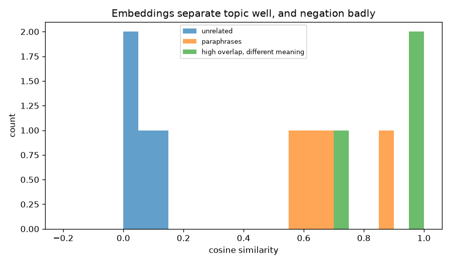
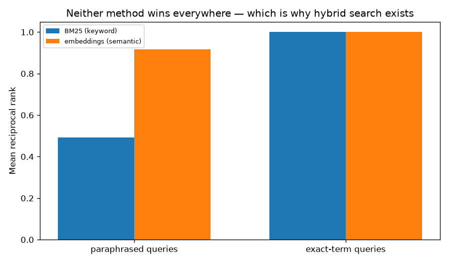
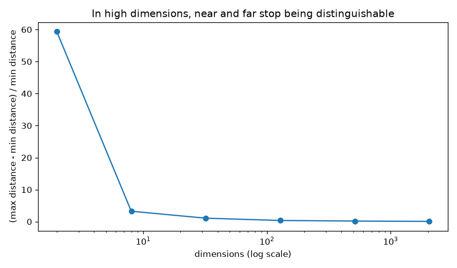
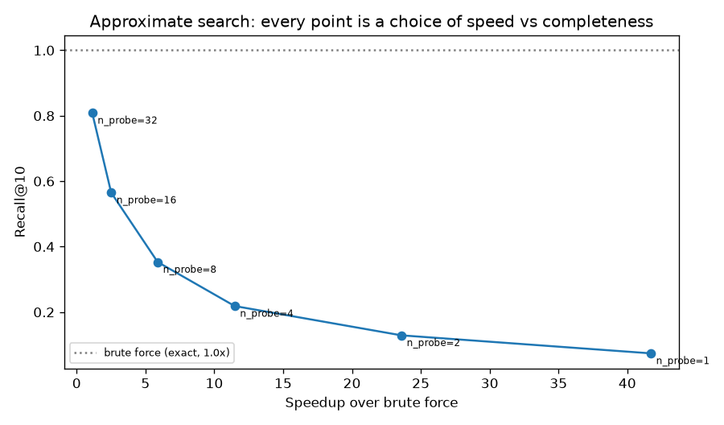
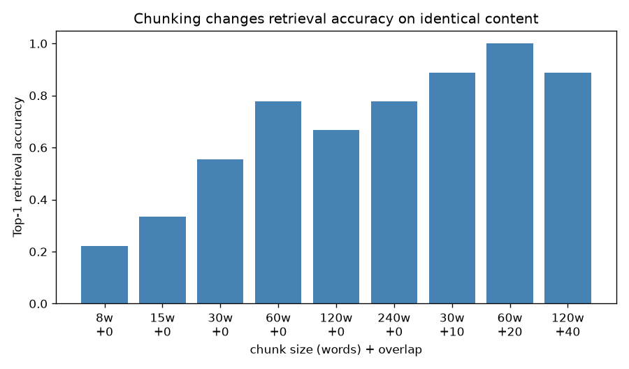

# 12 — Embeddings & Vector Search

> **New to this?** Section 2 explains what an embedding *is* before any notation. Every
> equation in §4 has a "reading it aloud" line, a symbol table, and a note on where it
> comes from.

**No API key needed.** Embeddings run locally via `sentence-transformers` — Groq has no
embeddings endpoint, and running locally is better here anyway since you can inspect
the actual vectors.

## 1. What you'll build

| Part | The claim | How it's proven |
|---|---|---|
| 1 | Cosine ignores length; euclidean doesn't | On count vectors euclidean gets it **backwards**: 19.80 vs 3.32 |
| 2 | Embeddings capture topic — **and miss negation** | Paraphrases 0.678; "Paris→Rome" vs "Rome→Paris" **0.998** |
| 3 | Semantic search beats keywords — sometimes | MRR 0.917 vs 0.492 paraphrased; **1.000 vs 1.000** on exact terms |
| 4 | High dimensions flatten all distances | Contrast ratio 59.4 → **0.09** from 2D to 2048D |
| 5 | Approximate search trades recall for speed | **46.7×** faster at recall 0.074; 1.1× at 0.808 |
| 6 | Chunking decides whether RAG works | Same article: top-1 accuracy **0.222 → 1.000** |

Parts 2, 3 and 6 each contain a result that contradicted what I expected — those are
flagged in §7 rather than smoothed over.

## 2. What are embeddings, why do we need them, and where are they used?

### What they are

Project 11 turned text into token IDs. But an ID is just a label: token 3797 is no more
similar to 3798 than to 50000. There's no arithmetic you can do on it.

An **embedding** is a vector — a list of numbers — positioned so that **distance means
similarity**:

```
                   ▲
                   │        ● dog
                   │      ● puppy          animals cluster here
                   │   ● cat
                   │
                   │                 ● car
                   │              ● truck    vehicles cluster here
                   │                ● van
                   └──────────────────────▶
```

`all-MiniLM-L6-v2`, used here, maps any sentence to **384 numbers**. Sentences meaning
similar things land near each other — even with no words in common. That last part is
the whole point: *"How do I reset my password?"* and *"What's the process for changing
my login credentials?"* share exactly one word, and score **0.561** similarity.

### Why we need them

**Keyword search fails when people don't use your words.** A user asks "how do I get my
money back"; your documentation says "refund policy". Zero overlap, zero results.
Embeddings bridge that gap because they encode meaning rather than spelling.

Concretely, embeddings are what make these possible:

1. **Semantic search** — find by meaning, not exact wording.
2. **RAG** (projects 13–14) — retrieve relevant documents to give an LLM as context.
   Retrieval quality caps the whole system: an LLM cannot answer from a passage it was
   never given.
3. **Clustering and deduplication** — project 05's k-means, now over meaning.
4. **Recommendation** — "more like this" is a nearest-neighbour query.
5. **Classification with almost no data** — embed, then a simple classifier on top.

There's also a direct line from earlier projects: this is **project 05's PCA idea**
(represent data in fewer, more meaningful dimensions) applied to text, and the vectors
themselves come from a **transformer** like the one you built in project 10.

### Where they're actually used

- **Every RAG system and AI chatbot over private documents**
- **Search** at Google, Bing, Amazon — hybrid with keyword search, not replacing it
- **Recommendations** — Spotify, YouTube, Netflix
- **Duplicate and plagiarism detection**; **support-ticket routing**
- **Multimodal search** — CLIP puts images and text in *one* space, so you can search
  photos with a sentence

**When *not* to use them:** exact-match queries (order IDs, error codes, SKUs) — Part 3
measures this and the answer is more nuanced than the usual advice. Also anything
depending on negation or word order, which Part 2 shows embeddings handle badly. And
they're not free: a model download, an encoding step per query, and a vector index to
maintain.

## 3. The core idea

Two questions, and this project answers both:

1. **How do you compare two vectors?** Cosine similarity — measure the *angle*, ignore
   the *length*. §4.1.
2. **How do you find the closest of ten million?** Not by checking all of them. §4.4.

Underneath is one assumption worth stating: **that meaning is geometric** — that
"similar" corresponds to "nearby". That assumption is mostly true and *specifically
false* for negation, which is why Part 2 exists.

## 4. The math

### 4.1 Cosine similarity

$$\cos(a, b) = \frac{a \cdot b}{\lVert a\rVert\,\lVert b\rVert} = \frac{\sum_i a_ib_i}{\sqrt{\sum_i a_i^2}\sqrt{\sum_i b_i^2}}$$

> **Reading it aloud:** *"Cosine of a and b equals a dot b, over the norm of a times the
> norm of b."*
>
> | Symbol | Say it | What it means here |
> |---|---|---|
> | $a \cdot b$ | "a dot b" | The **dot product**: multiply matching components, add them up. Large when the vectors point the same way. |
> | $\lVert a \rVert$ | "norm of a" | The **length** of the vector, $\sqrt{\sum a_i^2}$ — Pythagoras in 384 dimensions. |
> | $\cos$ | "cosine" | Literally the cosine of the **angle** between them. |
> | range | — | $[-1, 1]$: **1** = same direction, **0** = perpendicular (unrelated), **−1** = opposite. |
>
> **Where it comes from:** it *is* the geometric definition of the dot product,
> $a\cdot b = \lVert a\rVert\lVert b\rVert\cos\theta$, rearranged to solve for
> $\cos\theta$. Dividing by both lengths is what removes magnitude and leaves only
> direction.

**Why length should be ignored.** For count-based vectors, length tracks *document
length*, not meaning — a document repeated 8 times has 8× the counts but identical
content. Part 1 measures exactly this case.

### 4.2 The relationship to euclidean distance

$$\lVert a - b\rVert^2 = \lVert a\rVert^2 + \lVert b\rVert^2 - 2(a\cdot b) \;\;\overset{\text{unit vectors}}{=}\;\; 2 - 2\cos(a,b)$$

> **Where it comes from:** expanding the squared norm, then substituting
> $\lVert a\rVert = \lVert b\rVert = 1$.
>
> **The consequence matters practically:** on **normalized** vectors, euclidean distance
> is a strictly decreasing function of cosine similarity, so the two rank identically —
> choosing between them changes nothing. That's why embedding models normalize their
> output and vector databases use a plain dot product: on unit vectors it *is* cosine,
> and it's the cheapest operation available. Part 1 verifies the identity numerically.

### 4.3 BM25 — the keyword baseline worth beating

$$\text{score}(q,d) = \sum_{t \in q} \text{IDF}(t)\cdot\frac{f(t,d)\,(k_1+1)}{f(t,d) + k_1\left(1 - b + b\frac{|d|}{\text{avgdl}}\right)}$$

> | Symbol | Say it | What it means here |
> |---|---|---|
> | $f(t,d)$ | "f of t d" | **Term frequency** — how many times term $t$ appears in document $d$. |
> | IDF$(t)$ | "I-D-F" | **Inverse document frequency** — rare terms score higher. "the" tells you nothing; "AES-256" tells you a lot. |
> | $\lvert d\rvert$, avgdl | — | This document's length and the average, so long documents don't win by being long. |
> | $k_1$, $b$ | — | Tuning constants (1.5 and 0.75 by convention). |
>
> **Where it comes from:** decades of information-retrieval research, refined
> empirically. The saturating form matters: the 10th occurrence of a word adds far less
> than the 2nd, because a document isn't 5× more relevant for repeating a word 5×.
>
> **Why it's here:** it's the honest baseline. It needs no model, no GPU and no
> download. Part 3 checks whether a neural model actually beats it — and the answer is
> "on some queries".

### 4.4 Approximate nearest neighbour search

Exact search compares the query against **every** vector: $O(nd)$ per query. At 100
million vectors that's hopeless.

An **IVF index** (inverted file) does three things:

1. Cluster all vectors into groups (project 05's k-means).
2. At query time, find the nearest few **centroids**.
3. Search only inside those clusters.

> The parameter is `n_probe` — how many clusters to inspect. Small = fast and might miss
> the true neighbour sitting just across a boundary; large = slower and more complete.
>
> **Where it comes from:** the observation that if a vector is far from a cluster's
> centre, it's probably far from everything in that cluster — true enough, often enough,
> to be useful. It is a **heuristic**, not a guarantee, which is why the correct way to
> report it is with a recall number attached (Part 5).

$$\text{recall@}k = \frac{|\text{retrieved top-}k \cap \text{true top-}k|}{k}$$

## 5. From formula to code

| # | Formula | Code |
|---|---|---|
| (1) | $\cos(a,b)$ | `cosine_similarity()` |
| §4.2 | $\lVert a-b\rVert^2 = 2-2\cos$ | verified numerically in Part 1 |
| (2) | BM25 | `BM25.score()` |
| (3) | IVF search | `IVFIndex.search()` |
| §4.4 | recall@k | computed against brute-force ground truth |
| §6 | chunking | `chunk_text(size, overlap)` |

## 6. The data

- **A 16-document support knowledge base** (Part 3) with queries whose correct answer is
  known, so retrieval quality is *measured*, not judged. Includes deliberately
  confusable pairs (`E404`/`E503`, `v2.1`/`v3.0`) to test exact-term retrieval.
- **Hand-written sentence pairs** (Part 2) in three categories: paraphrases, unrelated,
  and *high-overlap-but-different-meaning*. That third group is the interesting one.
- **50,000 random 128-dim vectors** (Part 5). Random is the **worst case** for an index
  — no cluster structure to exploit — so the recall numbers are pessimistic, and the
  README says so.
- **A ~450-word article** (Part 6) covering several distinct topics, with 9 questions
  whose answers appear verbatim.

## 7. Results

### Part 1 — why cosine, demonstrated properly

```
text                                 vector length ||v||
short version                                     1.0000
same text repeated 8x                             1.0000
unrelated sentence                                1.0000
```

**First surprise: every length is exactly 1.0000.** MiniLM L2-normalizes its output, as
most modern embedding models do. So on these vectors cosine and euclidean rank
*identically* — the identity from §4.2 checks out to 8.4e-08 — and the usual "use cosine,
not euclidean" advice is, for this model, a distinction without a difference.

So why does cosine exist? Because it matters when vectors *aren't* normalized. The same
three texts as raw **term-count** vectors:

```
text                                 vector length ||v||
short version                                     2.8284
same text repeated 8x                            22.6274
unrelated sentence                                2.6458

pair                                          cosine     euclidean
short  vs  same text repeated 8x              1.0000       19.7990
short  vs  unrelated sentence                 0.2673        3.3166
```

**Euclidean gets it backwards.** It says the 8× repeat is 19.80 away while a completely
unrelated sentence is 3.32 away — because repeating a document multiplies every count by
8, which changes the vector's *length* enormously and its *direction* not at all. Cosine
says 1.0000: same content. That's the argument, and it needed un-normalized vectors to
be visible at all.

### Part 2 — embeddings capture topic, and miss negation



```
PARAPHRASES — same meaning, almost no shared words:
  0.561  (1 shared word)   "How do I reset my password?" / "changing my login credentials"
  0.684  (0 shared words)  "The restaurant was terrible." / "I had an awful experience..."
  0.601  (0 shared words)  "The flight was delayed by two hours." / "departed 120 minutes late"

UNRELATED:
  0.110  "How do I reset my password?" / "The volcano erupted in 1883."
  0.032  "The flight was delayed..."   / "Beethoven composed nine symphonies."

mean paraphrase: 0.678    mean unrelated: 0.065    separation: 0.613
```

That separation is the entire value proposition: sentences with **zero shared words**
score 10× higher than unrelated ones. Keyword search cannot do this.

**Now the result that should worry you:**

```
HARD CASES — high word overlap, different meaning:
  0.978  "The dog bit the man."      / "The man bit the dog."
  0.733  "I love this product."      / "I do not love this product."
  0.998  "Flight from Paris to Rome" / "Flight from Rome to Paris"
```

Mean **0.903 — higher than the genuine paraphrases at 0.678**, despite two of the three
meaning the *opposite* of each other. "Paris → Rome" and "Rome → Paris" score **0.998**:
essentially identical.

Sentence embeddings are largely a **bag of meaning**. They capture topic superbly and
negation and argument order badly. Practical consequences: never use raw cosine
similarity as a fact-checker or sentiment detector, and in RAG expect retrieval to
return passages on the right *topic* that may **contradict** the query. Project 16
measures this properly.

### Part 3 — semantic vs keyword, honestly



On queries that deliberately avoid the documents' wording:

```
metric                          BM25    embeddings
top-1 accuracy                 0.167         1.000
mean reciprocal rank           0.492         0.917
```

Embeddings win decisively — "get my money back" → *refund policy*, "stop paying monthly"
→ *cancel your subscription*. BM25 counts words and can't bridge that.

**But on exact-term queries, including pairs I built specifically to confuse embeddings:**

```
exact-term query                     BM25 rank   embedding rank
E503                                         1                1
E404                                         1                1
v3.0                                         1                1
MRR on exact-term queries        1.000            1.000
```

**A tie — and I expected BM25 to win.** With only 16 documents, one mention of "E503" is
distinctive enough that the embedding finds it too. The honest conclusion is *not*
"keyword search wins on identifiers"; it's that **embeddings lose their advantage
entirely here**.

That's still a real finding, because the methods aren't equally expensive. BM25 needs no
model, no GPU, no 90 MB download, and no encoding step per query — it's a word-count
table. The neural model buys you **+0.425 MRR** on paraphrased queries and *nothing*
here. At scale, with thousands of near-identical documents, BM25 typically wins outright;
exercise 3 builds that corpus so you can watch it rather than take my word.

Either way the practical answer is the same, and it's why production retrieval is almost
always **hybrid**: run both, combine the rankings.

### Part 4 — the curse of dimensionality



```
     d   mean distance       std    (max-min)/min
     2           1.380     0.725           59.356
    32           7.536     0.822            1.096
   128          16.099     0.856            0.376
  2048          63.944     0.858            0.093
```

The last column is the gap between nearest and furthest point, relative to the nearest.
In 2D the furthest is 59× further. **By 2048D everything is nearly equidistant** — so
"nearest neighbour" becomes a weak notion and distance-based methods lose their grip.

Why embeddings work anyway: real embeddings don't fill their space uniformly like these
random points. They lie on a much lower-dimensional surface within it (the *manifold
hypothesis*), because real text has far less variety than noise. The curse is a warning
about worst cases, not a proof that 384 dimensions can't work — Part 3 just showed them
working.

### Part 5 — speed against recall



```
method                         time (s)   speedup   recall@10
brute force (exact)               1.381       1.0x       1.000
IVF index, n_probe=1              0.030      46.7x       0.074
IVF index, n_probe=8              0.236       5.9x       0.353
IVF index, n_probe=32             1.261       1.1x       0.808
```

Same index every row; only how many clusters it inspects changes. This is the tradeoff
every vector database exposes under one name or another.

**These recall numbers are deliberately pessimistic.** Random vectors are the hardest
possible case — there's no cluster structure to exploit, so k-means has nothing real to
find. On actual embeddings, which cluster strongly by topic, you get far better recall at
the same speedup. Real systems also mostly use HNSW (a navigable graph) rather than IVF,
but the *shape* of the tradeoff is identical, and the lesson is that any "fast vector
search" claim is meaningless without a recall number attached.

### Part 6 — chunking



```
chunk size (words)      overlap   chunks   top-1 correct
8                             0       41           0.222
15                            0       22           0.333
30                            0       11           0.556
60                            0        6           0.778
120                           0        3           0.667
240                           0        2           0.778
30                           10       17           0.889
60                           20        9           1.000
120                          40        5           0.889
```

Same article, same model, same 9 questions. **Accuracy ranges from 0.222 to 1.000** — a
wider range than you'd get from switching embedding models.

- **Too small clearly fails.** 8-word chunks score 0.222, and accuracy climbs steadily
  with size. An 8-word chunk might contain "forty million dollars" with nothing marking
  it as the Series B, so the query can't match it.
- **Overlap is the cleanest result.** *Every* overlapping config beats its
  non-overlapping counterpart at the same size: 0.556→0.889 at 30 words, 0.778→**1.000**
  at 60, 0.667→0.889 at 120. Facts straddling a boundary would otherwise be cut in half
  and lost from both chunks.
- **"Too large fails" is the claim this experiment does *not* establish.** There's a hint
  at 120 words (0.667, below 60's 0.778), but 240 recovers to 0.778 — no clean decline.
  This article is only ~450 words, so a 240-word chunk is half the document. Testing
  dilution properly needs a much longer document; exercise 5 does that.

## 8. Run it

```bash
cd 12-embeddings-vector-search
python3 -m venv .venv
source .venv/bin/activate
pip install -r requirements.txt
python embeddings_search.py
```

About 30 seconds after the first run. Downloads `all-MiniLM-L6-v2` (~90 MB) once.
**No API key required.**

## 9. Exercises

1. **Break the geometry assumption.** Write 5 sentence pairs that mean opposite things
   with high word overlap, and measure. How high can you push similarity on a pair with
   genuinely inverted meaning? This is the failure mode to keep in mind for every RAG
   system you build.
2. **Compare embedding models.** Swap `all-MiniLM-L6-v2` for `all-mpnet-base-v2` (larger,
   slower, 768-dim) and re-run Parts 2 and 3. Does the extra capacity fix the negation
   problem? (Predict first — then check.)
3. **Make BM25 win.** Generate 5,000 synthetic documents differing only in an error code
   (`E001`–`E5000`), then query for one code. BM25 should retrieve it exactly; embeddings
   should blur across neighbours. This is the experiment Part 3's corpus was too small
   to show.
4. **Build hybrid search.** Combine BM25 and embedding rankings with reciprocal rank
   fusion: $\text{score}(d) = \sum_r 1/(60 + \text{rank}_r(d))$. Check it matches the
   better method on *both* query types from Part 3.
5. **Test the dilution claim.** Concatenate 10 articles on different topics into one
   long document and repeat Part 6 with chunk sizes up to 1000 words. Now "too large"
   should genuinely fail — and if it doesn't, that's worth knowing too.
6. **Semantic deduplication.** Take Part 3's documents, generate paraphrases of three of
   them, embed everything, and cluster with project 05's k-means. Do paraphrases land in
   the same cluster? This is how deduplication pipelines actually work.

## 10. What's next

You now have both halves of retrieval-augmented generation: **project 11** showed how an
LLM consumes tokens and produces them, and **this project** showed how to find the right
text to feed it.

**Project 13 builds RAG from scratch** — no framework — wiring chunking, embedding,
retrieval and generation into one pipeline, and using the Groq key for the generation
step. You'll see directly how retrieval quality caps answer quality: the honest failure
mode is that an LLM given the wrong passage will answer confidently and wrongly, and the
chunking and negation problems measured here are exactly where that starts.
