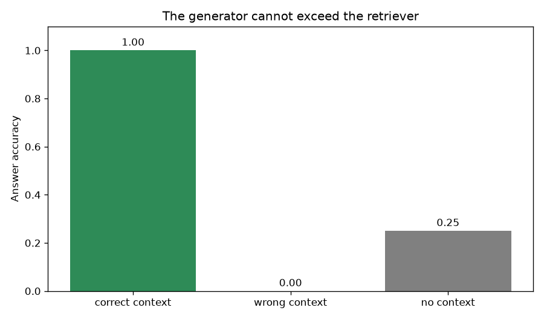
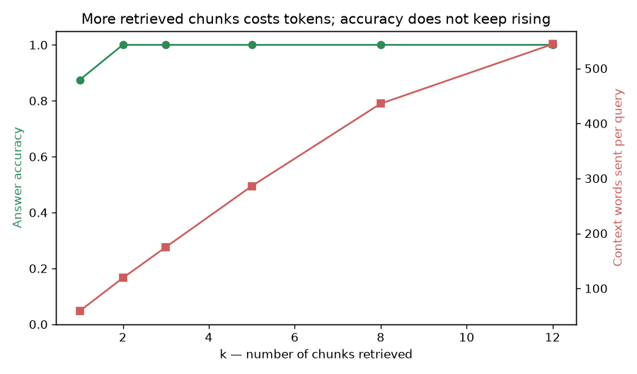
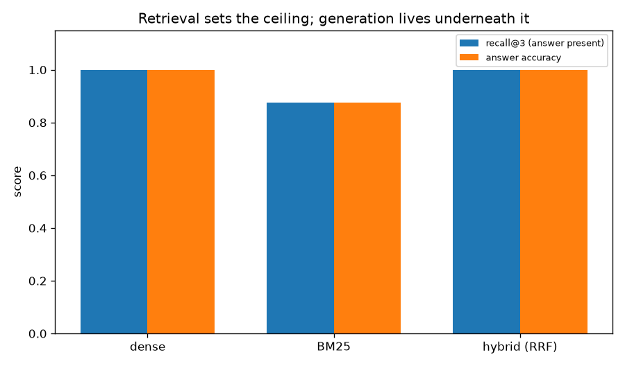
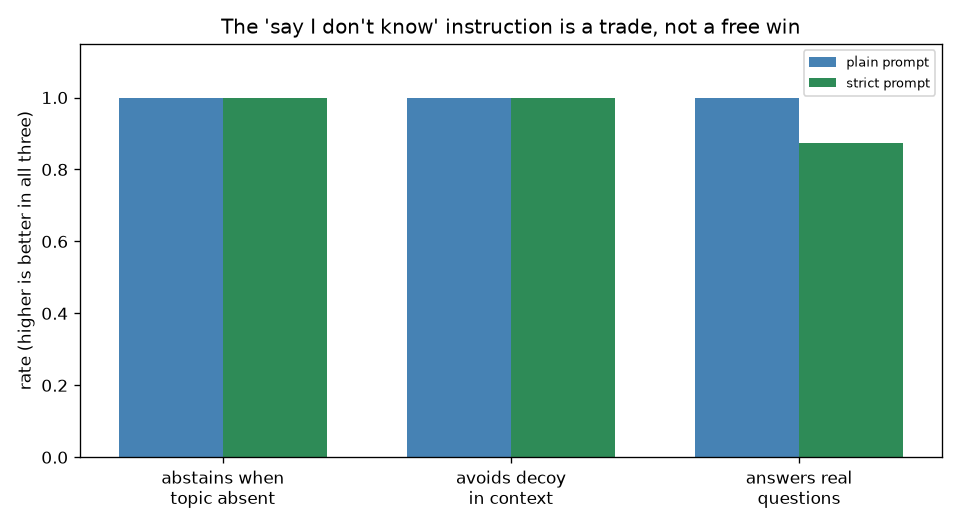

# 13 — RAG from Scratch (no framework)

> **New to this?** Section 2 explains what RAG *is* with a diagram before any notation.
> Every formula in §4 has a "reading it aloud" line, a symbol table, and a note on where
> it comes from.

This is the **first project that calls an LLM**. It uses `GROQ_API_KEY` from `../.env`
for generation only — retrieval stays local. Responses are cached to `./cache`, so
re-runs are free, instant, and give identical numbers.

## 1. What you'll build

The complete pipeline — chunk, embed, retrieve, augment, generate — in about 40 lines,
with no framework hiding any of it.

| Part | The claim | How it's proven |
|---|---|---|
| 1 | RAG closes a gap the model cannot close alone | Accuracy **0.250 → 1.000** on invented facts |
| 2 | RAG is four stages, no magic | Every stage printed, including the literal prompt |
| 3 | Retrieval caps generation | Correct context **1.000**, wrong context **0.000** |
| 4 | More chunks is not better | k=2 already 1.000; k=12 costs **9× the tokens** for nothing |
| 5 | Recall@k is the ceiling on answer accuracy | BM25 recall 0.875 → accuracy 0.875, exactly |
| 6 | "Tell it to say I don't know" is a **trade** | Zero measured benefit, **−0.125** accuracy cost |

Part 6 contradicts the most repeated piece of RAG advice there is. Details in §7.

## 2. What is RAG, why do we need it, and where is it used?

### What it is

**Retrieval-Augmented Generation**: before answering, go find the relevant text and paste
it into the prompt.

```
  user question
       │
       ▼
  ┌─────────────┐   "how many leave days?"
  │  RETRIEVE   │ ──────────────────────────▶  search your documents
  └─────────────┘                                      │
       │  the 3 most relevant chunks  ◀────────────────┘
       ▼
  ┌─────────────┐   "Answer using ONLY this context:
  │  AUGMENT    │    [chunk 1] [chunk 2] [chunk 3]
  └─────────────┘    Question: how many leave days?"
       │
       ▼
  ┌─────────────┐
  │  GENERATE   │ ──▶  "Employees get 28 days of paid annual leave."
  └─────────────┘
```

That's it. **No training, no fine-tuning, no model changes.** You are doing the model's
homework for it.

### Why we need it

A language model knows only what was in its training data. That creates four problems,
and RAG addresses all four with the same mechanism:

1. **It cannot know your private data.** Your company handbook, your codebase, your
   customer tickets were never in its training set. Part 1 measures this: the model
   scores 25% on questions about a company that doesn't exist — and the 25% is *luck*,
   as §7 explains.
2. **Its knowledge has a cutoff.** Anything after training is invisible.
3. **It hallucinates instead of abstaining.** Asked something it doesn't know, a model
   typically produces a fluent, confident, wrong answer.
4. **You cannot check its sources.** With retrieval you know exactly which document the
   answer came from, so a human can verify it.

**Why not fine-tune instead?** Fine-tuning (project 17) teaches *behaviour and style*
well and *facts* badly — it's expensive, must be redone whenever documents change, and
gives you no citation. RAG updates instantly: change the document, and the next answer
changes. For "answer questions over my documents", retrieval wins.

### Where it's actually used

- **Every "chat with your documents" product** — Notion AI, customer-support bots,
  internal search
- **Coding assistants** retrieving from your repository before suggesting code
- **Legal, medical and financial research**, where citations are mandatory
- **Customer support** grounded in the current knowledge base, not last year's

**When *not* to use it:** when the answer requires reasoning *across* many documents
rather than finding one passage ("what were our top three cost drivers last year?"),
when latency is critical (retrieval adds a round trip), or when the model already knows
the answer perfectly well — RAG on general knowledge just adds cost and a new failure
mode.

## 3. The core idea

**RAG is a retrieval problem wearing a generation costume.**

That framing is the single most useful thing in this project, and Part 3 proves it: with
the correct context, accuracy is 1.000; with irrelevant context, 0.000. The generator is
the same in both cases. When a RAG system gives bad answers, the bug is almost always in
retrieval — yet the instinct is to rewrite the prompt.

Everything you need is already built: **project 12** gave you chunking, embeddings,
cosine similarity and BM25; **project 11** gave you tokenization and sampling. This
project is the wiring.

## 4. The math

### 4.1 Chunking

$$\text{chunks} = \{\,w_{i:i+s} \;\mid\; i = 0,\, s-o,\, 2(s-o),\, \ldots \}$$

> | Symbol | Say it | What it means here |
> |---|---|---|
> | $w_{i:i+s}$ | "words i to i plus s" | A window of $s$ consecutive words. |
> | $s$ | "s" | **Chunk size** (60 words here). |
> | $o$ | "o" | **Overlap** (20 words) — how much each chunk repeats of the previous one. |
> | $s - o$ | — | The **stride**. With $s=60, o=20$ the window advances 40 words at a time. |
>
> **Where it comes from:** project 12 Part 6 measured this directly — overlap improved
> retrieval at *every* chunk size tested (0.556→0.889, 0.778→1.000, 0.667→0.889). The
> settings here are that result applied.

### 4.2 Retrieval

$$\text{score}_{\text{dense}}(q, c) = \cos\big(E(q),\, E(c)\big) \qquad\qquad \text{top-}k = \arg\max_c^{(k)} \text{score}(q,c)$$

> | Symbol | Say it | What it means here |
> |---|---|---|
> | $E(\cdot)$ | "E of" | The **embedding function** — project 12's `all-MiniLM-L6-v2`, text → 384 numbers. |
> | $q$, $c$ | "q, c" | The **query** and a **chunk**. |
> | $\arg\max^{(k)}$ | "top-k arg max" | The $k$ chunks with the highest score, not just the single best. |
> | $k$ | "k" | How many chunks to retrieve. Part 4 sweeps it. |
>
> **Where it comes from:** cosine similarity, derived in project 12 §4.1. Nothing new —
> retrieval here *is* project 12, called once per question.

### 4.3 Reciprocal rank fusion (hybrid retrieval)

$$\text{RRF}(c) = \sum_{r \in \text{retrievers}} \frac{1}{K + \text{rank}_r(c)}$$

> | Symbol | Say it | What it means here |
> |---|---|---|
> | $\text{rank}_r(c)$ | "rank of c under r" | Chunk $c$'s **position** (0, 1, 2, …) in retriever $r$'s ordering. |
> | $K$ | "K" | A damping constant, conventionally **60**. It stops rank 0 from dominating everything. |
> | $\sum_r$ | "sum over retrievers" | Add each retriever's contribution — here dense and BM25. |
>
> **Where it comes from:** the key design decision is that it combines **ranks, not
> scores**. A cosine similarity of 0.7 and a BM25 score of 12.4 live on incomparable
> scales, and any attempt to normalize them requires assumptions you can't justify.
> Ranks sidestep the problem entirely: *position* is meaningful for both.

### 4.4 Measuring it

$$\text{recall@}k = \frac{\text{number of questions whose answer appears in the top-}k\text{ chunks}}{\text{total number of questions}}$$

> | Symbol | Say it | What it means here |
> |---|---|---|
> | recall@$k$ | "recall at k" | The fraction of questions for which retrieval **put the answer in front of the model at all**. |
> | $k$ | "k" | How many chunks were retrieved (3 in Part 5). |
>
> Note this measures **retrieval alone** — no LLM is involved. That separation is the
> whole point: it tells you whether a failure happened before or after generation.

> **Why this is the metric that matters:** recall@k is the **hard ceiling** on answer
> accuracy. If the answer isn't in the retrieved context, the generator can only produce
> it by luck or by hallucinating something that happens to be right. Part 5 shows BM25's
> recall of 0.875 producing accuracy of exactly 0.875 — the ceiling reached, not exceeded.
>
> Grading here is **string containment**, deliberately: no human judgement and no
> LLM-as-judge, so the numbers are reproducible. Project 16 covers the harder question of
> grading free-form answers.

## 5. From formula to code

| # | Formula | Code |
|---|---|---|
| (1) | overlapping windows | `chunk_text(size=60, overlap=20)` |
| (2) | $\cos(E(q), E(c))$ | `Retriever.dense_scores()` |
| (3) | BM25 | `Retriever.bm25_scores()` |
| (4) | RRF | `Retriever.retrieve(method="hybrid")` |
| — | augment | `build_prompt()` |
| — | generate | `LLM.ask()` — cached to disk |

The `LLM` cache matters for more than speed: at `temperature=0`, a cached prompt returns
an identical answer, so **re-running the script reproduces the numbers exactly** instead
of letting them drift.

## 6. The data

A **fictional** employee handbook for "Meridian Analytics" — 372 words, 10 chunks.

Fictional is the whole design. If the documents described a real company, the model
might answer from pretraining and we could not distinguish *retrieval* from *recall*.
With invented facts, **a correct answer proves the information came from the context we
supplied**.

Three question sets, all with programmatic ground truth:

- **8 answerable** questions (expected answer string known).
- **6 unanswerable** — plausible handbook questions on topics entirely absent.
- **5 traps** — also unanswerable, but with a plausible **decoy** number sitting in the
  retrieved context (asking the *hardware* budget when "1,800" is the *learning* budget;
  asking *sick* leave when "28" is *annual* leave).

## 7. Results

### Part 1 — the gap RAG closes

```
question                                           no context   with RAG
How many days of annual leave do employees get?           YES        YES
How much is the annual learning budget?                    no        YES
Who founded Meridian Analytics?                            no        YES
Which version of Lumen added Iceberg support?              no        YES
...
accuracy                                                0.250      1.000
```

**0.250 → 1.000.** Nothing was retrained; we simply put the right text in front of the
model.

One honest note on that 0.250: the two "YES" rows without context are **coincidence, not
knowledge**. Grading is string containment, and "28 days" is a common European leave
entitlement while "5 days" is a common carry-over cap — so a generic plausible answer
matches by luck. The model has no access to this handbook whatsoever. Read that as
"about 0", with a measurement artifact attached.

### Part 2 — the whole pipeline

```
STAGE 1 — CHUNK.   372 words -> 10 chunks of ~60 words with 20 words of overlap

STAGE 2 — EMBED & RETRIEVE.
  rank 1  cos=0.548  chunk  1: "must be submitted at least 14 days in advance..." <- retrieved
  rank 2  cos=0.348  chunk  7: "90-day onboarding programme. The first two weeks..." <- retrieved
  rank 3  cos=0.336  chunk  0: "Meridian Analytics was founded in 2019 in Tallinn..." <- retrieved

STAGE 3 — AUGMENT.  "Answer the question using ONLY the context below. ..."

STAGE 4 — GENERATE. "Unused leave may be carried over up to a maximum of 5 days,
                     and it expires on 31 March of the following year."
```

Worth noticing: only **rank 1** is actually relevant (cos 0.548); ranks 2 and 3 are
noise at 0.348 and 0.336. The system still answers correctly because the right chunk is
present — which is exactly the point of retrieving more than one.

Also notice the model has **no memory between calls**. Everything it knows about
Meridian arrived in that prompt and is gone the moment the call returns.

### Part 3 — retrieval caps generation



```
                    correct context    wrong context    no context
accuracy                      1.000            0.000         0.250
```

Same model, same questions, three contexts. With the **lowest-scoring** chunks —
deliberately irrelevant text — accuracy is **zero**. No amount of prompt engineering
fixes this, because the information isn't there.

**This is the most important thing in the project.** When RAG fails it usually fails at
retrieval, and the instinct is to tune the prompt. Measure retrieval separately.

> **A finding that went against my expectation.** I wrote this part expecting to display
> a confident fabrication. Instead, of the 8 wrong-context answers, **all 8 correctly
> said the context did not contain the answer.** Given clearly irrelevant context, this
> model refuses rather than invents. That's better behaviour than the usual RAG
> cautionary tale suggests — and it's why Part 6 had to construct a genuinely harder
> test rather than resting on this one.

### Part 4 — how many chunks?



```
  k    answer accuracy   context words
  1              0.875              59
  2              1.000             119
  3              1.000             175
  8              1.000             436
 12              1.000             544
```

k=1 misses one answer; k=2 is already perfect. Beyond that, **context grows 9× for zero
gain** — and every extra chunk costs tokens, money and latency on *every* query, forever.

> **Be precise about what this shows.** The *cost* side is demonstrated. The
> *distraction* side is **not**: accuracy holds at 1.000 even at k=12, so this model
> isn't measurably confused by extra context here. The reason is that the handbook is
> only 372 words, so k=12 retrieves essentially the whole document and the answer is
> always present. "Lost in the middle" is real in the literature, but this experiment is
> far too small to show it, and presenting the token cost as evidence of it would be
> dishonest. Exercise 4 scales the corpus so it can actually be tested.

### Part 5 — the ceiling, made explicit



```
method       recall@3 (answer in context)   answer accuracy
dense                               1.000             1.000
bm25                                0.875             0.875
hybrid                              1.000             1.000
```

Look at BM25's row: recall 0.875, accuracy **0.875**. The generator answered correctly
for *every* question where the answer was present, and failed for the one where it
wasn't. The ceiling isn't approximate — it's reached exactly.

Dense and hybrid tie at 1.000. With only 8 questions on one document this is **weak
evidence**, and it would be wrong to conclude one retriever is generally better; project
12 measured that comparison more carefully. The argument for hybrid isn't that it always
wins — it's that it rarely loses, because the two methods fail on different queries.

### Part 6 — the advice that didn't survive testing



The near-universal RAG advice is: *always add "if the context doesn't contain the answer,
say so"* or the model will fabricate. I tested it three ways.

```
EASY — topic entirely absent          plain    strict
abstention rate                       1.000     1.000

HARD — a decoy number is in context   plain    strict
avoided the decoy                     1.000     1.000

COST — genuinely answerable           plain    strict
accuracy                              1.000     0.875
```

**The traps didn't work either.** I built them specifically to fool the model — asking
the *hardware* budget with "1,800" (the *learning* budget) sitting in the context, asking
*sick* leave with "28" (*annual* leave) right there — and it declined every one.

So on this corpus with this model, the famous instruction:

- provides **no measurable benefit** (1.000 → 1.000 on both tests), and
- **costs 0.125 accuracy** on genuinely answerable questions — telling a model to refuse
  when unsure makes it refuse when it shouldn't.

**A net negative.** That is not a claim the advice is wrong in general: `llama-3.1-8b-instant`
is heavily tuned to hedge, a larger or less cautious model may well need the instruction,
and 11 questions is a small sample from which to prove a negative.

The transferable lesson is the one this curriculum keeps arriving at: **prompt advice is
an empirical claim about your model and your data**, and it takes about twenty lines to
check rather than adopt. Project 16 builds that harness properly.

And note what none of this fixes: the model is following an *instruction*, not reasoning
about evidence. It has no way to know what it doesn't know.

## 8. Run it

```bash
cd 13-rag-from-scratch
python3 -m venv .venv
source .venv/bin/activate
pip install -r requirements.txt
python rag_from_scratch.py
```

First run: ~6 minutes (≈150 LLM calls, mostly API latency). Subsequent runs: seconds,
served entirely from `./cache`. Delete `cache/` to force fresh calls.

**Without a key** the script still runs — the embedding model, chunking and retrieval are
local, and generation parts print a message and skip.

## 9. Exercises

1. **Break retrieval, watch generation fail.** Set chunk size to 8 words in
   `chunk_text`. Retrieval should degrade badly and answers with it — confirming Part 3's
   claim from the other direction.
2. **Find the model's fabrication threshold.** Part 6's traps failed to fool
   `llama-3.1-8b-instant`. Try `llama-3.3-70b-versatile` and `openai/gpt-oss-20b` (both
   on Groq, just change `MODEL`). Does a different model take the bait? This is exactly
   the per-model measurement §7 argues for.
3. **Add citations.** Change the prompt to require `[chunk N]` after each claim, then
   verify programmatically that the cited chunk actually contains the answer. This is the
   real defence against hallucination — not asking the model to be honest, but making its
   claims checkable.
4. **Test "lost in the middle" properly.** Expand the handbook to ~5,000 words, put the
   answer in a chunk you place deliberately at position 1, 5, or 20 of the retrieved
   context, and measure accuracy by position. Now k should genuinely matter.
5. **Query rewriting.** Ask "what about carrying leave over?" — vague, pronoun-heavy.
   Then have the LLM rewrite it into a standalone query before retrieving, and compare
   recall@3. This is how multi-turn RAG chatbots work.
6. **Measure the cost.** Log `usage.total_tokens` per call and compute cost per question
   at each k from Part 4. Combined with the accuracy column, that gives you the actual
   engineering tradeoff rather than an aesthetic preference.

## 10. What's next

You've built RAG with no framework, which means you now know exactly what a framework
would be doing. **Project 14 rebuilds this identical pipeline in LangChain** — same
handbook, same questions, same measurements — so the comparison is concrete: which of
the four stages does each abstraction hide, what does it buy, and what does it cost when
you need to debug the retrieval that Part 3 showed is where the failures live.
