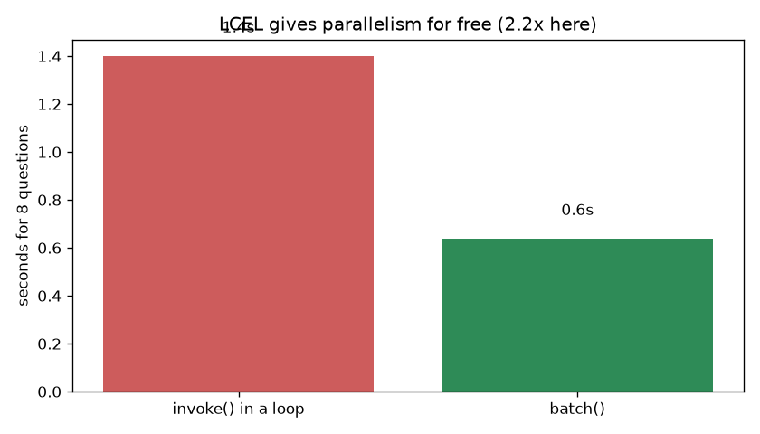
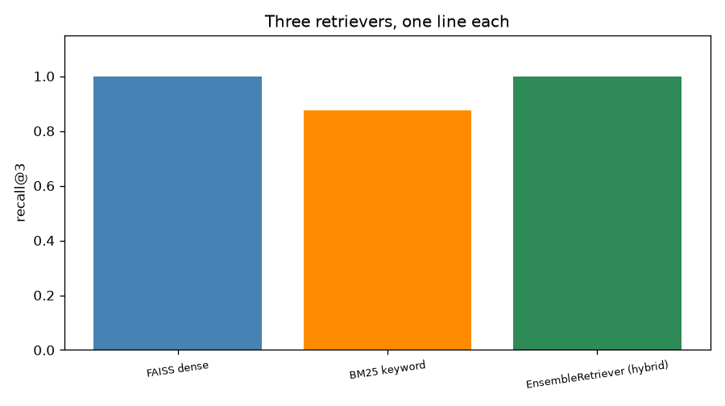
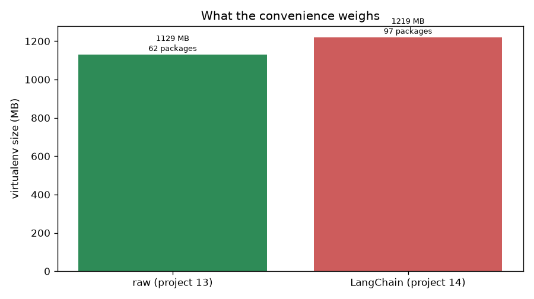

# 14 — RAG with LangChain

> **New to this?** Section 2 explains what a framework *is* and what it's for before any
> code. This project assumes you've read project 13 — it rebuilds that exact pipeline, so
> the comparison is the point.

This project **imports project 13's handbook, questions and prompt text directly**. Same
data, same model, same wording — so any difference in results is attributable to the
framework rather than the setup.

## 1. What you'll build

| Part | The claim | How it's proven |
|---|---|---|
| 1 | The same four stages, as components | Side-by-side mapping; the chain is one expression |
| 2 | The framework should not change your answers | It **did**: raw 1.000 vs LangChain 0.875 — diagnosed below |
| 3 | LCEL gives concurrency for free | `.batch()` is **2.3×** faster; streaming in one line |
| 4 | Components are genuinely swappable | Three retrievers, one line each; RRF for free |
| 5 | The abstraction has a measurable cost | **1.6×** the packages — but only **1.08×** the disk |
| 6 | It hides the thing you most need to debug | The chain returns a string; retrieval is invisible |

Parts 2 and 5 both came out differently from what I expected. Both are in §7 as measured.

## 2. What is a framework, why use one, and when not to?

### What it is

Project 13 wrote four stages by hand: chunk, embed, retrieve, generate. **LangChain
provides those stages as interchangeable components with a shared interface**, plus a
notation for wiring them together:

```python
chain = {"context": retriever | format_docs,
         "question": RunnablePassthrough()} | prompt | llm | StrOutputParser()
```

Read `|` as "feed into". That's LCEL — the LangChain Expression Language — and every
component in it implements the same `Runnable` interface: `.invoke()`, `.batch()`,
`.stream()`, `.ainvoke()`.

### Why use one

Not because the first version is hard. **Project 13 was 40 lines.** The argument is about
the *second year*:

1. **Swappability.** Every retriever exposes `.invoke(query) → list[Document]`, so FAISS
   → Chroma → Pinecone is one line. Every chat model exposes the same interface, so Groq
   → OpenAI → Anthropic is one line. In project 13 both changes meant rewriting functions.
2. **Free concurrency.** `.batch()`, `.stream()` and `.ainvoke()` work on any chain you
   build, because the interface guarantees them. Writing that yourself means thread
   pools, per-item error handling and ordering guarantees.
3. **Standard implementations.** Project 13 hand-wrote reciprocal rank fusion in 8 lines;
   here it's `EnsembleRetriever(retrievers=[dense, bm25])`.
4. **Ecosystem.** Document loaders for PDF/HTML/Notion/S3, dozens of vector stores,
   memory, callbacks, tracing.

### When *not* to

- **When the pipeline won't change.** Four function calls that work are hard to improve on.
- **When you need to see inside.** Part 6 measures this: the chain hands back a string,
  and the retrieved context — the thing project 13 proved you need to inspect — is gone.
- **When the dependency footprint matters.** Part 5 measures it (and finds it smaller
  than expected).
- **When you're learning.** Building it raw first is why you can now read the LangChain
  version and know exactly what each line replaces.

### A note on churn, and on LangGraph

LangChain reorganises itself often. While writing this project, `EnsembleRetriever` was
not where the documentation said — in LangChain 1.x it lives in a package literally named
**`langchain_classic`**. The code here uses a tolerant import as a result, which is what
you end up writing in practice.

More significantly: **LangChain's agent abstractions are now legacy.** `AgentExecutor`
has been superseded by **LangGraph**, because agents need cycles, persistent state and
human-in-the-loop interrupts, which a linear chain cannot express. Project 15 covers
LangGraph — the roadmap was updated for exactly this reason.

## 3. The core idea

**A framework is a bet that your requirements will change.**

If they will, the interchangeability in Part 4 pays for the weight in Part 5 many times
over. If they won't, you've bought indirection you don't need.

Having built the same pipeline twice, you can now make that call on evidence. That's the
entire reason project 13 came first — and it's why Part 2's disagreement is the most
useful result here, since noticing it required having both implementations to compare.

## 4. The math

There is **no new mathematics in this project**, and that's worth stating plainly rather
than inventing some. Every formula is project 13's:

| Concept | Formula | Where it was derived |
|---|---|---|
| Chunking | overlapping windows | project 12 §4, measured in project 12 Part 6 |
| Dense retrieval | $\cos(E(q), E(c))$ | project 12 §4.1 |
| BM25 | $\sum_t \text{IDF}(t)\cdot\text{tf-saturation}$ | project 12 §4.3 |
| Hybrid | $\text{RRF}(c) = \sum_r \frac{1}{K + \text{rank}_r(c)}$ | project 13 §4.3 |
| Recall@k | answers present / questions | project 13 §4.4 |

**That is the finding**, not a gap in the project: a framework is packaging, not an
algorithm. `EnsembleRetriever` uses the same RRF with the same $K = 60$ that project 13
implemented by hand. If the numbers had changed, one of the two implementations would be
wrong.

The one genuinely new concept is the interface itself:

$$\text{Runnable}: \quad \texttt{.invoke}(x) \to y, \quad \texttt{.batch}([x_i]) \to [y_i], \quad \texttt{.stream}(x) \to y_1, y_2, \ldots$$

> **Reading it aloud:** *"A Runnable supports invoke on one input, batch on a list, and
> stream, which yields pieces."*
>
> **Where it comes from:** a design decision, not a derivation. Because *every* component
> implements all three, composing components with `|` produces something that also
> implements all three — which is why Part 3's 2.3× speedup requires no code of your own.

## 5. From formula to code

| Stage | Project 13 (raw) | Project 14 (LangChain) |
|---|---|---|
| chunk | `chunk_text(size, overlap)` | `RecursiveCharacterTextSplitter` |
| embed | `SentenceTransformer.encode()` | `HuggingFaceEmbeddings` |
| store | a numpy array | `FAISS` vector store |
| retrieve | `vecs @ q`, `argsort` | `store.as_retriever()` |
| augment | `PROMPT.format(...)` | `ChatPromptTemplate` |
| generate | `openai` client + disk cache | `ChatGroq` |
| wiring | four function calls | LCEL: `a \| b \| c` |
| hybrid | 8 hand-written lines of RRF | `EnsembleRetriever(...)` |

## 6. The data

Project 13's fictional Meridian Analytics handbook, imported directly — 372 words, the
same 8 questions with known answers, and the same prompt template. Holding all of that
constant is what makes Part 2's comparison meaningful.

## 7. Results

### Part 1 — the same pipeline

```
Same handbook (372 words), now 10 chunks (project 13 made 10).

Question: "How many days of leave can be carried over, and when do they expire?"
Answer:   Up to 5 days of leave can be carried over, and they expire on 31 March
          of the following year.
```

Same four stages, now one expression. Genuinely more readable than threading four
function calls by hand — and also the moment you stop seeing the retrieved text unless
you go looking for it.

### Part 2 — the result I did not expect

```
question                                      raw   LangChain   agree?
How many days of annual leave do employees?   YES         YES      yes
...
What approval is needed for a 900 euro exp    YES          no       NO

accuracy                                    1.000       0.875    0.875
```

**They disagree.** I built this part expecting an exact match — same embeddings, same
metric, same prompt, same model at temperature 0 — and one question came out differently.

Project 13's own rule says: check whether it's a retrieval or a generation failure.

```
  Q: What approval is needed for a 900 euro expense?   (expected: 'director')
  answer present in raw context?        YES
  answer present in LangChain context?  YES

  raw:       Director approval.
  LangChain: Any team lead can approve the expense.
```

**Both retrieved the answer.** The handbook says expenses under 200 € need a team lead,
200–2,000 € need a director. 900 € is squarely in the director tier, and the LangChain
version got it wrong.

**This is not "temperature 0 is unreliable".** The model is deterministic; the *prompts*
weren't identical. Project 13 splits on word counts; `RecursiveCharacterTextSplitter`
splits on paragraph and sentence boundaries. Different chunk boundaries → different
context string → legitimately different output.

Two things worth taking from this:

1. **Recall is necessary but not sufficient.** A chunking change that left recall
   completely untouched still changed the final answer. *How the surrounding text frames
   a fact* matters, not just whether the fact is present.
2. **Framework defaults are defaults, not answers.** `RecursiveCharacterTextSplitter` is
   the better tool by reputation — it avoids cutting sentences in half — and here it
   produced the worse answer. Project 12's Part 6 already showed chunking swinging
   accuracy from 0.222 to 1.000. Nothing about adopting a framework removes the need to
   measure your own chunking.

### Part 3 — what LCEL actually buys



```
method                                 seconds    speedup
chain.invoke() in a loop                  1.62       1.0x
chain.batch() — parallel                  0.70       2.3x
```

One method call, **2.3× faster**, no code of my own. And streaming:

```
  28 days of paid annual leave per calendar year, plus public holidays. ...
  (17 chunks streamed rather than one blocking response)
```

This is the strongest practical argument for the framework. Every LCEL component
implements `Runnable`, so composition preserves `.batch()`, `.stream()` and `.ainvoke()`.
Writing that in project 13 would have been real work.

### Part 4 — swappability



```
retriever                                 recall@3
FAISS dense                                  1.000
BM25 keyword                                 0.875
EnsembleRetriever (hybrid)                   1.000
```

The numbers match project 13's hand-rolled versions, as they should —
`EnsembleRetriever` uses the same RRF with the same $K=60$.

The point isn't the numbers, it's the **interface**. Every retriever returns
`list[Document]`, so FAISS → Chroma → Pinecone is one line and nothing downstream
changes. That's what frameworks are for: not making the first version easier, but making
the tenth *change* easier.

### Part 5 — the cost, and it's smaller than advertised



```
project                             installed packages   venv size (MB)
13 — raw (openai + st)                              62             1129
14 — LangChain                                      97             1219

cold import time                                                seconds
raw imports                                                        4.00
LangChain imports                                                  3.69
```

**1.6× the packages, but only 1.08× the disk — and imports are marginally *faster*.**

That contradicts the usual complaint about LangChain's weight, and the reason is worth
understanding: **both projects already depend on `sentence-transformers`, which drags in
PyTorch — roughly a gigabyte on its own.** Against that, LangChain's own footprint is a
rounding error. If you called a hosted embedding API instead of running MiniLM locally,
the ratio would look far worse for the framework.

> **A benchmark I had to fix.** My first version imported `sentence_transformers` on the
> raw side but not the LangChain side, making the framework look *faster* to import. That
> was an artefact of the benchmark, not a property of the framework. Both sides now
> import what they actually need to serve a query.

The cost that *doesn't* show up in these numbers is **churn** — see §2's note on
`langchain_classic`. Project 13's forty lines of numpy and one HTTP call will still run
in five years.

### Part 6 — where it leaks

```
Question: "What is the bonus for resolving a SEV1 incident?"     (no such bonus exists)
Answer:   There is no information provided about a bonus for resolving a SEV1 incident.

To find out WHY, you have to reach inside the chain:
  chunk 0: "Production incidents are graded from SEV1 to SEV4..."
  chunk 1: "New employees complete a 90-day onboarding programme..."
  chunk 2: "The company uses a 4-day working week during July and August..."
```

The chain gave a string. Seeing the retrieved context required calling the retriever
**separately** — the chain doesn't hand back intermediate values. Project 13 printed the
cosine score of every chunk as a matter of course, because nothing was hiding it.

Given project 13 proved that RAG failures are usually *retrieval* failures, hiding
retrieval by default is a real cost. LangChain's answers are genuine and worth knowing:
`RunnableParallel` to return context alongside the answer, `set_debug(True)` for a step
trace, or LangSmith (paid, hosted) for full run recording.

**The honest summary:** worth it for swappable components and free concurrency; it costs
you dependency weight and directness. You can now make that call on evidence rather than
fashion — which is why project 13 came first.

## 8. Run it

```bash
cd 14-rag-langchain
python3 -m venv .venv
source .venv/bin/activate
pip install -r requirements.txt
python rag_langchain.py
```

About 60 seconds. Needs `GROQ_API_KEY` in `../.env`. It imports project 13's module, so
keep both folders in place.

## 9. Exercises

1. **Make them agree.** Part 2's disagreement came from chunking. Configure
   `RecursiveCharacterTextSplitter` to reproduce project 13's word-window behaviour, or
   feed project 13's chunks into LangChain via `Document(page_content=...)`. Do the
   answers now match exactly? That confirms the diagnosis.
2. **See inside the chain.** Rebuild it with `RunnableParallel` so `.invoke()` returns
   `{"answer": ..., "context": ...}`. Compare how much code that took against project
   13, where the context was simply a local variable.
3. **Swap the vector store.** Replace FAISS with Chroma (`pip install langchain-chroma`).
   Confirm it's one line and recall is unchanged — this is Part 4's claim, tested rather
   than accepted.
4. **Swap the model.** Change `ChatGroq` to `llama-3.3-70b-versatile`, then to
   `openai/gpt-oss-20b`. Does the larger model get Part 2's 900-euro question right?
   This also re-runs project 13's exercise 2 for free.
5. **Measure the real dependency cost.** Build a venv with LangChain but *without*
   `sentence-transformers`, using a hosted embedding API instead. Now how large is the
   framework's share? §7 predicts it looks much worse — check.
6. **Add a document loader.** Use `PyPDFLoader` or `WebBaseLoader` on a real document
   and run the same chain over it. This is the ecosystem argument from §2, and it's the
   part that's genuinely tedious to write yourself.

## 10. What's next

RAG answers questions from documents, but it always does the **same thing in the same
order**: retrieve once, generate once. It cannot decide to search again with a better
query, use a calculator, call an API, or ask you a clarifying question.

**Project 15 is agents** — models that choose their own actions in a loop. You'll derive
the ReAct pattern (reason → act → observe → repeat) and build it from scratch, then
rebuild it in **LangGraph**, which models an agent as a state machine with cycles and
conditional edges. That's the piece a linear chain fundamentally cannot express, and it's
why LangChain's own `AgentExecutor` was retired in its favour. You'll also measure where
agents fail — infinite loops, wrong tool choice, and confidently wrong tool arguments.
